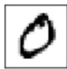
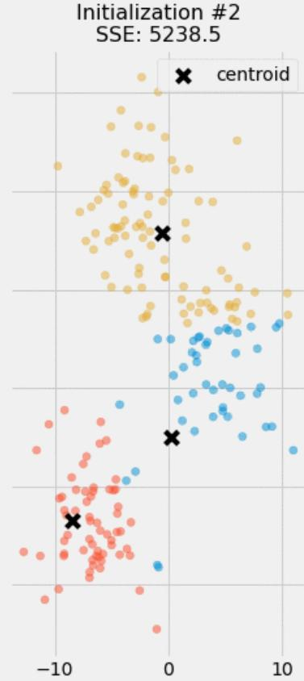
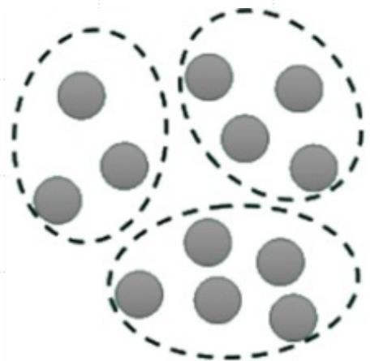
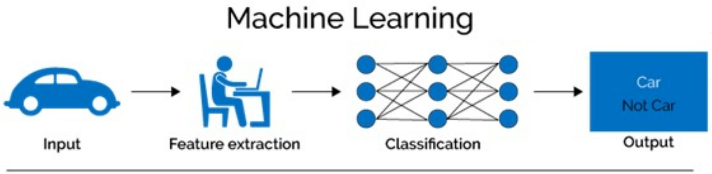
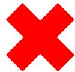
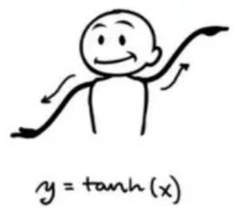
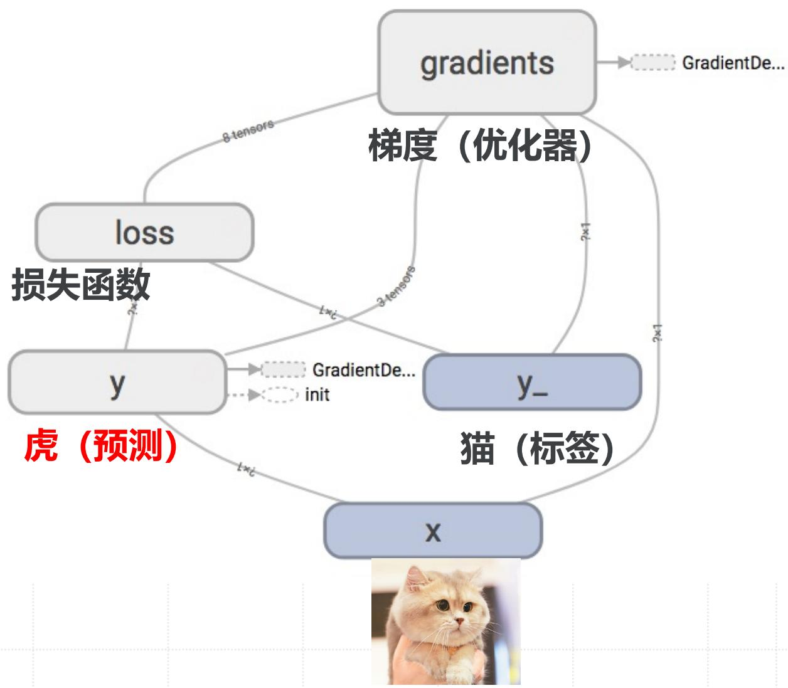
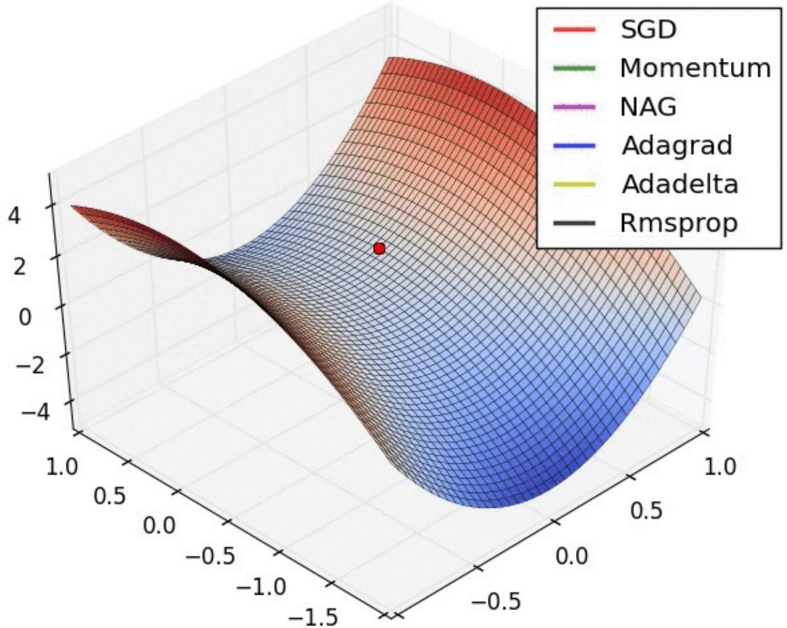

# AI通识基础与核心技术

# 人工智能与数据科学

# 人工智能技术维恩图

# 机器学习与深度学习理论基础

彭靖田

Google Developer Expert

# 目录

- 机器学习基础

监督学习算法与应用场景  
非监督学习原理与典型应用  

- 半监督学习与混合数据利用

神经网络与深度学习基础

神经网络的核心优势  

- 神经元与激活函数  
  前向与反向传播机制  
  深度神经网络经典架构解析  
  深度学习框架生态与实践

# 机器学习基础

# AI历史上的四次大发展

# 机器学习基础分类

  
(a) Supervised

  
(b) Semi-Supervised

  
(c) Unsupervised

# 机器学习基础分类

# 监督学习（Supervised Learning）：

- 训练数据集：输入数据和对应的标签（即目标输出）。  
  • 目标：学习一个映射函数，将输入映射到正确的输出（标签）。  
- 应用：分类、回归等任务。例如，垃圾邮件分类、房价预测。

# 半监督学习（Semi-supervised Learning）：

- 训练数据集：大量没有标签的数据和少量有标签的数据。  
- 目标：利用少量标签数据来帮助从大量未标注数据中学习，从而提高模型的准确性。  
- 应用：大规模数据集的分类任务，在标注成本高的情况下有很大的应用价值。例如，语音识别、图像分类。

# 非监督学习（Unsupervised Learning）：

- 训练数据集：只有输入数据，没有标签信息。  
- 目标：从数据中找出隐藏的结构或模式，例如通过聚类或降维来分析数据。  
- 应用：聚类、降维、异常检测等任务。例如，顾客分群、PCA降维。

# 机器学习基础分类

# 监督学习（Supervised Learning）：

- 训练数据集：输入数据和对应的标签（即目标输出）。  
- 目标：学习一个映射函数，将输入映射到正确的输出（标签）。  
- 应用：分类、回归等任务。例如，垃圾邮件分类、房价预测。

# 半监督学习（Semi-supervised Learning）：

- 训练数据集：大量没有标签的数据和少量有标签的数据。  
- 目标：利用少量标签数据来帮助从大量未标注数据中学习，从而提高模型的准确性。  
- 应用：大规模数据集的分类任务，在标注成本高的情况下有很大的应用价值。例如，语音识别、图像分类。

# 非监督学习（Unsupervised Learning）：

- 训练数据集：只有输入数据，没有标签信息。  
- 目标：从数据中找出隐藏的结构或模式，例如通过聚类或降维来分析数据。  
- 应用：聚类、降维、异常检测等任务。例如，顾客分群、PCA降维。

# 人工智能三大核心：数据、算力、算法

人工智能的成功依赖于数据、算力和算法协同作用，缺一不可。与道家炼丹的原理有异曲同工之妙。

# 数据  $\Rightarrow$  药材

- 数据是人工智能的基础，就像炼丹中的药材。炼丹需要精选各种药材，不同的药材组合决定了丹药的效果。  
- 数据的种类、数量和质量直接影响模型的性能。

# 算力  $\Rightarrow$  炉火

- 算力是人工智能的驱动力，就像炼丹中的炉火。炼丹需要控制火候，火太弱则丹药无法成形，火太猛则可能毁掉药材。  
- 算力决定了模型训练的速度和规模，算力不足会导致训练缓慢，算力过剩则可能浪费资源。

# 算法  $\Rightarrow$  丹方

- 算法是人工智能的核心逻辑，就像炼丹中的丹方。丹方是炼丹的关键，决定了药材如何搭配、火候如何控制，最终决定丹药的功效。  
- 算法决定了如何处理数据、优化模型，最终影响人工智能的表现。

  
豆包 AI 提示词：生成一个中国正一派道士正在山中炼丹的图，包含：道士，炼丹炉、药材、药方书籍（如：抱朴子）。

# 监督学习算法与应用场景

# 监督学习 (Supervised Learning)

在监督学习中，训练数据是带标签的，也就是说，每个输入数据都有一个对应的输出标签。模型的目标是从这些输入数据和标签对中学习一个映射函数，使得给定新的输入时，能够预测出正确的输出标签。

• 输入数据 (X) : 由特征组成的样本数据。  

- 输出标签 (y) : 与输入数据对应的正确答案 (标签), 如价格、类别、销售额等。

# 监督学习典型算法

- 线性回归 (Linear Regression)  
- 逻辑回归 (Logistic Regression)  
- 决策树 (Decision Tree)  
  随机森林 (Random Forest)  
- 最近邻算法 (k-NN)  
  • 朴素贝叶斯 (Naive Bayes)  
- 支持向量机 (SVM)  
  感知器 (Perceptron)  
- 深度神经网络 (DNN)

# 线性回归

在统计学中，线性回归是利用称为线性回归方程的最小二乘函数对一个或多个自变量和因变量之间关系进行建模的一种回归分析。这种函数是一个或多个称为回归系数的模型参数的线性组合。

# 单变量线性回归

理想函数

$$
\begin{array}{c} y = b + w x \\ \uparrow \quad \uparrow \end{array}
$$

假设函数

$$
h _ {\theta} (x) = \theta_ {0} + \theta_ {1} x _ {1} = \theta^ {T} x
$$

$$
h _ {\theta} (x) = \theta_ {0} x _ {0} + \theta_ {1} x _ {1} = \theta^ {T} x \quad (x _ {0} = 1)
$$

损失值 (误差)

$$
l o s s = y - h _ {\theta} (x)
$$

# 单变量线性回归

为了从一组样本  $\left(x^{(i)}, y^{(i)}\right)$  （其中  $i = 1,2,\dots,n$ ）之中估计最合适（误差最小）的  $\theta_{0}$  和  $\theta_{1}$ ，通常采用最小二乘法，其优化目标为最小化残差平方和：

$$
J (\theta) = \frac {1}{n} \sum_ {i} ^ {n} \left(h _ {\theta} \left(x ^ {(i)}\right) - y ^ {(i)}\right) ^ {2}
$$

为了消除求导时产生的系数, 将目标函数设置为  $\frac{1}{2} J(\theta)$ , 不影响优化策略与梯度下降方向。即:

$$
J (\theta) = \frac {1}{2 n} \sum_ {i} ^ {n} \left(h _ {\theta} \left(x ^ {(i)}\right) - y ^ {(i)}\right) ^ {2}
$$

# 梯度下降

模型参数  $\theta_{0}$  和  $\theta_{1}$  在优化目标函数的每轮迭代中, 按如下表达式更新:

$$
\theta_ {j} := \theta_ {j} - \alpha \frac {\partial}{\partial \theta_ {j}} J (\theta)
$$

代入  $\mathrm{J}(\theta)$  求导, 结果如下:

$$
\begin{array}{l} \theta_ {j} := \theta_ {j} - \alpha \frac {\partial}{\partial \theta_ {j}} \frac {1}{2 n} \sum_ {i} ^ {n} \left(h _ {\theta} \left(x ^ {(i)}\right) - y ^ {(i)}\right) ^ {2} \\ \theta_ {j} := \theta_ {j} - \alpha \frac {1}{2 n} \sum_ {i} ^ {n} 2 \left(h _ {\theta} \left(x ^ {(i)}\right) - y ^ {(i)}\right) \left(x _ {j} ^ {(i)}\right) \\ \end{array}
$$

$$
\theta_ {j} := \theta_ {j} - \boxed {\alpha} \frac {1}{n} \sum_ {i} ^ {n} \left(h _ {\theta} \left(x ^ {(i)}\right) - y ^ {(i)}\right) \left(x _ {j} ^ {(i)}\right)
$$

  
Gradient Descent  
Gradient Descent

  
Gradient Descent

# 线性回归应用：房价预测

问题描述：根据房屋面积  $x$ ，预测其销售价格  $y$  假设函数：

训练数据:

<table><tr><td>面积（平方英尺）</td><td>价格（美元）</td></tr><tr><td>2104</td><td>399900</td></tr><tr><td>1600</td><td>329900</td></tr><tr><td>2400</td><td>369000</td></tr><tr><td>1416</td><td>232000</td></tr><tr><td>3000</td><td>539900</td></tr><tr><td>1985</td><td>299900</td></tr><tr><td>1534</td><td>314900</td></tr><tr><td>1427</td><td>198999</td></tr><tr><td>1380</td><td>212000</td></tr><tr><td>1494</td><td>242500</td></tr></table>

$$
h _ {\theta} (x) = \theta_ {0} + \theta_ {1} x _ {1} = \theta^ {T} x
$$

# 多变量线性回归

理想函数

$$
y = w _ {0} + w _ {1} x _ {1} + w _ {2} x _ {2}
$$

$$
\vec {y} = W ^ {T} X
$$

假设函数

$$
h _ {\theta} (X) = \theta^ {T} X = \theta_ {0} + \theta_ {1} x _ {1} + \theta_ {2} x _ {2}
$$

损失值 (误差)

$$
l o s s = \vec {y} - h _ {\theta} (X)
$$

# 梯度下降

为了从一组样本  $\left(x_{1}^{(i)}, x_{2}^{(i)}, y^{(i)}\right)$  （其中  $i = 1,2,\dots,n$ ）之中估计最合适（误差最小）的模型参数  $\theta_{j}(\theta_{0}, \theta_{1}$  和  $\theta_{2}$ ），目标函数如下：

$$
J (\theta) = \frac {1}{2 n} (h _ {\theta} (X) - \vec {y}) ^ {\mathrm {T}} (h _ {\theta} (X) - \vec {y})
$$

$$
J (\theta) = \frac {1}{2 n} \left(\mathrm {X} \theta - \vec {y}\right) ^ {\mathrm {T}} (X \theta - \vec {y})
$$

$$
\mathbf {X} = \left[ \begin{array}{c c c} - & \left(x ^ {(1)}\right) ^ {T} & - \\ & \vdots \\ - & \left(x ^ {(n)}\right) ^ {T} & - \end{array} \right] \quad \vec {y} = \left[ \begin{array}{c c c} & y ^ {(1)} \\ & \vdots \\ & y ^ {(n)} \end{array} \right]
$$

# 线性回归应用：多变量房价预测

问题描述：根据房屋面积  $x_{1}$  和卧室数量  $x_{2}$ ，预测其销售价格  $y$

训练数据:  

<table><tr><td>面积（平方英尺）</td><td>卧室数量（个）</td><td>价格（美元）</td></tr><tr><td>2104</td><td>3</td><td>399900</td></tr><tr><td>1600</td><td>3</td><td>329900</td></tr><tr><td>2400</td><td>3</td><td>369000</td></tr><tr><td>1416</td><td>2</td><td>232000</td></tr><tr><td>3000</td><td>4</td><td>539900</td></tr><tr><td>1985</td><td>4</td><td>299900</td></tr><tr><td>1534</td><td>3</td><td>314900</td></tr><tr><td>1427</td><td>3</td><td>198999</td></tr><tr><td>1380</td><td>3</td><td>212000</td></tr><tr><td>1494</td><td>3</td><td>242500</td></tr></table>

  
数据分布:

# 多变量房价预测问题：特征归一化

房屋面积和卧室数量这两个变量（特征）在数值上差了1000倍。在这种情况下，通常先进行特征缩放（Scaling），再开始训练，可以加速模型收敛。

$$
x ^ {\prime} = \frac {x - \bar {x}}{\sigma} \leftarrow \text {平 均 值}
$$

# 监督学习应用场景

监督学习的应用场景非常广泛，主要用于那些数据可以明确标注的任务。常见的应用包括：

- 分类任务（离散的标签）：例如垃圾邮件检测、情感分析、手写数字识别（MNIST数据集）。  
- 回归任务（连续的数值）：例如房价预测、股票市场预测、天气预测。

# 优点

- 训练过程较为清晰，容易理解。  
- 在有足够标注数据的情况下，模型可以非常准确地进行预测。

# 缺点

- 依赖大量标注数据：标注数据需要人工进行，尤其在某些领域（如医学、法律等）标注成本很高。  
- 过拟合风险：模型可能会在训练数据上表现很好，但在新数据上表现不佳，尤其是在训练数据不足或质量不高时。

# 监督学习应用场景：垃圾邮件检测

![]监督学习应用场景：垃圾邮件检测

  
反垃圾防护体系架构

# 监督学习应用场景：车牌号识别

MNIST 是一个常用于训练各种图像处理系统和机器学习模型的图像数据集，包含 60,000 个训练和 10,000 个测试样例。

Label: 5

Label: 2

Label: 3

Label: 0

Label: 1

Label: 5

Label: 4

Label: 3

Label: 3

Label: 1

Label: 1

Label: 6

Label: 9

Label: 4

Label: 1

# 监督学习应用场景：情感分析/评论打分

<table><tr><td></td><td>所属类型</td><td>机制</td><td>算法</td><td>用户门槛</td><td>反作弊</td><td>特殊机制</td></tr><tr><td>豆瓣</td><td>影视、书籍评论</td><td>五星制</td><td>平均值</td><td>无门槛</td><td>技术+人工</td><td>TOP 250 榜单</td></tr></table>

# 非监督学习原理与典型应用

# 非监督学习 (Unsupervised Learning)

# 基本原理

- 非监督学习与监督学习的最大不同之处在于, 它不依赖于标注数据。在非监督学习中, 训练数据没有标签,目标是从数据中发现潜在的结构、模式或规律, 而不是预测具体的输出标签。  
- 非监督学习的关键在于通过不同的算法来揭示数据内部的潜在关系。

# 训练过程:

- 输入数据 (X) : 仅包含样本的特征数据, 没有对应的标签。  
- 目标：识别数据中的内在结构或规律，如聚类、降维、异常检测等。

Classification  
  
Supervised learning

Clustering  
  
Unsupervised learning

# 非监督学习常见算法

- K-means聚类 (K-means Clustering)  
- 层次聚类 (Hierarchical Clustering)  
- 主成分分析 (PCA)  
  自编码器 (Autoencoders)  
- 孤立森林 (Isolation Forest)

  
original data space

  

# K-means 聚类

目标：将数据集划分为 K 个不同的簇，使得同一个簇内的数据点尽可能相似（距离近），不同簇的数据点尽可能不同（距离远）。

# 算法步骤:

1. 初始化：随机选择 K 个数据点作为初始聚类中心 (Centroids)。  
2. 分配：计算每个数据点到各个聚类中心的距离，将其分配给距离最近的那个聚类中心所在的簇。  
3. 更新：重新计算每个簇的聚类中心（通常是该簇所有数据点的均值）。  
4. 迭代：重复步骤 2 和 3，直到聚类中心不再发生显著变化或达到预设的迭代次数。

算法优化目标：最小化平方误差和 (Sum of Squares Errors, SSE)。

  
k-means iteration: 1

# RFM模型

  
个人信息

·频率  
间隔周期  

- 金额  
  产品偏好支付方式

年龄  
性别  
建卡时间  
建卡信息  
车辆信息

$\therefore m - 1 \neq  0$  ;

  
购买记录数据  
需求和兴趣

网站咨询明细  
来电信息（频次/内容）  
客户工单信息

场景：电商希望将用户划分为不同的群体，实施更精准的营销策略（如向不同群体推荐不同的商品、发送定制化的优惠券等）。

# 聚类分析

K-means 应用场景：客户分群

# K-means 应用场景：客户分群

# 算法应用步骤:

1. 特征选择/构建：从用户数据中提取关键特征，如：

最近购买时间 (Recency)  
购买频率 (Frequency)  
购买总金额 (Monetary Value) - (RFM 模型)  
浏览商品类别偏好  
平均客单价  

- 活跃度指标（登录次数、停留时长等）

2. 数据预处理：对选取的特征进行清洗、处理缺失值、特征缩放（非常重要，因为K-means基于距离计算）。  
3. 选择 K 值: 确定希望将客户分为多少个群体。可以通过业务经验、肘部法则 (Elbow Method) 或轮廓系数 (Silhouette Score) 等方法辅助确定 K 值。  
4. 运行 K-means: 使用预处理后的用户特征数据运行 K-means 算法。  
5. 结果分析与画像：分析每个簇的特征均值（聚类中心），理解每个客户群体的特点（例如，“高价值活跃用户”、“低消费潜力新用户”、“即将流失用户”等），并为每个群体打上标签，形成用户画像。  
6. 策略制定：基于用户画像，为不同群体制定差异化的营销、服务和产品策略。

# Principal Component Analysis (PCA) 降维

目标：通过找到数据方差最大的方向（主成分），将高维数据转换为低维数据，并尽可能保留原始数据的信息。

# 核心思想：

1. 去中心化：将数据进行中心化处理（减去均值）。  
2. 计算协方差矩阵：描述不同维度之间的线性相关性。  
3. 特征值分解/SVD：计算协方差矩阵的特征值和特征向量。特征向量代表了主成分的方向，特征值代表了在对应方向上的方差大小。  
4. 选择主成分：按特征值大小排序，选择前 k 个特征向量作为新的基向量。  
5. 投影：将原始数据投影到选定的 k 个主成分上，得到降维后的数据。

# PCA 应用场景：图像压缩

场景：存储和传输高分辨率图像需要大量的磁盘空间和带宽，希望有算法可以尽可能无损压缩图像。

  
原始图像

  
k=1

  
k=10

  
k=20

  
k=50

  
k=100

  
k=200

# PCA 应用场景：图像压缩

# 算法应用步骤:

1. 数据准备：将图像表示为数值矩阵。对于灰度图，是一个2D矩阵；对于彩色图（如RGB），可以分别处理R,G,B三个通道，或者将图像分成小块（patch），将每个小块展平成向量。假设我们处理灰度图或图像块向量。  
2. 构建数据集：将图像（或图像块向量）视为数据样本。例如，可以将图像的每一行或每一列视为一个高维向量，或者将整个图像（或图像块）展平成一个长向量。  
3. 运行 PCA：对这些向量组成的数据集运行 PCA:

计算数据的协方差矩阵。  

- 计算协方差矩阵的特征值和特征向量（主成分）。  
- 按特征值大小对主成分排序。

4. 选择主成分数量 (k): 选择前 k 个最重要的主成分（对应最大的 k 个特征值）。k 的选择决定了压缩率和信息保留程度。可以通过设定保留的总方差比例（如  $95\%$ ）来确定 k 值。  
5. 投影（编码）：将原始图像向量投影到选定的 k 个主成分上，得到 k 维的低维表示。这就是压缩后的数据。  
6. 重构（解码）：需要恢复图像时，将 k 维的低维表示乘以对应的 k 个主成分（特征向量），再加上数据的均值（如果之前去中心化了），可以近似重构出原始图像。由于只使用了部分主成分，重构后的图像会损失一些细节，但保留了主要结构。

效果：存储低维表示和 k 个主成分，而不是原始像素数据，显著减少存储空间。k 越小，压缩率越高，但图像质量损失越大。

# 非监督学习算法应用场景

# 1. 客户分群(Customer Segmentation)的扩展场景

- 用户兴趣聚类：通过社交媒体行为（点赞、评论、分享）或内容消费习惯（视频、文章偏好）划分兴趣群体，优化内容推荐。  
- 生命周期阶段划分：根据用户活跃度、付费周期等特征识别潜在流失用户、新用户或高价值用户，制定差异化策略。  
- 地理分群：结合地理位置数据（如移动轨迹、区域消费差异）进行区域化营销或门店选址优化。

# 2. 异常检测（Anomaly Detection）的扩展场景

- 医疗健康：识别异常生理信号（如心电图异常）、罕见疾病模式或医疗记录中的错误数据。  
- 物联网 (IoT)：检测传感器异常读数（如温度骤变、设备振动异常），预测硬件故障。  
- 供应链管理：发现物流延迟、库存异常波动或供应商行为异常。  
  ·能源领域：电网负荷异常监测或可再生能源发电中的异常模式（如光伏板故障）。

# 3. 数据降维（Dimensionality Reduction）的扩展场景

- 基因组学：将高维基因表达数据降维，识别关键生物标记或疾病相关基因簇。  
- 图像处理：压缩图像特征（如人脸识别中的特征提取），减少计算资源消耗。  
- 自然语言处理 (NLP) : 将词嵌入 (Word Embeddings) 降维后可视化, 分析语义关联。

# 4. 主题建模（Topic Modeling）的扩展场景

- 新闻分类：自动聚合新闻文章的主题，用于舆情分析或事件追踪。  
- 学术文献分析：从海量论文中提取研究热点领域或技术趋势。  
- 用户反馈挖掘：分析客服记录、产品评论中的隐含主题，改进服务质量。

# 半监督学习与混合数据利用

# 半监督学习 (Semi-supervised Learning)

核心思想：半监督学习介于监督学习和非监督学习之间，它利用少量带标签的数据和大量未标签的数据来进行学习。其动机在于现实世界中，获取未标签数据，通常比获取带标签数据容易得多且成本更低。

目标：通过结合利用这两种数据，达到比仅使用少量带标签数据（监督学习）或仅使用未标签数据（非监督学习）更好的学习效果，特别是提高模型的泛化能力和准确性。

  
监督学习（有标签）

  
半监督学习（部分标签）

  
无监督学习 (无标签)

# 半监督学习常见算法

<table><tr><td>算法类型</td><td>代表算法</td><td>适用场景</td><td>优势</td></tr><tr><td>基于图的方法</td><td>标签传播
(Label Propagation, LP)</td><td>社交网络、推荐系统</td><td>直观，适合关系数据</td></tr><tr><td>生成模型</td><td>高斯混合模型（GMM）+EM
,变分自编码器（VAE）</td><td>文本、图像聚类</td><td>概率解释性强</td></tr><tr><td>低密度分离</td><td>半监督支持向量机（S3VM）</td><td>医疗、异常检测</td><td>边界清晰，抗噪声</td></tr><tr><td>一致性正则化</td><td>Mean Teacher, FixMatch</td><td>图像、语音</td><td>适合深度学习，鲁棒性强</td></tr><tr><td>伪标签</td><td>自训练（Self-Training），Noisy Student</td><td>语音识别、NLP</td><td>简单易实现</td></tr><tr><td>对比学习</td><td>SimCLR</td><td>多模态数据（图像+文本）</td><td>无需负样本，高效表征学习</td></tr></table>

# 半监督学习应用场景

# 特别适用于标注成本高昂或标注过程耗时的领域：

- 图像分类：有少量标注图像和大量未标注图像。(如自训练场景)  
- 社交网络分析：用户关系和行为数据丰富，但显式标签少。(如标签传播场景)  
- 文本分类：如网页分类、情感分析，只有部分文本被人工标注。(如一致性正则化场景)  
- 语音识别：大量的语音数据易于获取，但转录标注费时费力。  
- 生物信息学：如蛋白质功能预测、基因序列分析。  
- 医学影像分析：标注需要专业医师，成本高。

# 自训练算法应用场景：大规模图像分类

场景：一个公司需要开发一个图像分类器，用于识别其产品图片库中的不同产品类别（如“鞋子”、“衬衫”、“裤子”）。他们拥有数百万张产品图片，但只有一小部分（例如几千张）经过了人工标注。人工标注所有图片成本过高。

自训练算法流程图例：在 ImageNet 数据集上，使用 Noisy Student 方法训练图像分类器

# 标签传播算法应用场景：社交网络分析

场景：社交网络平台希望根据用户的行为和关系，将用户划分到不同的兴趣群体（例如，“体育迷”、“科技爱好者”、“美食家”）。只有少数种子用户被明确标注了兴趣标签，但平台拥有庞大的用户关系网络（关注、好友）和用户生成内容。

传统机器学习 三大范式对比  

<table><tr><td>特性</td><td>监督学习</td><td>非监督学习</td><td>半监督学习</td></tr><tr><td>目标</td><td>学习从输入到输出的映射，进行预测</td><td>从数据中发现潜在的结构或模式，进行探索性分析</td><td>利用少量标注数据和大量未标注数据提高模型性能</td></tr><tr><td>数据类型</td><td>需要大量标注数据（标签）</td><td>不需要标签数据，只需输入特征数据</td><td>需要少量标注数据和大量未标注数据</td></tr><tr><td>常见算法</td><td>线性回归、逻辑回归、决策树、SVM、KNN等</td><td>K-means、PCA、聚类、异常检测、自编码器等</td><td>自训练（Self-training）、协同训练（Co-training）、图方法（Label Propagation）、一致性正则化（Consistency Regularization）等</td></tr><tr><td>应用场景</td><td>预测任务，如分类、回归、推荐等</td><td>数据探索、聚类、降维、异常检测、特征学习等</td><td>大规模数据集上的分类与回归任务，尤其在标注数据稀缺的场景，如图像分类、文本分类、语音识别等</td></tr><tr><td>优点</td><td>精确度较高，有明确的评估标准</td><td>可以利用大量未标注数据，适合数据探索任务</td><td>减少对大量标注数据的依赖，能够在标注稀缺的情况下有效利用未标注数据，提高模型性能</td></tr><tr><td>缺点</td><td>需要大量标签数据，容易过拟合</td><td>缺乏评估标准，模型的效果不易量化，结果难以解释</td><td>伪标签可能带来错误传播，未标注数据质量差时可能影响模型性能</td></tr></table>

# 神经网络与深度学习基础

# 感知机模型

1957年，受 Warren McCulloch 和 Walter Pitts 在神经元建模方面工作的启发，心理学家 Frank Rosenblatt 参考大脑中神经元信息传递信号的工作机制，发明了神经感知机模型 Perceptron。

# 神经网络

在机器学习和认知科学领域，人工神经网络（ANN），简称神经网络（NN）是一种模仿生物神经网络（动物的中枢神经系统，特别是大脑）的结构和功能的数学模型或计算模型，用于对函数进行估计或近似。神经网络是多层神经元的连接，上一层神经元的输出，作为下一层神经元的输入。

输出神经元

隐藏层神经元

输入神经元

# 神经网络：碳基 vs 硅基

  
Neuron in our brain.

  
Neural Network develop using A.I.

# 神经网络与深度学习

# Neural network

# Deep neural network

# 神经网络核心优势

# 机器学习与深度学习

# “照猫画虎”学习法-训练

  
hidden layer 1 hidden layer 2

虎 (预测)

猫 (标签)

# “照猫画虎”学习法-训练

  
hidden layer 1 hidden layer 2

猫 (预测)

猫 (标签)

# “照猫画虎”学习法-训练

猫 (预测)

猫 (标签)

狗 (预测)

狗 (标签)

# “照猫画虎”学习法-推理

猫

# “照猫画虎”学习法-推理

# “照猫画虎”学习法-推理

# 神经元与激活函数

# 一个简化的神经网络

输出 激活函数

$$
h = \boxed {g (\sum_ {i = 1} \theta_ {i} x _ {i} - b)}
$$

引入非线性，使网络能够学习复杂模式。

# Sigmoid

$$
\sigma (x) = \frac {1}{1 + e ^ {- x}}
$$

线性不可分

# 激活函数 (Activation Function)

为了实现神经网络的非线性建模能力，解决一些线性不可分的问题，我们通常使用激活函数来引入非线性因素。激活函数都采用非线性函数，常用的有Sigmoid、tanh、ReLU等。

# Sigmoid

$$
\sigma (x) = \frac {1}{1 + e ^ {- x}}
$$

# LeakyReLU

$$
\max (0. 1 x, x)
$$

# tanh

$$
\tanh (x)
$$

# Maxout

$$
\max  \left(w _ {1} ^ {T} x + b _ {1}, w _ {2} ^ {T} x + b _ {2}\right)
$$

# ReLU

$$
\max  (0, x)
$$

# ELU

$$
\left\{ \begin{array}{l l} x & x \geq 0 \\ \alpha (e ^ {x} - 1) & x <   0 \end{array} \right.
$$

# 激活函数很重要

• 增加“智商”: 激活函数加入“非线性”, 让网络能处理更难的问题。  

- 做决定：决定这个神经元最终输出什么信号。

• Sigmoid / Tanh: 把信号压缩到特定范围（老牌选手，有点过时）。  
• ReLU: 信号小于0就关掉（输出0），大于0就直接输出（现在很流行，快！）。  

- LeakyReLU:ReLU的改进版，小于0也不完全关掉，留一点点信号。  
- Softmax: 用在最后一步, 特别适合 “多选一”问题。

  
Sigmoid

  
Tanh

  
Step Function

  
Softplus

  
ReLU

  
Softsign

  
ELU

  
Log of Sigmoid

  
Swish

  
Sinc

  
LeakyReLU

  
Mish

# 激活函数很简单

# 前向与反向传播机制

# 神经网络中的基础概念

层（Layer）：基本计算单元，对输入数据进行特定变换。

- 输入层 (Input Layer): 原材料入口, 接收原始数据。  
  隐藏层 (Hidden Layer(s)): 加工车间, 进行信息处理和学习。可以有很多层。  
- 输出层 (Output Layer): 成品出口, 产生最终结果。  
  • 全连接 (Fully Connected): 上一层的每个神经元都跟下一层的每个神经元连接。  
- 深度 (Depth): 指隐藏层的数量。  
  • 宽度 (Width): 指每层神经元的数量。

  
hidden layer

# 神经网络如何学习？

X

虎 (预测)

猫 (标签)

hidden layer

# 目标：

- 调整“连接强度”（模型权重 W），  
  • 让预测结果（输出 Y）不断接近正确答案（标签 Y）。

# 方法（反向传播 Backpropagation）：

- 先算算错多少：计算预测结果与正确答案的“误差”(Loss)。  
- 从后往前“追责”: 倒推计算每一层的每个连接对误差的“贡献”。  
  告诉大家怎么改：根据“贡献”调整权重，让下次误差变小。  
- 关键：用微积分的“链式法则”高效计算。

# 神经网络：前向传播

  
前向传播

- 工作流程 (前向传播): 数据逐层加工, 直到输出层产出结果。  
- 特点：信息从前往后单向流动（输入层 -> 隐藏层 -> 输出层），不倒流、不绕圈。

  
数据流图

# 神经网络：训练机制

理想函数:  
$$
y = b + w x
$$
假设函数:  
$$
h_{\theta}(x) = \theta_0 + \theta_1 x_1 = \theta^T x
$$
损失值 (误差):  
$$
\operatorname{loss} = y - h_{\theta}(x)
$$

# 神经网络：反向传播

目标函数:

$$
J (\theta) = \frac {1}{2 n} \sum_ {i} ^ {n} \left(h _ {\theta} \left(x ^ {(i)}\right) - y ^ {(i)}\right) ^ {2}
$$

迭代模型参数:

$$
\theta_ {j} := \theta_ {j} - \alpha \frac {\partial}{\partial \theta_ {j}} J (\theta)
$$

反向传播  
  
hidden layer 1 hidden layer 2

# 优化算法: 怎么调整参数最有效?

目标函数:

$$
J (\theta) = \frac {1}{2 n} \sum_ {i} ^ {n} \left(h _ {\theta} \left(x ^ {(i)}\right) - y ^ {(i)}\right) ^ {2}
$$

迭代模型参数:

$$
\theta_ {j} := \theta_ {j} - \alpha \frac {\partial}{\partial \theta_ {j}} J (\theta)
$$

- 梯度下降 (Gradient Descent): 最常用的方法。  
- 想法：把“误差”想象成山，我们想下到山谷（误差最小）。梯度告诉我们下山最陡的方向，我们就朝那走一小步。  
- 更新规则：新参数 = 旧参数 - 学习率 × 改进建议(梯度)  
- 学习率 (Learning Rate): 每一步迈多大。太小慢, 太大可能错过最低点。  
- 常见做法 (小批量 Mini-batch): 每次看一小部分数据来计算方向和调整参数, 效率和稳定性均衡。

  
hidden layer 1 hidden layer 2

# 优化算法：随机梯度下降（SGD）

迭代模型参数:

$$
\theta_ {j} := \theta_ {j} - \alpha \frac {\partial}{\partial \theta_ {j}} J (\theta)
$$

代入  $\mathrm{J}(\theta)$  求导, 结果如下:

$$
\begin{array}{l} \theta_ {j} := \theta_ {j} - \alpha \frac {\partial}{\partial \theta_ {j}} \frac {1}{2 n} \sum_ {i} ^ {n} \left(h _ {\theta} \left(x ^ {(i)}\right) - y ^ {(i)}\right) ^ {2} \\ \theta_ {j} := \theta_ {j} - \alpha \frac {1}{2 n} \sum_ {i} ^ {n} 2 \left(h _ {\theta} \left(x ^ {(i)}\right) - y ^ {(i)}\right) \left(x _ {j} ^ {(i)}\right) \\ \end{array}
$$

$$
\theta_ {j} := \theta_ {j} - \boxed {\alpha} \frac {1}{n} \sum_ {i} ^ {n} \left(h _ {\theta} \left(x ^ {(i)}\right) - y ^ {(i)}\right) \left(x _ {j} ^ {(i)}\right)
$$

  
Gradient Descent

  
Gradient Descent  
Gradient Descent

# 更聪明的“下山”方法：高级优化器

# 主要思路:

- 加点“惯性”(Momentum): 加速下山, 不易卡住。  
  • 自动调整(Adaptive)“步子”（学习率）

# 经典优化器:

- Momentum: 带惯性的梯度下降, 加速收敛但容易震荡。  
- NAG: Momentum 的“预判版”，快到谷底时自动减速。  
- Adagrad: 自动调参学习率, 但会越来越保守 (学习率  $\downarrow$  )。  
- Adadelta: Adagrad 的改进版，动态调整，避免过早停止。  
- Rmsprop: 只关注近期梯度, 适合神经网络训练。

# 现在流行用啥？

- Adam: 结合了“惯性”和“自动调步子”，通常效果又快又好。  
- AdamW(适合大模型): Adam 的“减肥版”, 解耦权重衰减 (L2正则化),避免优化偏差, 训练更稳定, 泛化性更好。

# 神经网络核心概念及关系

  
hidden layer 1 hidden layer 2

反向传播

模型

# 深度神经网络经典架构解析

# 深度学习是什么？为啥要深？

# 深度学习：更“深”的神经网络（很多隐藏层）

- 有啥不一样：机器学习，需要专家手动设计特征（比如从图片里提取颜色、纹理信息）。  
- 自动学特征：能直接从原始数据学习有用的特征（比如图片像素），实现“端到端”学习。  
- 胃口大：通常需要很多数据才能喂饱它，让它学好。  
- 计算量大：训练起来很耗费计算资源，所以GPU（显卡）成了标配。  
- 核心优势：自动从数据里学习复杂模式和表示。

# 为啥要“深”: 层数多的好处

- 学得更“透彻”（层次化特征）：模仿认知过程，从简单特征到复杂特征逐层学习。  
- 可能更“省料”（表示效率）：表达复杂关系时，深网络可能比浅宽网络更节省参数。  
- 学习更通用: 浅层学到的通用知识可被深层重用。

# 模型：层构成的神经网络

# 神经网络基础构建模块：层（Layer）类型

  
全连接层/密集层 (FC/Dense)

  
卷积层 (Conv)

# 全连接：全局学习模式

  
hidden layer 1 hidden layer 2

猫

卷积：局部学习模式

# 卷积层：卷积神经网络（CNN）的核心

# 工作原理：

- 使用卷积核 (Kernel) 在输入数据（如图像）上滑动，提取局部特征。

# 关键特性：

- 参数共享: 同一个卷积核在整个输入上共享权重, 极大减少参数量。  
- 局部连接：神经元只与输入的一个局部区域连接。  
- 平移不变性: 对特征的位置不敏感。

# 主要参数：

卷积核大小  
• 步长 (Stride)  

- 填充 (Padding)  
- 通道数

# 卷积：提取局部特征

# 不同通道提取到的特征有差异

  
通道1

  
通道2

# 池化层

# 目的:

- 降维、减少计算量  
- 增强特征鲁棒性（对微小位移不敏感）。

作用：逐步减小特征图的空间尺寸，增大感受野。

# 常见类型：

- 最大池化 (Max Pooling): 取区域内的最大值。  
- 平均池化 (Average Pooling): 取区域内的平均值。

# 经典架构：卷积神经网络 (CNN)

核心思想：利用卷积层和池化层构建层级化的特征提取器。

典型结构：输入  $->$  [ [卷积层 -> 激活函数]  $\times$  N -> 池化层?]  $\times$  M -> [全连接层 -> 激活函数]  $\times$  K -> 输出层

# 里程碑模型:

- LeNet-5 (1998): 卷积网络的早期成功应用（手写数字识别），奠定基础结构。  
- AlexNet (2012): ImageNet 竞赛冠军, 引爆深度学习革命。关键贡献: 更深的网络、ReLU、Dropout、GPU 加速。  
- VGGNet (2014): 探索深度影响。使用小的  $(3 \times 3)$  卷积核堆叠, 结构简洁, 证明深度是关键。  
- GoogleNet / Inception (2014): 引入 Inception 模块, 实现“网络中的网络”, 在增加深度和宽度的同时控制计算成本。  
- ResNet (2015): 引入残差连接 (Residual Connection), 解决了深度网络训练中的梯度消失/退化问题, 使构建数百甚至上千层网络成为可能。

# CNN 里程碑模型：AlexNet

ImageNet 竞赛冠军，引爆深度学习革命。关键贡献：更深的网络、ReLU、Dropout、GPU 加速。

# CNN 里程碑模型：VGG-Net

探索深度影响：使用小的  $(3 \times 3)$  卷积核堆叠，结构简洁，证明深度是关键。

# CNN 里程碑模型：GoogLeNet

引入 Inception 模块，实现“网络中的网络”，在增加深度和宽度的同时控制计算成本。

# Inception 模块：多尺寸卷积核

# CNN 里程碑模型：ResNet

引入残差连接 (Residual Connection)，解决了深度网络训练中的梯度消失/退化问题，使构建数百甚至上千层网络成为可能。

  
ResNet50 Model Architecture

# ResNet 模块：残差连接

# 经典架构：循环神经网络 (RNN)

- 核心思想：处理序列数据（文本、语音、时间序列），利用隐藏状态传递历史信息。  
- 原始 RNN 的局限性：难以捕捉长期依赖（梯度消失/爆炸问题）。  
  • LSTM (Long Short-Term Memory): 通过精密的门控单元（遗忘门、输入门、输出门）和细胞状态 (Cell State), 有效控制信息的长期记忆和遗忘。  
  • GRU (Gated Recurrent Unit): 结构比 LSTM 简单（更新门、重置门），参数更少，在许多任务上表现与 LSTM 相当。

  
RNN

  
LSTM

  
GRU

# 编码器-解码器架构：序列到序列模型（Seq2Seq）

# 深度学习框架生态与实践

# 什么是深度学习框架？

- 定义：提供了一套用于构建、训练和部署深度学习模型的软件库和工具。

# 为何需要框架？

- 抽象与易用性：隐藏底层复杂性（如自动微分、GPU计算）。  
- 性能优化：内置高效的数值计算库（BLAS, cuDNN）和硬件加速支持。  
- 灵活性与模块化：提供丰富的预定义层、优化器、损失函数等。  
- 社区支持与生态：庞大的社区提供教程、预训练模型、解决方案。  
- 部署便捷：提供模型导出、转换和部署工具。

# “深度学习时代”的框架与生态 (2012 - 2020)

# 时代特征:

- 模型规模相对较小（千万级到数亿级参数）。  
- 主要任务：图像分类、目标检测、NLP 基础任务（情感分析、序列标注等）。  
- 研究和应用重点：模型架构创新 (CNN, RNN 及其变种)、训练技巧、特定任务优化。  
- 用户：研究人员、工程师从零构建或微调模型。

# 生态特点

- 模型共享：Model Zoos (如 TensorFlow Hub, PyTorch Hub) 提供预训练模型。  
- 可视化：TensorBoard 成为事实标准。  
- 部署工具：TF Serving, TF Lite (移动端), ONNX (模型交换格式) 逐渐兴起。  
  社区活跃：大量教程、博客、开源项目涌现。  
- 关注点：如何更方便地构建和训练模型，以及在特定硬件上部署。

# “深度学习时代”的主流框架 (2012 - 2020)

# TensorFlow(1.x):

- Google 出品，工业界广泛应用。  
- 特点：静态计算图 (Define-and-Run)，强大的分布式训练支持，完善的部署工具链 (TF Serving, TF Lite)。  
- 生态：TensorBoard (可视化), Keras (高层 API)。

# Keras:

- 高层神经网络 API，注重用户友好和快速原型设计。  
- 可运行在 TensorFlow, Theano (早期), CNTK 之上。后成为 TensorFlow 官方高层 API。

# PyTorch:

- Facebook (Meta) 出品，学术界和研究领域迅速普及。  
- 特点：动态计算图 (Define-by-Run)，Pythonic 风格，调试友好。  
- 生态：TorchVision, TorchText, TorchAudio 等领域库。

# 其他框架：

- Caffe/Caffe2 (计算机视觉), Theano (早期先驱), MXNet (亚马逊), CNTK (微软)。

# “大模型时代”的框架格局变化与范式迁移

<table><tr><td>特性</td><td>“深度学习时代”</td><td>“大模型时代”</td></tr><tr><td>核心框架</td><td>TensorFlow (1.x), Keras, PyTorch</td><td>PyTorch, TensorFlow (2.x), JAX</td></tr><tr><td>模型规模</td><td>百万级 - 数亿级</td><td>十亿级 - 万亿级</td></tr><tr><td>开发范式</td><td>从零构建/微调中小模型</td><td>基于超大预训练模型微调/提示</td></tr><tr><td>关键技术</td><td>CNN, RNN/LSTM/GRU</td><td>Transformer</td></tr><tr><td>生态核心</td><td>框架本身, Model Zoos, TensorBoard</td><td>Hugging Face, 分布式训练库, 推理优化/服务</td></tr><tr><td>主要挑战</td><td>模型设计, 训练技巧, 特定任务部署</td><td>规模化 (Scale): 训练/推理成本, 显存, 部署</td></tr><tr><td>社区焦点</td><td>模型精度, 新架构</td><td>效率, 可扩展性, 易用性 (HF), MLOps</td></tr></table>

# “大模型时代”的深度学习框架 (2020-至今)

# PyTorch:

- 凭借其灵活性和研究社区的喜爱，在LLM研发中占据主导地位。生态持续扩展(FSDP,TorchServe)。

# TensorFlow (2.x):

- 引入Eager Execution (动态图)，整合Keras。在工业界仍有大量应用，但LLM前沿研究声量相对减弱。生态依然强大(TFX, TF Serving/Lite)。

# JAX:

- Google 出品，面向高性能数值计算和机器学习研究。  
- 特点：函数式编程风格，强大的自动微分、自动向量化 (vmap)、并行化 (pmap)。  
- 优势：在 TPU 上表现优异，适合大规模模型研究和训练。常与 Flax/Haiku (神经网络库) 配合使用。

# “大模型时代”的核心生态组件（训练）

# Hugging Face Transformers: 已成为事实上的大模型“操作系统”/核心枢纽。

- 关键作用：极大降低了使用、分享和训练大模型(Transformer)的门槛。  
  核心功能：

- 海量预训练模型库 (Model Hub)。  
- 标准化的模型加载、分词器 (Tokenizer) 接口。  
- 易用的训练/微调 Pipeline (Trainer API)。  
- 支持 PyTorch, TensorFlow, JAX 后端。

# 分布式训练库：训练超大模型的必备工具

- DeepSpeed (Microsoft): 优化显存、通信和计算，支持 ZeRO (零冗余优化器) 等技术。  
- Megatron-LM (NVIDIA): 专注于 Transformer 模型的高效并行训练（张量并行、流水线并行、数据并行）。  
- Colossal-AI: 提供多维度并行、异构内存管理等方案。  
- 框架原生支持: PyTorch FSDP (Fully Sharded Data Parallel), TF DTensor。

# “大模型时代”的核心生态组件（推理/部署）

# 推理优化与服务 (Inference Optimization & Serving):

# 核心挑战：

大模型推理延迟高  

- 算力成本高昂

# 工具：

- TensorRT (NVIDIA): GPU 推理优化器和运行时。  
- ONNX Runtime: 跨平台推理引擎，支持多种硬件加速。  
- vLLM / Text Generation Inference (Hugging Face): 针对 LLM 的高效推理服务框架。  
- Triton Inference Server (NVIDIA): 通用推理服务平台，支持多框架、多模型、动态批处理。

# LLMOps (大模型运维):

- 重要性凸显：管理大模型生命周期（数据、实验、模型版本、部署、监控）至关重要。  
- 平台/工具：Kubeflow, MLflow, Weights & Biases (W&B), ClearML 等。

# 未来趋势展望

软硬协同设计：框架与专用硬件（GPU，TPU，NPU）的结合更紧密。

面向特定领域/模型的框架？可能出现更细分的工具。

易用性与自动化的持续提升：AutoML, Low-code/No-code 平台发展。

多模态与基础模型的统一框架支持。