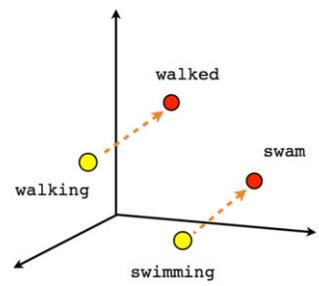
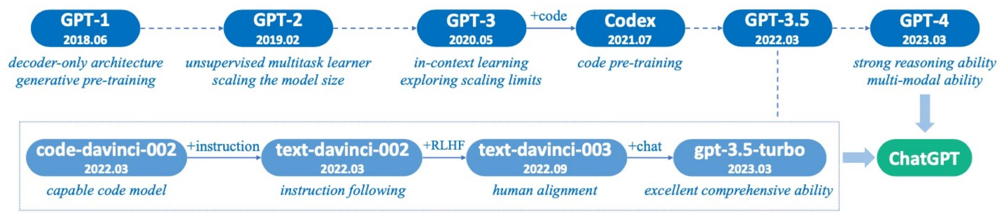
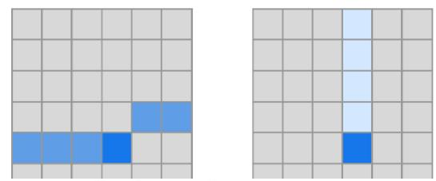
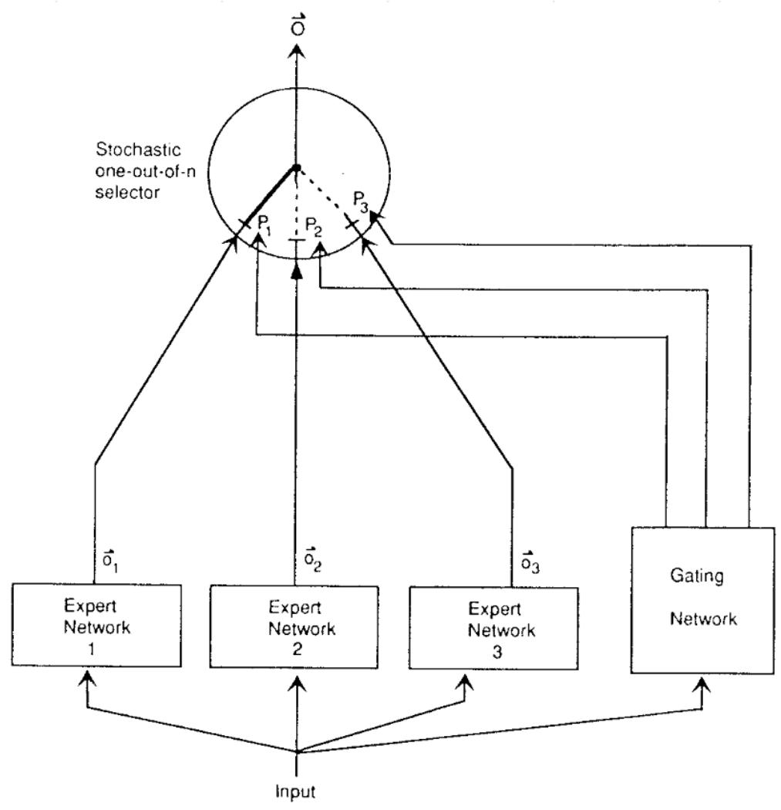
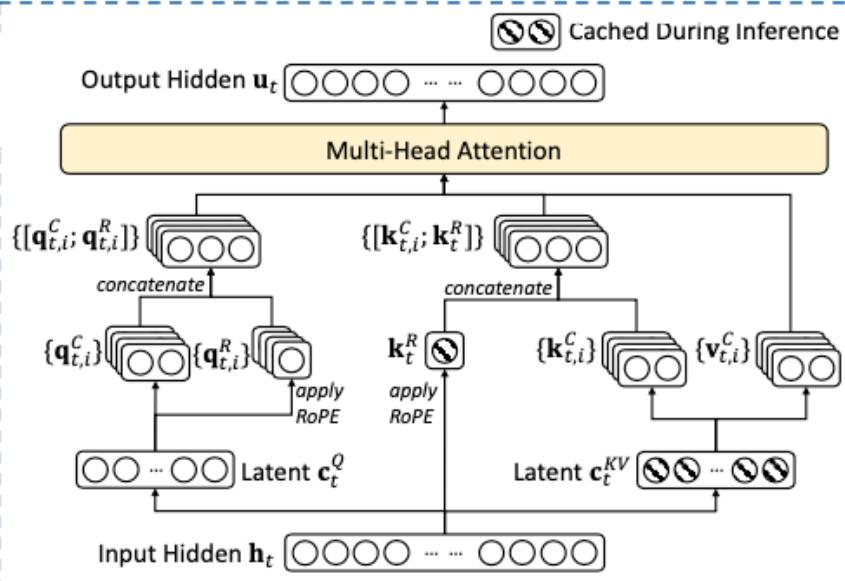

# 大模型发展全景与关键技术

# 目录

- Transformer架构的诞生与应用

• 注意力模型（Attention Model）：捕捉长距离依赖  
• 自注意力机制（Self-Attention）：语义理解的钥匙  

- 多头注意力（Multi-Head Attention）：并行计算不同子空间的特征  
- 位置编码（Positional Encoding）：引入序列位置信息

大模型技术突破与前沿趋势

大模型的定义与特点  
传统模型与大模型的差异  
• 稀疏注意力（Sparse Attention）：降低计算复杂度  

- 混合专家模型（MoE）：动态路由机制  
- 模型压缩与加速：量化、知识蒸馏

# Transformer架构的诞生与应用

# AI历史上的四次大发展

# 数据和算力增长推动深度学习的繁荣发展 (2010's)

# 人工智能 四轮技术特点对比

<table><tr><td>阶段</td><td>时间</td><td>代表性技术成果</td><td>数据规模</td><td>技术栈</td></tr><tr><td>弱人工智能</td><td>1950年-1990年</td><td>基于人工设计的规则系统</td><td>数百规则集</td><td>基于专家知识和规则的系统</td></tr><tr><td>统计机器学习</td><td>1990年-2012年</td><td>HMM, CTF, SVM反向传播,卷积网络</td><td>百万级标注数据</td><td>统计机器学习算法+算法包(scikit-learn,XGBoost)</td></tr><tr><td>深度学习</td><td>2013年-2018年</td><td>AlexNet, GoogLeNet,ResNet, Transformer</td><td>十亿级标注数据</td><td>深度神经网络+开发框架(TensorFlow, PyTorch)</td></tr><tr><td>大语言模型</td><td>2018年-至今</td><td>GPT-4, LLaMA, Claude DeepSeek, Qwen</td><td>全网万亿数据十亿用户反馈</td><td>预训练+微调(HuggingFace, DeepSpeed)</td></tr></table>

# 深度学习时期 核心网络架构

  
ResNet50 Model Architecture  
CNN

  
Transformer

# Transformer：开启大模型时代的里程碑架构

  
Multi-Head Attention

- 注意力模型（Attention Model）捕捉长距离依赖  
- 自注意力机制（Self-Attention）语义理解的钥匙  
- 多头注意力（Multi-Head Attention）并行计算不同子空间特征  
- 位置编码（Positional Encoding）引入序列位置信息

# 

# 开山之作 Neural Network Language Model (NNLM)

BENGIO, DUCHARME, VINCENT AND JAUVIN

概率分布统计 -> 目标函数优化: 统计学 -> 深度学习

$\mathrm{p}(\mathrm{w}|\mathrm{context}(\mathrm{w})) = \mathrm{F}(\mathrm{w},\mathrm{context}(\mathrm{w}),\theta)$

NNLM 是实现模型 F 的首次尝试:

$$
f (i, w _ {t - 1}, \dots , w _ {t - n + 1}) = g (i, C (w _ {t - 1}), \dots , C (w _ {t - n + 1}))
$$

g 表示神经网络，C(i) 是第 i 个词的特征向量（词向量）

模型训练方法:

$$
\begin{array}{l} L = \frac {1}{T} \sum_ {t} \log f \left(w _ {t}, w _ {t - 1}, \dots , w _ {t - n + 1}; \theta\right) + R (\theta), \\ \theta \leftarrow \theta + \varepsilon \frac {\partial \log \hat {P} \left(w _ {t} \mid w _ {t - 1} , \cdots w _ {t - n + 1}\right)}{\partial \theta} \\ \end{array}
$$

模型参数：  $\theta = (C, \omega)$

# RNN 支撑了早期语言模型的发展

语言模型的发展，体现在学习自然语言两个由浅入深的特征：语法与语义特性。

语法 (N-Gram): 通常只需考虑生成词的上下文, 属于局部特征。

语义（NNLM）：通常需要考虑的上下文就要长的多，N远大于3。

  
NNLM 普遍采用 RNN / LSTM 作为神经网络

两个问题:

1. 长距离依赖（梯度消失）  
2. 计算效率 (RNN难以并行)

# 注意力模型：捕捉长距离依赖

# 注意力模型最早应用于机器翻译问题

# Encoder-decoder Architecture with Attention Model

Table 1. Encoder-decoder architecture: traditional and with attention model  

<table><tr><td>Function</td><td>Traditional Encoder-Decoder</td><td>Encoder-Decoder with Attention</td></tr><tr><td>Encode</td><td>hi=f(xi, hi-1)</td><td>hi=f(xi, hi-1)</td></tr><tr><td>Context</td><td>c= hT</td><td>cj= ∑i=1Tαijhiαij= p(eij)eij=a sj-1, hi)</td></tr><tr><td>Decode</td><td>sj=f sj-1, yj-1, c)</td><td>sj=f sj-1, yj-1, cj)</td></tr><tr><td>Generate</td><td>yj=g(yj-1, sj, c)</td><td>yj=g(yj-1, sj, cj)</td></tr><tr><td colspan="3">x = (x1, ..., xT): input sequence, T: length of input sequence, hi: hidden states of encoder, c: context vector, αij: attention weights over input, sj: decoder hidden state, yj: output token, f, g: non-linear functions, a: alignment function, p: distribution function</td></tr></table>

  
(b)  
Fig. 2. Encoder-decoder architecture: (a) traditional (b) with attention model

Access entire input seq and focus on the relevant positions in the input seq

# Encoder-decoder Architecture with Attention Model

Table 1. Encoder-decoder architecture: traditional and with attention model  

<table><tr><td>Function</td><td>Traditional Encoder-Decoder</td><td>Encoder-Decoder with Attention</td></tr><tr><td>Encode</td><td>hi = f(xi, hi-1)</td><td>hi = f(xi, hi-1)</td></tr><tr><td rowspan="3">Context</td><td rowspan="3">c = hT</td><td>cj = ∑i=1Tαijhi</td></tr><tr><td>αij = p(eij)</td></tr><tr><td>eij = a(sj-1, hi)</td></tr><tr><td>Decode</td><td>sj = f sj-1, yj-1, c)</td><td>sj = f sj-1, yj-1, cj)</td></tr><tr><td>Generate</td><td>yj = g(yj-1, sj, c)</td><td>yj = g(yj-1, sj, cj)</td></tr></table>

$x = (x_{1},\dots,x_{T})$  : input sequence,  $T$  : length of input sequence,  $h_i$  : hidden states of encoder,  $c$  : context vector,  $\alpha_{ij}$  : attention weights over input,  $s_j$  : decoder hidden state,  $y_{j}$  : output token,  $f,g$  : non-linear functions,  $a$  : alignment function,  $p$  : distribution function

  
(b)  
Fig. 2. Encoder-decoder architecture: (a) traditional (b) with attention model

# Encoder-decoder Architecture with Attention Model

Table 1. Encoder-decoder architecture: traditional and with attention model  

<table><tr><td>Function</td><td>Traditional Encoder-Decoder</td><td>Encoder-Decoder with Attention</td></tr><tr><td>Encode</td><td>hi = f(xi, hi-1)</td><td>hi = f(xi, hi-1)</td></tr><tr><td rowspan="3">Context</td><td rowspan="3">c = hT</td><td>cj = ∑i=1Tαijhi</td></tr><tr><td>αij = p(eij)</td></tr><tr><td>eij = a sj-1, hi)</td></tr><tr><td>Decode</td><td>sj = f sj-1, yj-1, c)</td><td>sj = f sj-1, yj-1, cj)</td></tr><tr><td>Generate</td><td>yj = g(yj-1, sj, c)</td><td>yj = g(yj-1, sj, cj)</td></tr></table>

$x = (x_{1},\dots,x_{T})$  : input sequence,  $T$  : length of input sequence,  $h_i$  : hidden states of encoder,  $c$  : context vector,  $\alpha_{ij}$  : attention weights over input,  $s_j$  : decoder hidden state,  $y_{j}$  : output token,  $f,g$  : non-linear functions,  $a$  : alignment function,  $p$  : distribution function

$$
A (q, K, V) = \sum_ {i} p \left(a \left(k _ {i}, q\right)\right) * v _ {i}
$$

$$
\begin{array}{l l} k _ {i} = v _ {i} = h _ {i} & \text {I n s o m e c a s e s , t h e r e i s a l s o} \\ & \text {a d d i t i o n a l i n p u t o f v a l u e s V} \end{array}
$$

# Attention Mechanism

$$
A (q, K, V) = \sum_ {i} p (a (k _ {i}, q)) * v _ {i}
$$

![]

# 注意力模型：解决 RNNs 带来的问题

解决传统编码器-解码器模型的挑战，避免信息损失和无法建模输入输出对齐的问题。

允许解码器访问整个编码的输入序列，通过注意力权重选择性地关注相关信息。

自动学习注意力权重，捕捉编码器和解码器之间的相关性。

构建上下文向量，使解码器能够全面访问输入序列并重点关注相关部分。

提高模型性能，改善输出质量，并提供更好的解释性。

# 注意力模型：可视化效果

  
注意力模型学会了不同语言中的同义词

# 自注意力机制：语义理解的钥匙

# Key Components of Attention Modeling Techniques

# 自注意力机制：语义理解的钥匙

  
Transformer: Self-Attention Visualizations

# Self-attention

$\operatorname{Attention}(Q, K, V) = \operatorname{softmax}\left(\frac{Q K^T}{\sqrt{d_k}}\right)V$

Scaled Dot-Product Attention

  
Multi-Head Attention

# Self-attention

Attention  $(Q, K, V) = \operatorname{softmax}\left(\frac{Q K^{T}}{\sqrt{d_{k}}}\right) V$

$$
A (q, K, V) = \sum_ {i} p (a (k _ {i}, q)) * v _ {i}
$$

# Generalized Attention Model

$$
A (q, K, V) = \sum_ {i} p (\boxed {a (k _ {i}, q)}) * v _ {i}
$$

Table 2. Summary of Alignment Functions  

<table><tr><td>Function</td><td>Equation</td><td>References</td></tr><tr><td>similarity</td><td>a(ki,q) = sim(ki,q)</td><td>[Graves et al. 2014a]</td></tr><tr><td>dot product</td><td>a(ki,q) = qTki</td><td>[Luong et al. 2015a]</td></tr><tr><td>scaled dot product</td><td>a(ki,q) = qTwki</td><td>[Vaswani et al. 2017]</td></tr><tr><td>general</td><td>a(ki,q) = qTwi</td><td>[Luong et al. 2015a]</td></tr><tr><td>biased general</td><td>a(ki,q) = ki(Wq+b)</td><td>[Sordoni et al. 2016]</td></tr><tr><td>activated general</td><td>a(ki,q) = act(qTwKi+b)</td><td>[Ma et al. 2017b]</td></tr><tr><td>generalized kernel</td><td>a(ki,q) = φ(q)Tφ(ki)</td><td>[Choromanski et al. 2021]</td></tr><tr><td>concat</td><td>a(ki,q) = wTimpact(W[q;ki]+b)</td><td>[Luong et al. 2015a]</td></tr><tr><td>additive</td><td>a(ki,q) = wTimpact(W1q+W2ki+b)</td><td>[Bahdanau et al. 2015]</td></tr><tr><td>deep</td><td>a(ki,q) = wTimpE(L-1)+bL</td><td>[Pavlopoulos et al. 2017]</td></tr><tr><td></td><td>E(l) = act(WlE(l-1)+bl</td><td></td></tr><tr><td></td><td>E(1) = act(W1ki+W0q)+bl</td><td></td></tr><tr><td>location-based</td><td>a(ki,q) = a(q)</td><td>[Luong et al. 2015a]</td></tr><tr><td>feature-based</td><td>a(ki,q) = wTimpact(W1φ1(K)+W2φ2(K)+b)</td><td>[Li et al. 2019a]</td></tr></table>

$a(k_{i},q)$ : alignment function for query  $q$  and key  $k_{i}$ , sim: similarity functions such as cosine,  $d_{k}$ : length of input,  $(W,w_{imp},W_{0},W_{1},W_{2})$ : trainable parameters, b: trainable bias term, act: activation function.

# Transformer: Game Changer

  
Encoder-decoder architecture with Attention Network

  
The Transformer - model architecture.

# Transformer : Game Changer

  
seq-aligned RNNs

  
Transformer

# 注意力机制的特点和优势

1. 注意力机制有助于克服循环神经网络（RNNs）的一些挑战，例如输入序列长度增加时性能下降和顺序处理输入导致的计算效率低下。  
2. 在自然语言处理（NLP）、计算机视觉（Computer Vision）、跨模态任务和推荐系统等多个领域中，注意力机制已成为多项任务中的最先进模型，取得了显著的性能提升。  
3. 注意力机制不仅可以提高主要任务的性能，还具有其他优势。它们被广泛用于提高神经网络的可解释性，帮助解释模型的决策过程，使得原本被认为是黑盒模型的神经网络变得更易解释。这对于人们对机器学习模型的公平性、可追溯性和透明度的关注具有重要意义。

# 多头注意力：并行计算不同子空间的特征

# Multi-Head Attention

$\operatorname{Attention}(Q, K, V) = \operatorname{softmax} \left( \frac{Q K^T}{\sqrt{d_k}} \right) V$

$$
\begin{array}{l} \operatorname {M u l t i H e a d} (Q, K, V) = \operatorname {C o n c a t} (\operatorname {h e a d} _ {1}, \dots , \operatorname {h e a d} _ {\mathrm {h}}) W ^ {O} \\ \text {w h e r e} \quad \text {h e a d} _ {\mathrm {i}} = \text {A t t e n t i o n} \left(Q W _ {i} ^ {Q}, K W _ {i} ^ {K}, V W _ {i} ^ {V}\right) \\ \end{array}
$$

  
Scaled Dot-Product Attention  
Multi-Head Attention

# Multi-Head Attention

# 多头注意力机制：并行学习不同子空间特征

# 前馈网络（Feed Forward）：全连接层

$$
\operatorname {F F N} (x) = \max  \left(0, x W _ {1} + b _ {1}\right) W _ {2} + b _ {2}
$$

# Transformer : Encoder - Decoder

# Transformer : A High-Level Look

# Transformer : A Specific-Level Look

# Transformer:3D可视化结构

# Transformer:3D可视化结构

Head 2

# Transformer : Beat Previous SOTA

Table 2: The Transformer achieves better BLEU scores than previous state-of-the-art models on the English-to-German and English-to-French newstest2014 tests at a fraction of the training cost.  

<table><tr><td rowspan="2">Model</td><td colspan="2">BLEU</td><td colspan="2">Training Cost (FLOPs)</td></tr><tr><td>EN-DE</td><td>EN-FR</td><td>EN-DE</td><td>EN-FR</td></tr><tr><td>ByteNet [18]</td><td>23.75</td><td></td><td></td><td></td></tr><tr><td>Deep-Att + PosUnk [39]</td><td></td><td>39.2</td><td></td><td>1.0·1020</td></tr><tr><td>GNMT + RL [38]</td><td>24.6</td><td>39.92</td><td>2.3·1019</td><td>1.4·1020</td></tr><tr><td>ConvS2S [9]</td><td>25.16</td><td>40.46</td><td>9.6·1018</td><td>1.5·1020</td></tr><tr><td>MoE [32]</td><td>26.03</td><td>40.56</td><td>2.0·1019</td><td>1.2·1020</td></tr><tr><td>Deep-Att + PosUnk Ensemble [39]</td><td></td><td>40.4</td><td></td><td>8.0·1020</td></tr><tr><td>GNMT + RL Ensemble [38]</td><td>26.30</td><td>41.16</td><td>1.8·1020</td><td>1.1·1021</td></tr><tr><td>ConvS2S Ensemble [9]</td><td>26.36</td><td>41.29</td><td>7.7·1019</td><td>1.2·1021</td></tr><tr><td>Transformer (base model)</td><td>27.3</td><td>38.1</td><td colspan="2">3.3·1018</td></tr><tr><td>Transformer (big)</td><td>28.4</td><td>41.8</td><td colspan="2">2.3·1019</td></tr></table>

# 位置编码：引入序列位置信息

# Embedding

# Attention

# MLPs

# Unembedding

并行计算的挑战：为何需要位置信息？

• 序列模型的演进：传统的循环神经网络（RNN）及其变体（LSTM, GRU）通过顺序处理输入序列，其隐藏状态天然地编码了词语的上下文和位置信息。  
• Transformer 的优势: Transformer 架构的核心是自注意力机制, 它允许模型并行处理整个输入序列, 极大地提高了计算效率和捕捉长距离依赖的能力。  

- 并行化的代价：然而，纯粹的自注意力计算会同时关注序列中的所有词语，计算每个词与其他所有词之间的关系。在这个过程中，模型并不知道词语在原始序列中的位置或顺序。  
  • 信息丢失：如果不引入额外的位置信息，“我爱你”和“你爱我”这两个句子，虽然词语相同，但顺序不同，含义完全相反。仅依赖自注意力机制，模型难以区分这种顺序差异。  
  • 结论：Transformer需要一种显式的方法，将序列中每个词语的位置信息注入到其向量表示中，以便模型能够理解词语之间的顺序和相对距离。

# Transformer 方案：固定位置编码 (Sinusoidal PE)

灵感来源：Transformer 论文提出了一种基于正弦和余弦函数的固定（Non-learnable）位置编码方法。  
• 基本思想：为序列中的每个位置 (pos) 和词嵌入向量中的每个维度 (i) 生成一个特定的值。  
• 目标：使相加后的向量 Embedding + PE 既包含词语语义，也包含位置信息。

编码方式：将生成的编码向量直接加到（Element-wise addition）对应的词嵌入向量上。

数学公式：

$$
P E _ {(p o s, 2 i)} = \sin (p o s / 1 0 0 0 0 ^ {2 i / d _ {\mathrm {m o d e l}}})
$$

$$
P E _ {(p o s, 2 i + 1)} = \cos (p o s / 1 0 0 0 0 ^ {2 i / d _ {\mathrm {m o d e l}}})
$$

• 其中 pos 是词语在序列中的位置, i 是词嵌入的维度索引,  $d_{\text {model }}$  是词嵌入的总维度。

# 固定位置编码的特性与优势

- 周期性：由于使用了正弦和余弦函数，位置编码具有周期性。这意味着不同位置之间可以通过简单的线性变换关联起来，有助于模型捕捉相对位置信息。  
  • 相对位置: 对于任意相对偏移  $k$ ,  $P E(\text {pos} + k)$  可以表示为  $P E(\text {pos})$  的线性函数。这允许模型关注相对位置关系, 而不是仅依赖绝对位置。  
- 泛化能力：固定位置编码不需要学习参数，并且公式设计允许它理论上可以编码任意长度的序列位置。即使在训练时只见过短序列，模型也能处理更长的序列（尽管实际效果可能受其他因素限制）。  
- 计算效率：位置编码是预先计算或根据公式计算的，不增加额外的模型参数和显著的计算量。  
  • 维度关联：不同维度的正弦/余弦函数具有不同的波长，这使得每个位置的编码向量在不同维度上是独特的，并且能够区分不同的位置。

  
Male-Female

  
Verb tense

  
Country-Capital

# 探索相对位置信息：相对位置编码 (Relative PE)

- 目标：更自然地建模相对位置关系。（应用模型：Transformer-XL，T5）  
  • 动机：许多任务中，词语之间的相对距离比它们的绝对位置更重要。例如，在解析句子时，谓语和其宾语的相对位置关系很关键，而它们在整个长文本中的绝对位置可能变化很大。  
- 核心思想：修改注意力机制的计算方式，使其能够直接感知或利用 Query 和 Key 之间的相对距离。

实现方式：

- 不是计算  $\mathrm{Q}^{*} \mathrm{K}^{\wedge} \mathrm{T}$ , 而是在计算注意力分数时, 引入一个与 Query 和 Key 之间相对距离相关的项。  
- 这个相对距离项可以是可学习的嵌入向量，或者由相对距离计算得到的值。

# 前沿技术：旋转位置编码 (RoPE - Rotary PE)

- 背景：近年在大模型中非常流行的方法，例如DeepSeek, LLaMA, Qwen等都采用了RoPE。  
- 核心思想：RoPE 通过对 Query (Q) 和 Key (K) 向量应用一个与位置相关的旋转操作来注入位置信息。  
- 优点：

- 外推性更强：理论上可以应用于比训练时更长的序列，因为相对位置关系保持一致。  
- 长文本支持：在 128K 长上下文场景下仍能保持较好的位置感知能力。  
- 泛化性更强：模型无需显式存储所有位置组合，只需通过旋转角度的差值计算相对位置关系，  
- 计算高效：可与 FlashAttention 等优化技术结合，提升训练和推理速度。

实现方式:

- 对于 Query 向量 q 和 Key 向量 k 在位置 m 和 n, RoPE 定义了一个旋转函数 R(pos, v)。  
  修改注意力分数计算为: Attention Score(m, n) = R(m, q) * R(n, k)^T  
  • 旋转函数  $R(\mathrm{pos}, \mathrm{v})$  的设计使得  $R(m, q) * R(n, k)^{\wedge} T$  只依赖于相对距离  $m - n$  。

  
Fig 1.  
(2,D) Position encoding at position 1

  
Fig 2.  
(2,D) Position encoding at position 2

  
(2,D) Position encoding at position 5  
Fig 3.

  
(2,D) Consistent difference in positional encoding of 2 words that are two words apart, regardless of sentence length  
Fig 4.

# 位置编码技术对比与总结

<table><tr><td>特性</td><td>固定位置编码(Absolute PE)</td><td>相对位置编码(Relative PE)</td><td>旋转位置编码(RoPE)</td></tr><tr><td>代表方法</td><td>Transformer的sin/cos编码</td><td>T5的注意力偏置、ALiBi(如MPT、BLOOM)</td><td>DeepSeek-V2/V3、Qwen、LLaMA</td></tr><tr><td>核心思想</td><td>为每个绝对位置生成固定编码,直接加到词嵌入上。</td><td>通过注意力分数中的偏置项(bias)建模相对位置关系。</td><td>通过旋转矩阵变换Query/Key,隐式编码相对位置。</td></tr><tr><td>位置信息类型</td><td>绝对位置</td><td>相对位置</td><td>相对位置</td></tr><tr><td>外推性</td><td>弱(超出训练长度需微调)</td><td>中等(ALiBi外推较好)</td><td>强(支持超长上下文,如128K)</td></tr><tr><td>计算复杂度</td><td>低(预计算固定编码)</td><td>中等(需计算/存储偏置矩阵)</td><td>低(融合到Q/K计算中)</td></tr><tr><td>显存占用</td><td>低(固定编码表)</td><td>中等(偏置矩阵随序列长度增长)</td><td>低(无额外参数)</td></tr><tr><td>优点</td><td>简单易实现,适合短文本。</td><td>显式建模相对位置,适合任务如机器翻译。</td><td>长文本友好,泛化性强,兼容高效注意力优化(如FlashAttention)。</td></tr><tr><td>缺点</td><td>难以泛化到更长序列。</td><td>偏置项设计需人工干预(如ALiBi的线性衰减)。</td><td>旋转计算可能增加少量开销(但可优化)。</td></tr></table>

# 大模型技术突破与前沿趋势

# OpenAI: GPT 家族技术迭代与改进（2018-2023）

# OpenAI

  
Fig. 3: A brief illustration for the technical evolution of GPT-series models. We plot this figure mainly based on the papers, blog articles and official APIs from OpenAI. Here, solid lines denote that there exists an explicit evidence (e.g., the official statement that a new model is developed based on a base model) on the evolution path between two models, while dashed lines denote a relatively weaker evolution relation.

# DeepSeek V2 横空出世（2024年5月）

提出MLA与DeepSeekMoE架构，大幅降低训练成本，提升模型性能

  
(a)

  
(b)

  
DeepSeek R1 赶超 OpenAI o1（2025年1月）

# 大模型的定义与特点

# 到底啥是大模型？

核心就一个字: “大”!

# 大模型到底有多大?

# 大模型有什么特点?

# 大模型特点一：参数规模巨大

<table><tr><td>模型</td><td>参数规模</td><td>推理显存需求(估计)</td><td>说明</td></tr><tr><td>AlexNet</td><td>~6000万(0.06B)</td><td>较低(&lt;1GB)</td><td>经典的图像分类CNN,参数量很小。</td></tr><tr><td>ResNet50</td><td>~2500万(0.025B)</td><td>较低(&lt;1GB)</td><td>经典的图像识别CNN主干网络,参数量比AlexNet还小。</td></tr><tr><td>GPT-3(davinci)</td><td>1750亿(175B)</td><td>约350GB(FP16)约175GB(INT8)</td><td>早期的超大型语言模型,需多张高端GPU并行。</td></tr><tr><td>LLaMA3-70B</td><td>700亿(70B)</td><td>约140GB(FP16)约70GB(INT8)</td><td>近期高性能开源密集型语言模型,FP16需多张高端GPU,INT8可能在单张80GB+GPU上运行。</td></tr><tr><td>DeepSeek-V3(MoE)</td><td>总计6710亿(671B)激活370亿(37B)</td><td>FP8:约1.1-1.2 TBBF16:约2.1-2.3 TBINT8:约620-720 GBINT4:约416-516 GB</td><td>混合专家模型(MoE),推理时仅激活部分专家(约37B参数),但需加载全部专家权重。显存需求取决于参数精度(如FP8、BF16、INT8、INT4)和上下文长度等因素。FP8精度在支持的GPU上运行效率最高,BF16精度在不支持FP8的硬件上作为替代方案。通过量化技术(如INT8、INT4)可显著降低显存需求,但可能影响推理精度。</td></tr></table>

# 大模型特点二：训练数据海量

GPT-3 预训练数据集 Tokens 超 5000 亿  

<table><tr><td>Dataset</td><td>Quantity (tokens)</td><td>Weight in training mix</td><td>Epochs elapsed when training for 300B tokens</td></tr><tr><td>Common crawl (filtered)</td><td>410 billion</td><td>60%</td><td>0.44</td></tr><tr><td>WebText2</td><td>19 billion</td><td>22%</td><td>2.9</td></tr><tr><td>Books1</td><td>12 billion</td><td>8%</td><td>1.9</td></tr><tr><td>Books2</td><td>55 billion</td><td>8%</td><td>0.43</td></tr><tr><td>Wikipedia</td><td>3 billion</td><td>3%</td><td>3.4</td></tr></table>

LLaMA 1 预训练数据集 Tokens 超万亿  

<table><tr><td>Dataset</td><td>Sampling prop.</td><td>Epochs</td><td>Disk size</td></tr><tr><td>CommonCrawl</td><td>67.0%</td><td>1.10</td><td>3.3 TB</td></tr><tr><td>C4</td><td>15.0%</td><td>1.06</td><td>783 GB</td></tr><tr><td>Github</td><td>4.5%</td><td>0.64</td><td>328 GB</td></tr><tr><td>Wikipedia</td><td>4.5%</td><td>2.45</td><td>83 GB</td></tr><tr><td>Books</td><td>4.5%</td><td>2.23</td><td>85 GB</td></tr><tr><td>ArXiv</td><td>2.5%</td><td>1.06</td><td>92 GB</td></tr><tr><td>StackExchange</td><td>2.0%</td><td>1.03</td><td>78 GB</td></tr></table>

Table 1: Pre-training data. Data mixtures used for pretraining, for each subset we list the sampling proportion, number of epochs performed on the subset when training on 1.4T tokens, and disk size. The pre-training runs on 1T tokens have the same sampling proportion.

DeepSeek-v3 预训练数据集 Tokens 14.8万亿

# 大模型特点三：令人惊艳的“涌现能力” (Emergent Abilities)

- 涌现：当模型超过一定规模（GPT-3开始），会突然表现出一些之前小模型不具备的、没有被直接训练过的新能力。

- 上下文学习 (In-context Learning): 不用重新训练, 直接给几个例子, 它就能照猫画虎完成新任务。  
- 思维链 (Chain-of-Thought): 引导它一步步思考, 能解决更复杂的推理问题。  
- 零样本/少样本学习 (Zero/Few-shot Learning): 没见过或只见过少量样本的任务, 也能做得不错。

- 原因：目前还没有完全搞清楚，但普遍认为跟规模跨越某个“临界点”有关。

# 大模型特点四：强大的泛化与通用性

- 泛化性强：在训练数据中学习到的知识和模式，能很好地应用到没见过的新数据和新任务上。  
- 通用性好 (Foundation Models):

- 大模型被设计为“基础模型”，不只是为了一个特定任务训练，而是具备广泛的底层能力（如语义理解、逻辑推理）。  
- 在这个基础上，通过简单的“提示”(Prompting)或者少量的“微调”(Fine-tuning)，就能让它适应各种五花八门的下游任务。比如：同一个大语言模型，可以用来做翻译、写摘要、当客服、写代码、创作故事等。

# 传统模型与大模型的差异

# 人工智能三大核心：数据、算力、算法

人工智能的成功依赖于数据、算力和算法协同作用，缺一不可。与道家炼丹的原理有异曲同工之妙。

# 数据  $\Rightarrow$  药材

- 数据是人工智能的基础，就像炼丹中的药材。炼丹需要精选各种药材，不同的药材组合决定了丹药的效果。  
- 数据的种类、数量和质量直接影响模型的性能。

# 算力  $\Rightarrow$  炉火

- 算力是人工智能的驱动力，就像炼丹中的炉火。炼丹需要控制火候，火太弱则丹药无法成形，火太猛则可能毁掉药材。  
- 算力决定了模型训练的速度和规模，算力不足会导致训练缓慢，算力过剩则可能浪费资源。

# 算法  $\Rightarrow$  丹方

- 算法是人工智能的核心逻辑，就像炼丹中的丹方。丹方是炼丹的关键，决定了药材如何搭配、火候如何控制，最终决定丹药的功效。  
- 算法决定了如何处理数据、优化模型，最终影响人工智能的表现。

  
豆包 AI 提示词：生成一个中国正一派道士正在山中炼丹的图，  
包含：道士，炼丹炉、药材、药方书籍（如：抱朴子）。

# 传统模型与大模型的差异

规模量级

训练范式与 训练成本

能力与表现

开发与使用哲学

# 差异一：规模的“量级”之差

# 参数数量：

- 传统模型：几千 (k) 到几百万 (M)，少数能到千万级别。  
- 大模型：几十亿 (B) 到上万亿 (T)。至少差了 3-6 个数量级！

# 训练数据量：

- 传统模型：通常用精心处理过的、相对较小的数据集 (MBs 或 GBs)。  
- 大模型：需要互联网级别的数据 (TBs 或 PBs)。也差了几个数量级！

# 差异二：训练范式与成本

# - 训练范式：

- 传统模型：通常是“从零开始为特定任务训练”。每个新任务基本都要重新收集数据、设计模型、训练。  
- 大模型：“预训练 + 微调/指令跟随 + 后训练”范式。

- 预训练：用海量通用数据训练一个基础大模型，这个过程极其耗时耗钱。  
- 微调/指令跟随：在基础模型上，用少量特定任务数据或巧妙的指令，快速适配新任务/提升任务指令响应。  
- 后训练：使用强化学习，提升模型的深度思考和原生CoT能力，为复杂长任务的解决提供基础。

# - 训练成本 (时间、金钱、算力):

- 传统模型：几小时到几天，单张或几张GPU/CPU就能搞定，成本相对可控。  
- 大模型：几周到几个月，需要数百甚至数千张高端GPU/TPU并行计算，成本动辄几千万美金以上。

# BERT: 预训练+微调范式

# 差异三：能力与表现的差异

“智能”程度：

- 传统模型：通常在一个或少数几个任务上表现良好，很难泛化到新任务。  
- 大模型：惊人的“涌现能力”，如零样本/少样本学习、复杂推理等，适应范围更广，有望实现通用人工智能。

性能上限：

传统模型：

- 受限于其规模和设计，性能提升到一定程度后容易遇到瓶颈。  
  传统模型像个“专科医生”，在特定领域知识渊博。

大模型：

- 展现和验证了 Scaling Laws, 即参数、数据、算力越大, 性能往往越好, 潜力似乎更大。  
- 大模型像个拥有“通识百科全书”并能融会贯通的“全科超级医生”。

# ChatGPT:世界知识的神经网络化

  
世界知识的神经网络化表示 + 超强的AI生成能力

ChatGPT是知识模型与算法模型的混合体：大模型将海量知识（以文字序列为主）预先学习进神经网络中，与传统以算法为主的模型不同，ChatGPT训练的是富含知识的模型

# 差异四：开发与使用哲学

# 模型开发：

- 传统模型：为每个新问题“量身定做”一个新模型。更像是“手工作坊”模式。  
- 大模型：倾向于打造一个或少数几个超强的“基础模型/底座模型”(Foundation Model)，然后通过微调或提示工程来适配各种应用。更像是“工业化平台”模式。

# - 使用方式:

- 传统模型：调用 API，输入数据，得到特定输出。  
- 大模型：除了传统 API 调用，“提示工程”(Prompt Engineering) 成为一种新的、重要的交互和使用方式，通过设计巧妙的自然语言指令来引导模型完成任务。

# 生态影响:

传统模型：技术门槛相对分散。  

- 大模型：由于高昂的训练成本，核心基础模型的研发更集中在少数拥有雄厚资源的大公司或机构手中，但其能力通过 API 或开源形式赋能了广泛的开发者和应用。

# 稀疏注意力：降低计算复杂度

# 稀疏注意力（Sparse Attention）：应对长序列挑战

• 问题: 标准的 Transformer 自注意力机制计算复杂度为  $O(N^{2})$ , 其中  $\mathbf{N}$  是序列长度。对于长文本 (如文档、书籍), 计算量和内存消耗呈平方级增长, 落地困难。  
• 目标：在处理长序列时，降低计算复杂度，尽可能保留模型捕捉长距离依赖的能力。  
• 核心思想：不再让每个词都关注序列中的所有其他词，而是只关注序列中经过精心选择的一小部分词。  
• 如何选择关注点？设计不同的“稀疏模式”（Sparse Patterns），例如：

- 只关注固定窗口内的词（Local Attention）。  
  • 关注特定位置的词（如句首/句尾，Global Attention）。  
- 基于某种规则或学习到的模式选择关注点。

  
(a) Transformer

  
Fixed Sparsity Structure

  
(b) Sparse Transformer (strided)

# Facebook AI: Longformer (2020)

- Longformer 有效建模了长距离依赖，将计算复杂度降低到线性  $O(N)$ ，适用于长文本分类、问答等任务。  
- 核心思想：结合了局部注意力和全局注意力。

- 局部注意力 (Local Attention): 每个 Token 只关注其周围一个固定大小窗口内的 Token。这捕捉了词语与其近邻之间的关系, 类似于卷积核的作用, 计算量是  $O(N * \text{window_size})$ , 即  $O(N)$  。  
- 全局注意力(Global Attention): 允许序列中特定 Token (如句子开头/结尾标记 [CLS]/[SEP] 或特定任务 Token) 关注整个序列中的所有 Token, 并且被整个序列中的所有 Token 关注。这提供了跨越长距离的信息传递路径。

  
(a) Full  $n^2$  attention

  
(b) Sliding window attention

  
(c) Dilated sliding window

  
(d) Global+sliding window

# Google AI: BigBird (2020)

- 在Longformer的基础上，Google AI提出了BigBird，旨在进一步提升长序列模型的连接性和能力。  
- 核心思想：在局部注意力和全局注意力（与Longformer相似）的基础上，增加了随机注意力。

随机注意力 (Random Attention): 对于序列中的每个 Token, 随机地选择序列中的少量其他 Token 进行关注。这些随机连接虽然数量少, 但能有效缩短序列中任意两个 Token 之间的平均路径长度, 促进信息在整个序列中快速传播。  
• 优势：随机注意力的引入增强了模型对长序列信息的捕获能力。BigBird 在理论上被证明是图灵完备的（即具有通用图计算能力），能够更好地处理各种复杂的长序列依赖。

# 混合专家模型（MoE）：动态路由机制

# MoEs 开山鼻祖: 自适应局部专家混合 (Adaptive Mixtures of Local Experts, 1991)

1. 混合专家模型：提出了一种有效减弱干扰效应的模型结构，设立多个独立的子网络（“专家”）来处理不同的输入数据子集（子任务），从而实现学习网络独立的权重更新。  
2. 门控网络：除了专家网络，这个模型还引入了一个称为“门控网络”（Gating Network）的结构。门控网络的职责，根据输入数据决定使用哪个专家网络（或组合）处理当前输入。  
3. 自适应学习：同时对每个专家和门控网络进行训练，模型可以根据数据自适应地改变每个专家的权重和作用。

# 深度 MoEs ( Learning Factored Representations in a Deep Mixture of Experts ,2013)

1. 层次化 MoE: 提出一种将深度神经网络与混合专家模型相结合的架构 (DMoE), 支持将DNN中的层作为MoE来训练, 使其能够应用于更深层次的网络结构。  
2. 分解表示输入: 该模型着重于学习输入数据的分解表示 (factored representations), 这意味着每个专家网络学习数据的一部分特征或模式, 而这些特征在整个模型中被综合起来形成完整的数据表示。  
3. 3.高效处理复杂数据：相比MoE（a）每个专家直接处理全量输入数据，DMoE（b）通过在深度网络中应用分解表示和专家模型，使得模型可以更有效地处理高维和复杂的数据集。

# Hinton 和 Jeff Dean 合作发表稀疏门控 MoE (2017 ICLR)

# 主要贡献

1. 构建大型MoE模型：提出了一种模型架构，在堆叠的LSTM层之间卷积应用高达1370亿参数的MoEs。  
2. 引入稀疏性概念：研究中介绍了由数千个前馈子网络组成的Sparsely-Gated Mixture-of-Experts层（MoE）。通过训练的门控网络为每个样例确定使用哪些专家的稀疏组合。  
3. 实现了条件计算（网络的某些部分仅针对特定样本激活）目标：使得在不增加计算量的情况下扩大模型规模成为可能，从而在每层MoE中使用了数千名专家。

$$
y = \sum_ {i = 1} ^ {n} G (x) _ {i} E _ {i} (x)
$$

# GShard: 基于 MoE 探索巨型 Transformer 网络（Google, 2020）

Transformers 模型展示了一个明显的趋势：增加参数的数量可以显著提高性能。Google GShard 项目正是在这方面进行了深入探索，试图将 Transformers 模型扩展到超过 6000 亿个参数。

  
GShard: 基于 MoE 探索巨型 Transformer 网络（Google, 2020）

# Mixtral 8x7B 稀疏专家模型（Mistral AI, 2024）

Mixtral 8x7B 是一种decoder-only 的模型，每层由 8 个前馈块（即专家）组成。对于每个 token，在每一层，路由器网络都会选择两名专家来处理当前状态并组合他们的输出。尽管每个 token 只看到两个专家，但所选的专家在每个时间步上都可能不同。因此，每个 token 可以访问 47B 参数，但在推理过程中仅使用 13B 激活参数。

  

# DeepSeek-V2 提出 DeepSeekMoE (DeepSeek, 2024)

细粒度专家分割：将专家划分为更细粒度（如160个路由专家），并通过2个共享专家隔离减少冗余，提升专家专业化能力。

设备限制路由与负载平衡：引入设备级路由限制（每 token最多访问3台设备）和三级平衡损失（专家级、设备级、通信级），降低并行通信开销，同时通过Token丢弃策略缓解负载不均问题。

参数激活稀疏性：每个token仅激活21B参数（总参数236B），结合专家并行和优化框架（HAI-LLM），训练成本较DeepSeek 67B降低42.5%（每万亿token消耗172.8K GPU小时）。

混合精度与算子优化：使用FP8参数和6位KV缓存量化，结合定制化的CUDA内核（如FlashAttention-2改进版）提升计算效率。

  
DeepSeekMoE

  
Multi-Head Latent Attention (MLA)

# 模型压缩与加速：量化、知识蒸馏

# 模型压缩与加速：让大模型更易用

- 问题：大模型虽然强大，但其巨大的体积和计算需求限制了在资源受限环境（如移动设备、边缘计算）上的部署和应用，也增加了推理成本。  
- 目标：在尽量不损失模型性能的前提下，减小模型体积、降低计算量、提高推理速度。

# 主要技术方向：

- 模型剪枝 (Pruning): 移除模型中不重要的参数（权重、连接、甚至神经元）。  
- 模型量化 (Quantization): 降低模型参数和计算的数值精度。  
- 知识蒸馏 (Knowledge Distillation): 用大模型的输出/行为指导训练一个小模型。  
- 网络结构搜索 (NAS) / 低秩分解 (Low-Rank Factorization) 等。

# 模型压缩：量化

- 核心思想：将模型中的浮点数（如 FP32）参数和/或激活值转换为低精度整数（如 INT8）或半精度浮点数（如 FP16）。  
- 好处:

- 减小模型体积：INT8 参数存储只需 FP32 的 1/4 空间。  
- 加速计算：低精度计算通常更快（特别是硬件支持 INT8 计算），能效比更高。  
- 降低内存带宽需求：读写参数更快。

常见精度：

- FP16 (半精度浮点): 训练和推理中常用, 相较 FP32 加速明显, 精度损失较小。  
- INT8 (8位整数): 推理中常用, 能带来显著的体积和速度优势, 但可能需要更精细的处理以减少精度损失。  
- 更低比特 (INT4, INT1, Binary): 更极致的压缩，但精度损失更大，实现更复杂。

方法：

- 训练后量化(Post-Training Quantization, PTQ): 模型训练完成后直接进行量化。  
- 量化感知训练 (Quantization-Aware Training, QAT): 在训练过程中模拟量化，使模型对量化更鲁棒。

# DeepSeek-V3 推理显存需求 (估计)

<table><tr><td>精度类型</td><td>参数存储需求</td><td>运行时上下文</td><td>KV Cache (估计)</td><td>总显存需求(估计)</td><td>说明</td></tr><tr><td>FP8</td><td>~700 GB</td><td>~140 GB</td><td>200-300 GB</td><td>1.1-1.2 TB</td><td>DeepSeek-V3 原生支持的精度，需 FP8 支持的 GPU（如 H100、H200）</td></tr><tr><td>BF16</td><td>~1.4 TB</td><td>~280 GB</td><td>400-600 GB</td><td>2.1-2.3 TB</td><td>在不支持 FP8 的 GPU 上运行（如 A100、Ascend 910B），精度较高但显存需求翻倍</td></tr><tr><td>INT8</td><td>~350 GB</td><td>~70 GB</td><td>200-300 GB</td><td>620-720 GB</td><td>通过量化技术降低显存需求，适用于资源受限的环境，可能影响精度</td></tr><tr><td>INT4</td><td>~180 GB</td><td>~36 GB</td><td>200-300 GB</td><td>416-516 GB</td><td>极端压缩，显存占用最低，但可能导致推理精度显著下降</td></tr></table>

# 模型压缩: 知识蒸馏 (Knowledge Distillation)

• 核心思想：利用一个已经训练好的、性能强大的大模型（“教师模型”）的知识，来训练一个更小、更快的模型（“学生模型”）。  

- 训练过程：

1. 教师模型对输入数据进行预测，得到“软目标”（Soft Targets），例如 Softmax 输出的概率分布，包含比硬标签（Hard Labels）更丰富的类别间关系信息。  
2. 学生模型也对相同输入进行预测，得到自己的软目标。  
3. 训练学生模型，使其输出的软目标尽可能接近教师模型的软目标（例如，使用KL散度作为损失函数）。  
4. 同时，学生模型也可以使用原始的硬标签进行训练（常规的交叉熵损失），通常是结合两种损失进行优化。

- 优势：学生模型可以用比教师模型少得多的参数，达到接近教师模型甚至超越直接用硬标签训练的同等规模小模型的性能。  
- 应用：生成更适合部署到移动端或推理成本敏感场景的模型。

# DeepSeek-R1 生成推理数据集，蒸馏 Qwen 和 LLaMA

<table><tr><td>模型名称</td><td>用途</td><td>特点</td><td>类型</td></tr><tr><td>DeepSeek-R1-Distill-Qwen-1.5B</td><td rowspan="4">个人开发、学术研究</td><td rowspan="4">部署成本低、能力有限</td><td rowspan="4">蒸馏模型（小尺寸）</td></tr><tr><td>DeepSeek-R1-Distill-Qwen-7B</td></tr><tr><td>DeepSeek-R1-Distill-Llama-8B</td></tr><tr><td>DeepSeek-R1-Distill-Qwen-14B</td></tr><tr><td>DeepSeek-R1-Distill-Qwen-32B</td><td rowspan="2">商业化产品开发集成</td><td>成本适中，中文场景能力强</td><td>蒸馏模型（最大尺寸）</td></tr><tr><td>DeepSeek-R1-Distill-Llama-70B</td><td>成本偏高，中文能力差</td><td>蒸馏模型（最大尺寸）</td></tr><tr><td>DeepSeek-R1-67IB</td><td>政府和国央企等综合应用</td><td>成本高，最接近通用人工智能</td><td>满血版</td></tr></table>

# 总结：大模型的前沿趋势

效率优化：稀疏注意力、MoE等技术是解决规模扩大带来计算瓶颈的关键。

多模态融合：将文本、图像、音频、视频等多种模态数据集成到统一模型中，实现更全面的感知和生成能力。

Agent 与具身智能：让大模型能够与环境交互，执行复杂任务，迈向更智能的应用形态。

模型压缩与部署：将大模型能力普惠化，使其能在更多设备和场景下运行。