# DeepSeek 篇:大模型应用与 Agent 开发入门

## 一、AI大模型四阶技术对比

<table><tr><td>技术阶段</td><td>面向人群</td><td>技术积累</td><td>应用场景</td><td>特征总结</td></tr><tr><td>提示工程(Prompt Engineering)</td><td>终端用户</td><td>对ChatGPT等应用的提示词有基础的了解和使用</td><td>文本生成、机器翻译等</td><td>门槛低，易于上手</td></tr><tr><td>AI智能体(Agents)</td><td>大模型应用开发人员</td><td>了解大模型基础原理和理论，熟悉特定领域的业务逻辑和流程</td><td>自动客服、虚拟助手</td><td>侧重于交互性和用户体验</td></tr><tr><td>大模型微调(Fine-tuning)</td><td>领域模型研发、私有化团队</td><td>掌握神经网络和机器学习概念，有数据处理和模型训练经验</td><td>语义理解、领域知识学习</td><td>通用性强、性价比高</td></tr><tr><td>预训练技术(Pre-training)</td><td>大模型研究人员、数据科学家</td><td>熟悉深度学习原理和网络架构，有大规模数据处理和模型训练经验</td><td>多模态学习、语言模型预训练</td><td>前期投入大、效果显著</td></tr></table>

## 二、目录

- DeepSeek 国运级爆火的现象与本质  

- DeepSeek 等前沿大模型技术发展现状  

- DeepSeek 应用开发快速入门

- DeepSeek 提示工程核心原则与技巧  

- DeepSeek 文案生成和迭代实践  

- DeepSeek 代码生成和测试实践

- DeepSeek 里程碑模型与关键技术  

- DeepSeek-R1 开启推理大模型新篇章

  一阶段训练：RL自进化成果DeepSeek-R1-Zero  
  二阶段训练：RL与SFT共舞诞生DeepSeek-R1  
  三阶段训练：推理能力蒸馏（Distill）迁移至小模型

## 三、DeepSeek 国运级爆火的现象与本质

2月17日，中共中央总书记、国家主席、中央军委主席习近平《民营企业座谈会》。DeepSeek 梁文锋出席。

1月20日，中共中央政治局常委、国务院总理李强《总理座谈会》。DeepSeek创始人梁文锋出席并发言。

DeepSeek-全球增速最快AI应用，仅上线18天日活1500万，增速是ChatGPT的13倍

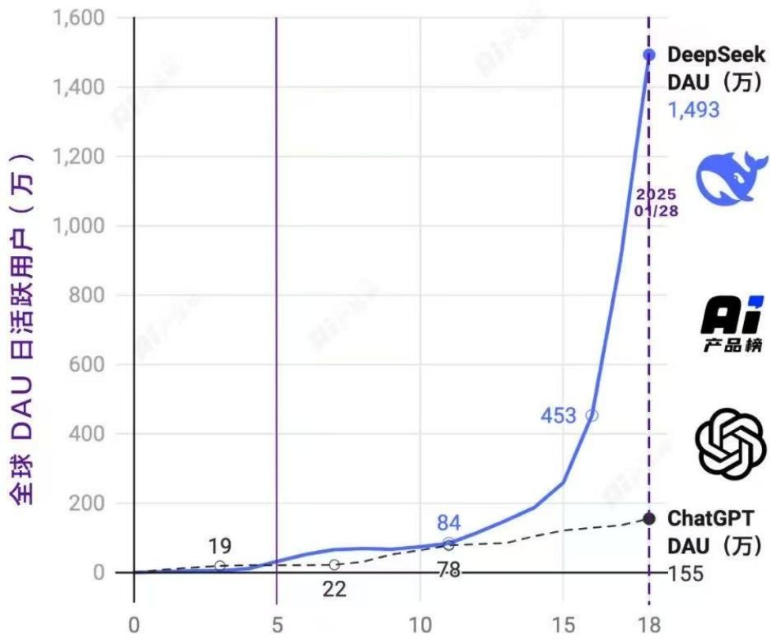  

微软、英伟达、亚马逊全部接入DeepSeek！吴恩达表示：如果美国继续妨碍开源，AI供应链的这一环节就将由中国主导。

超级产品增长1亿用户所用的时间

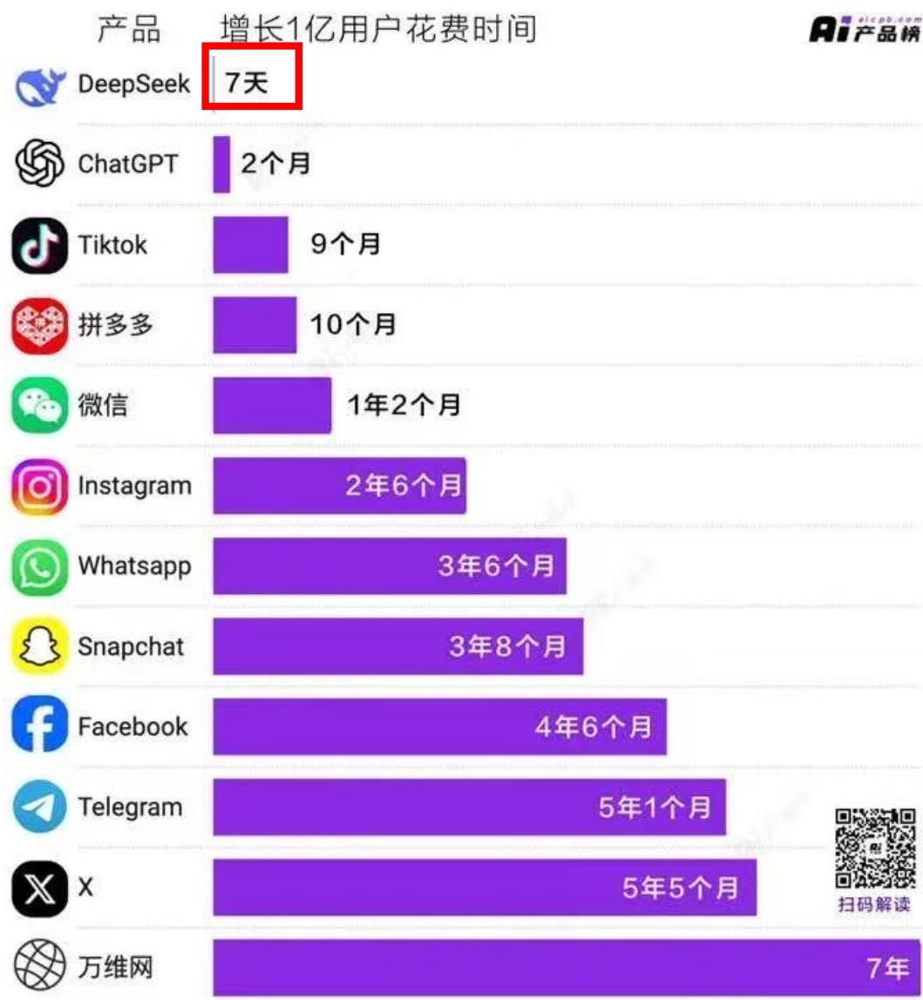  

> 注：DeepSeek 包含网站Web/应用App累加不去重，Tiktok不包含国内版抖音

1月底，DeepSeek 搜索热度超过 OpenAI ChatGPT（美国用户）

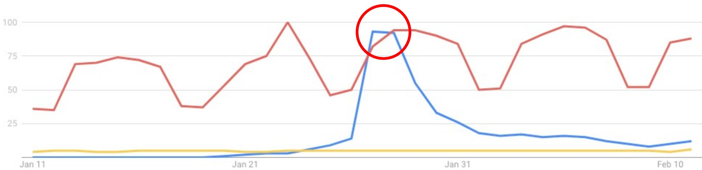

1月底，DeepSeek 搜索热度超过 OpenAI ChatGPT（全球用户）

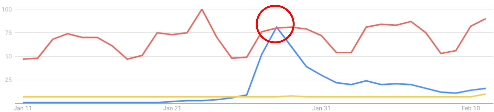

### 1. 为什么火：能力突破、开源、低成本、国产化

能力突破：推理大模型 No.1

- 全球推理大模型领跑者：DeepSeek R1 模型赶超 OpenAI o1，拥有最强推理能力。

开源：技术共享，生态共建

- 大模型标准制定者：公开技术原理论文，开源代码和模型，建立大模型训练标准，v3-0324 惊艳众人。

低成本：开启普惠企业级AI应用

- 训练成本仅550万美金：显著低于行业同类模型（LLaMA，6000万美金），打破高价壁垒

- 推理成本降低83%：加速商业化落地，开发者可快速构建教育、金融、医疗等垂直领域应用

国产化：100%技术自主可控

- 突破“卡脖子”技术瓶颈：将国产模型与美国的代际差距从3-5年追平，部分能力赶超。  
- 带动国产半导体产业智能化升级，典型如：华为昇腾，沐曦GPU（已完成上市辅导）。

### 2. DeepSeek 等前沿大模型技术发展现状

#### 3月24日，DeepSeek 迭代 v3 基座模型，大幅提升编程能力

DeepSeek-V3-0324较之前的版本增加了60%的专家（从160增加到256），使用了FP8精度训练将计算效率翻倍，不仅使前端编码能力增强，数学与逻辑能力也有所提升。

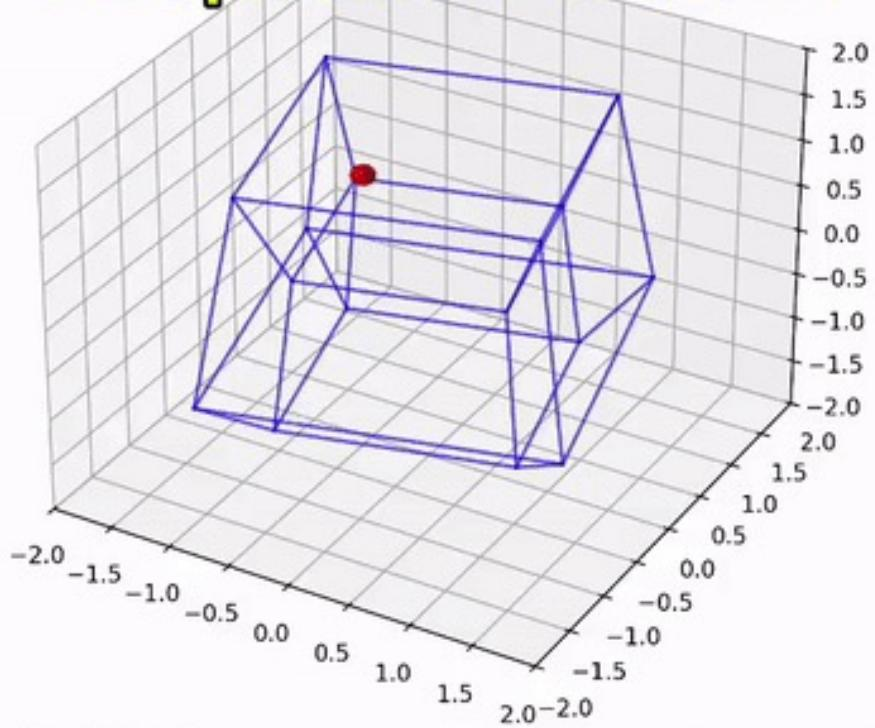  

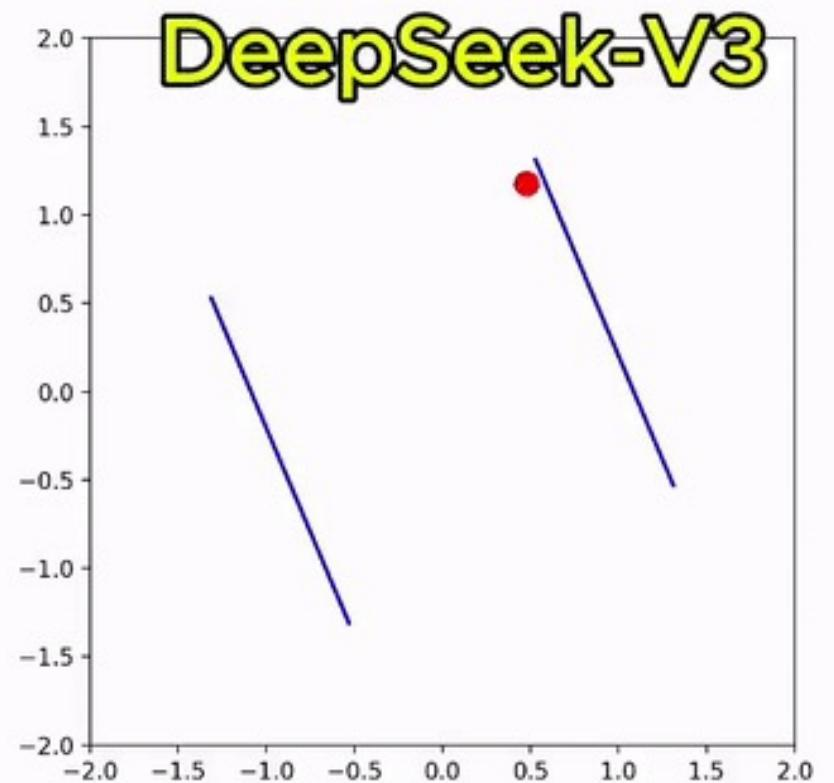  

DeepSeek-V3-0324 跃居非推理类模型榜首，甚至超越了 Claude Sonnet 3.7（闭源商业模型）。

Aider polyglot benchmark results

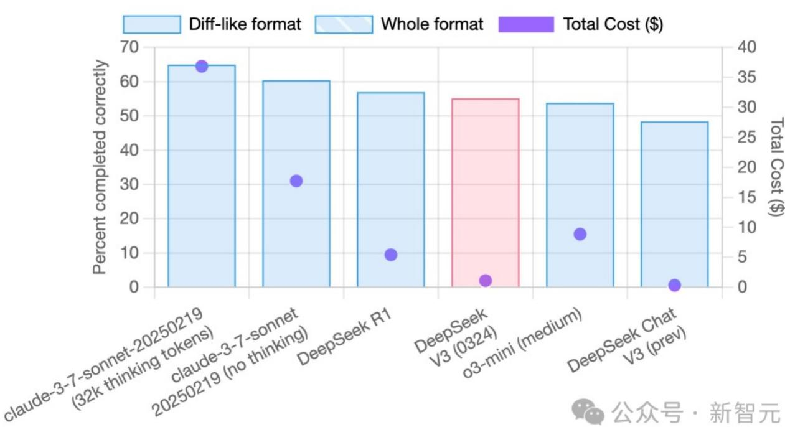  

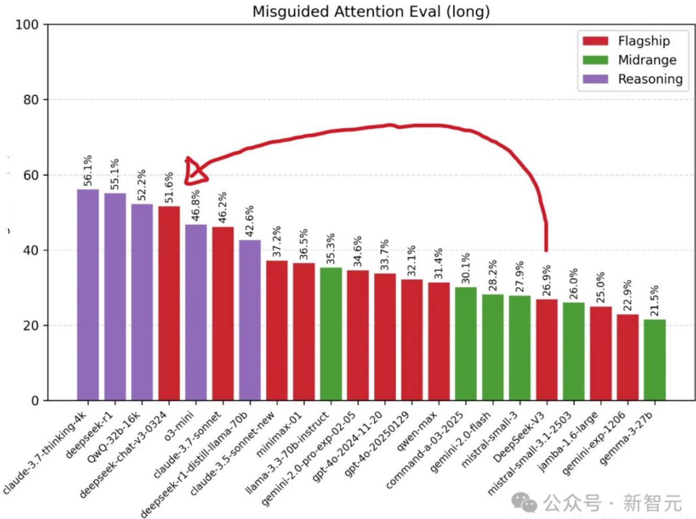

#### Google 重回巅峰，基准测试表现优异

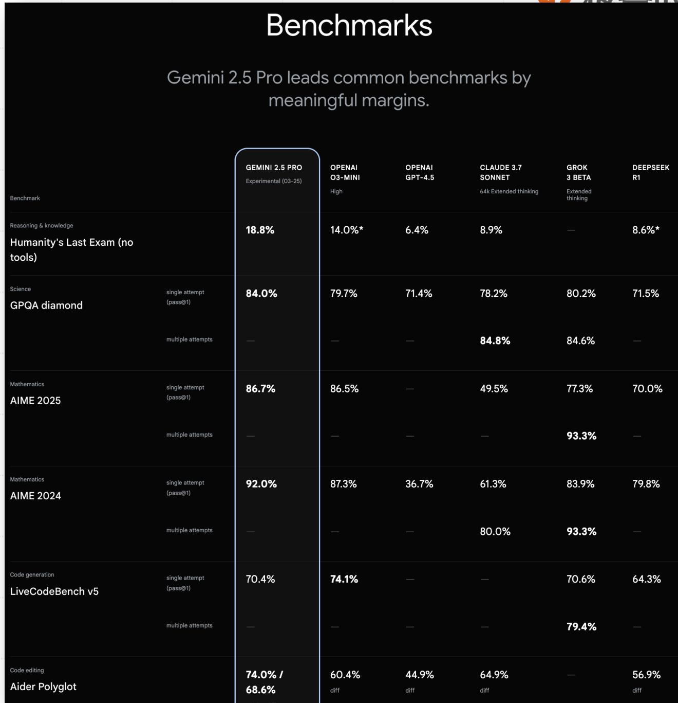

Gemini 2.5 Pro 图像编辑能力引发关注

remove the hair

  
修改图片，让狗抽一支雪茄

  
add a mustache

#### 3月25日，GPT-4o迎来大更新，花样玩法层出不穷

《如何借助AI提升开发效率？》漫画

GPT-4o 快速完成复杂网站 UI 设计

GPT-4o 结合可灵一键生成 潮玩手办

- 图片提示词（GPT-40）：

创建一个isowspeed的人物的手办玩具。让它成为一个动作人偶。参考图片里speed的形象。在人偶旁边，应该有跟他相关的玩具的装备。此外，在盒子的顶部，写上

"isowspeed in china"。以一种现实的方式来可视化这个场景。

- 视频提示词（kling1.6）：

一只手把盒子中的玩具手办拿出来

GPT-4o 在 LMSYS 跃升到第二

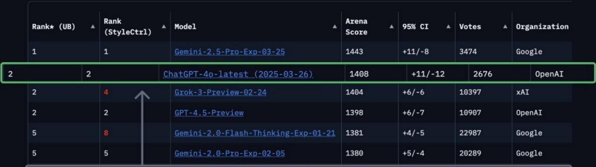

#### 4月6日，Meta正式推出LLaMA 4系列

- 多模态原生支持：可处理文本、图像、视频等多种输入，显著提升泛化能力。  

- 混合专家架构（MoE）：提升计算效率，按需激活专家模块，节省资源并增强性能。  

- 多型号发布：

  - LLaMA 4 Scout: 17B参数, 16个专家模块, 支持单张 H100 运行。

  - LLaMA 4Maverick: 17B参数, 128专家模块, 性能更强。 

  - LLaMA 4 Behemoth: 超大规模模型, 仍在训练中, 定位为最强版本。

<table><tr><td>Category Benchmark</td><td>Llama 4 Maverick</td><td>Gemini 2.0 Flash</td><td>DeepSeek v3.1</td><td>GPT-4o</td></tr><tr><td>Inference CostCost per 1M input&amp; output tokens (3:1 blended)</td><td>$0.19-$0.495</td><td>$0.17</td><td>$0.48</td><td>$4.38</td></tr><tr><td rowspan="2">Image ReasoningMMMU</td><td>73.4</td><td>71.7</td><td rowspan="4">No multimodal support</td><td>69.1</td></tr><tr><td>73.7</td><td>73.1</td><td>63.8</td></tr><tr><td>MathVista</td><td>90.0</td><td>88.3</td><td>85.7</td></tr><tr><td>DocVQA (test)</td><td>94.4</td><td>—</td><td>92.8</td></tr><tr><td>CodingLiveCodeBench(10/01/2024-02/01/2025)</td><td>43.4</td><td>34.5</td><td>45.8/49.23</td><td>32.33</td></tr><tr><td>Reasoning &amp; KnowledgeMMLU Pro</td><td>80.5</td><td>77.6</td><td>81.2</td><td>—</td></tr><tr><td>GPQA Diamond</td><td>69.8</td><td>60.1</td><td>68.4</td><td>53.6</td></tr><tr><td>MultilingualMultilingual MMLU</td><td>84.6</td><td>—</td><td>—</td><td>81.5</td></tr></table>

#### 中美在大模型领域的技术与政策对比

技术能力对比

1. 美国：在基础模型研发（如OpenAI o3、Gemini 2.5 Pro）、算力基础设施（芯片设计、云计算）和开源生态（Hugging Face、PyTorch）上占据领先地位。头部企业（OpenAI、Google、Meta）与学术界（斯坦福、MIT）形成紧密协同。  
2. 中国：侧重应用场景落地（如智慧城市、金融、医疗）和数据资源优势（庞大用户基数），但在底层芯片（如高端GPU依赖进口）、算法理论突破（Transformer级创新）上仍有差距。

政策环境差异

1. 美国：以市场化驱动为主，政府通过《国家人工智能倡议法案》支持基础研究，同时注重伦理风险管控（如白宫AI权利法案）。对技术出口限制（如芯片禁令）强化技术壁垒。  
2. 中国：政策引导型发展，通过“新一代人工智能发展规划”推动国产替代，强调数据主权（《数据安全法》《生成式AI管理办法》），但监管趋紧可能限制创新自由度。

#### 潜在的合作与竞争格局

合作:

- 全球合作：尽管中美之间的竞争日益加剧，全球范围内的合作仍然是不可忽视的趋势。随着人工智能技术的高度复杂性和全球化需求，国际间的技术合作仍然有潜力，尤其是在一些基础性技术、标准制定、伦理研究等领域。  
- 中美合作：尽管政治和经济环境的变化可能会影响中美之间的合作，但在一些共同面临的技术挑战上（如AI伦理、AI安全、算法公平性等），双方的合作仍然有一定的空间。跨国公司与研究机构可能在某些领域寻求技术共享和合作。

竞争：

- 技术竞争：中美在大模型领域的技术竞争会更加激烈。美国公司在技术创新、算力和研发资金上仍然占据领先地位，但中国在政府政策支持和庞大的数据优势方面逐渐迎头赶上，尤其是在垂直领域的定制化大模型（如金融、医疗、零售等）方面。  
- 人才竞争：全球AI人才的争夺将成为一大战场，尤其是在顶级科研人员和工程师的招募方面。中美两国都将在AI领域争夺最优秀的人才，尤其是那些有经验的 AI 领域专家和深度学习研究人员。

## 四、DeepSeek 应用开发快速入门

### 1. DeepSeek 使用方式

DeepSeek模型有以下三种使用方式：官方路径、第三方渠道和本地化部署。

官方路径直接使用的方式更适合**普通用户**，而本地化部署则更具安全性(**政府、企业客户**)。

#### DeepSeek官方服务-开袋即食

网页：https://chat_deepseek.com/

手机APP

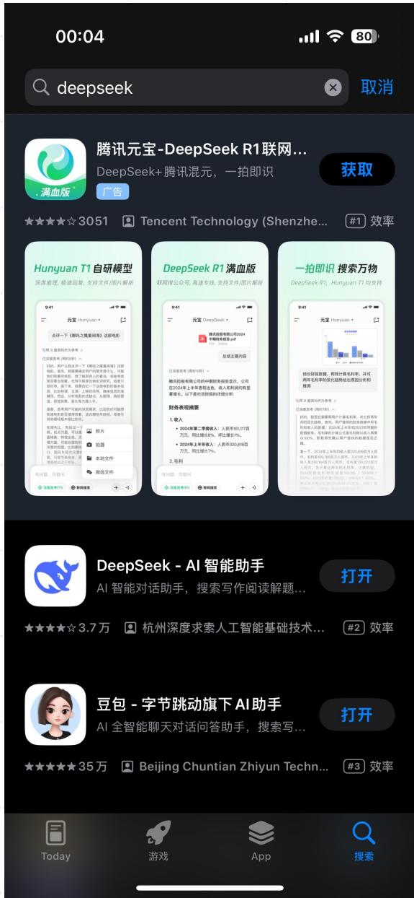

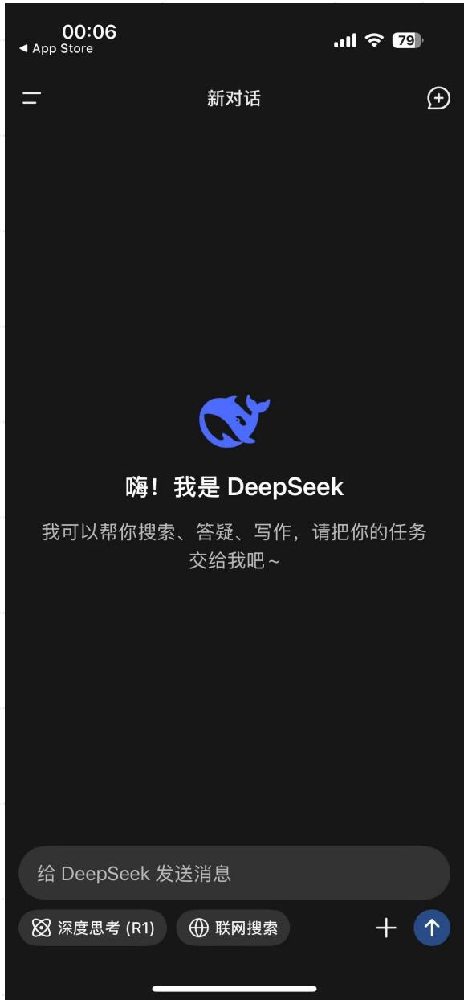

#### 软件集成 DeepSeek API

钉钉

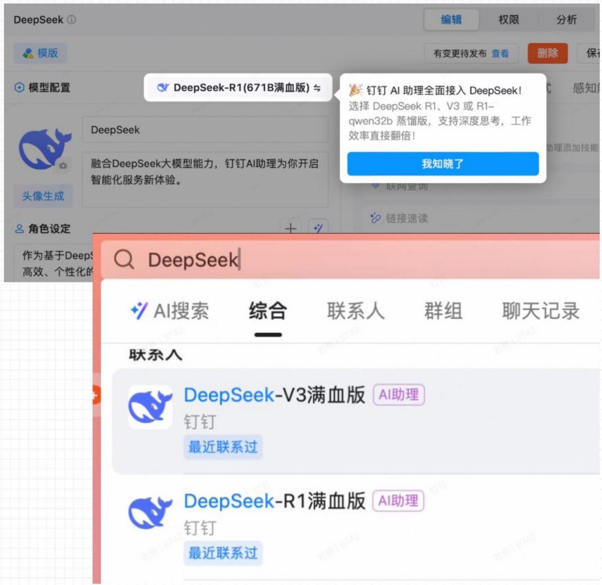  

微信

#### DeepSeek 本地化全面接入（多场景）

- DeepSeek 的"朋友圈"不断扩大  
- 在AI领域兼具创新性和实用性  
- 三大基础运营商 (电信、移动、联通)  
- 超过15家芯片厂家适配  
- 200多家企业(涉及手机、车企、云服务、网络科技、金融等领域)  
- 世界级云计算巨头如微软、亚马逊

DeepSeek的“朋友圈”

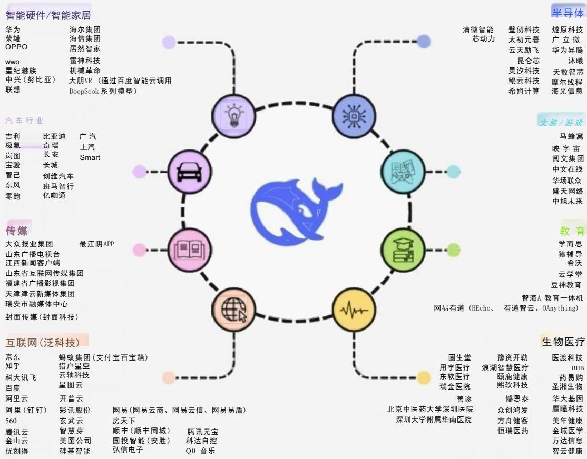

金融：国泰君安、兴业证券、华安证券、广发证券、中泰证券、华福证券、国金证券、国元证券、国信证券、华西证券、东兴证券、西南证券、光大证券、国盛证券、中金财富证券、中建投证券、江苏银行、邮储银行、北京银行、重庆银行、苏商银行、海安农商银行、乐信、汇添富、富国基金、诺安基金、新华保险、中国平安

### 2. DeepSeek 提示工程核心原则与技巧

#### 什么是提示工程(Prompt Engineering)?

- 定义：提示工程是设计和优化输入文本（Prompt）的技术，旨在引导大模型（如：DeepSeek）生成高质量输出。  
- 核心思想：你向模型提问或下达指令的**方式**，直接决定了模型回答的质量。  
- 重要性：好的提示能解锁模型的强大能力，差的提示则可能导致答非所问或低效输出。  
- 提示工程，就是你与 AI 高效沟通的“说明书”和“导航仪”！

好的提示 = 清晰的目标 + 充分的信息 + 明确的指引 = 更高质量、更符合预期的输出。

#### 为什么提示工程如此重要？

- 精确控制模型行为：引导模型按照特定风格、格式、角色进行输出。  
- 提升输出质量与准确性：减少模糊性，获得更相关、更可靠的答案。  
- 解锁模型隐藏能力：通过巧妙的提示，激发模型在推理、创作、分析等方面的潜力。  
- 提高任务效率：更快获得满意结果，减少反复尝试和修改的次数。  
- 定制化应用：使通用大模型能更好地服务于特定场景和需求。

举个例子

场景：假设你是一位市场经理，需要为一款新上市的环保咖啡杯撰写一段社交媒体推广文案，目标是吸引关注环保的年轻消费者。

糟糕的提示（模糊且缺乏指导）：“帮我写个咖啡杯的文案”

- 问题分析:

- 模糊不清: “咖啡杯”种类繁多, “文案”风格各异。  
- 缺乏目标：没有说明受众、产品特点、推广渠道。  
- 无引导性：模型不知道你想要什么风格的输出。

DeepSeek回答如下

> 当然可以！以下是几款不同风格的咖啡杯文案，供你参考：
>
> 1. 简约高级风
>
> “一杯，一世界。”
>
> 细腻陶瓷，温润手感，盛满你的晨间灵感与午后沉思。
>
> 2. 文艺治愈风
>
> “咖啡的温度，刚好捂暖生活。”
>
> 手捧一杯的时光，苦涩与香甜都是故事。
>
> 3.极简实用派
>
> 防烫不沾唇，专注每一口纯粹。
>
> 双层隔热设计，让热爱无需等待。
>
> 4.幽默趣味款
>
> 警告：装咖啡后幸福感飙升！
>
> 容量：360ml | 材质：陶瓷 | 副作用：停不下来
>
> 5.环保主题
>
> "用可持续的方式，喝一杯可持续的快乐。"
>
> 天然釉料，可降解杯盖，为地球续杯。
>
> 6. 送礼场景化
>
> "想你的365天，杯杯皆暖。"
>
> 定制刻字，让每一杯都藏着专属心意。
>
> 
>
> 如果需要针对某类风格或功能（比如保温杯、随身杯等）调整，可以告诉我具体需求哦！

chatGPT回答如下：

> 当然可以！下面是几个不同风格的咖啡杯文案，你可以根据使用场景（比如：电商、礼品、品牌宣传等）选择或让我进一步调整：
>
> 1. 简约生活风（适合电商商品描述）
>
> 一杯温热，唤醒清晨的慵懒；一口醇香，开启每一天的仪式感。
>
> 简约设计，握在手中的不止是咖啡，更是片刻宁静。
>
> 2. 品牌感文艺风（适合精品咖啡馆周边）
>
> 杯中是咖啡，杯外是世界。
>
> 每一次轻啜，都是一场关于热爱与灵感的旅程。
>
> 3. 送礼场景文案 (适合礼盒装)
>
> 一杯子，一辈子。
>
> 把温暖握在手里，把思念藏进咖啡香。
>
> 送你一杯热腾腾的在乎。
>
> 4. 搞笑俏皮风 (适合年轻群体)
>
> 咖啡还没喝完，别跟我说话。
>
> 我的能量，全靠这杯续命水撑着！
>
> 需要针对具体人群、场景（如企业定制、情侣款、节日礼品）再细化吗？可以告诉我用过，我可以给你更精准的文案版本。

**咖啡推广文案——优秀提示（清晰、具体、有引导）**

提示：

> 你是一位专业的社交媒体营销撰稿人，擅长使用活泼、有吸引力的语言。
>
> 请为一款名为“绿意随行杯 (EcoSip Cup)”的新型环保咖啡杯撰写一条推文文案（140字符以内）。
>
> 这款咖啡杯由可降解竹纤维制成，设计简约时尚，主打卖点是环保理念和便携性。
>
> 目标受众是18-30岁关注可持续生活方式的年轻人。
>
> 文案需突出环保特性，并包含一个行动号召，例如“立即选购”或“加入环保行列”。
>
> 请使用 #环保生活 和 #绿意随行杯 标签。

**提示词分析:**

- 角色扮演：“专业的社交媒体营销撰稿人”引导了文案风格。  
- 明确产品：“绿意随行杯 (EcoSip Cup)”，具体特点“可降解竹纤维”、“简约时尚”、“环保”、“便携”。  
- 清晰受众：“18-30岁关注可持续生活方式的年轻人”。  
- 指定格式/要求: “推文文案 (140字符以内) ”、“行动号召”、“标签”。

DeepSeek回答如下：

> 你是一位专业的社交媒体营销撰稿人，擅长使用活泼、有吸引力的语言。
>
> 请为一款名为“绿意随行杯（EcoSip Cup）”的新型环保咖啡杯撰写一条推文文案（140字符以内）。
>
> 这款咖啡杯由可降解竹纤维制成，设计简约时尚，主打卖点是环保理念和便携性。
>
> 目标受众是18-30岁关注可持续生活方式的年轻人。
>
> 文案需突出环保特性，并包含一个行动号召，例如“立即选购”或“加入环保行列”。
>
> 请使用#环保生活和#绿意随行杯标签。

> 告别一次性杯子！EcoSip可降解竹纤维杯，时尚又环保，随身携带超方便~一起为地球减负吧！立即选购
>
> 环保生活#绿意随行杯" (138字符)

> 你是一位专业的社交媒体营销撰稿人，擅长使用活泼、有吸引力的语言。
>
> 请为一款名为“绿意随行杯(EcoSip Cup)”的新型环保咖啡杯撰写一条推文文案（1000字符以内）。
>
> 这款咖啡杯由可降解竹纤维制成，设计简约时尚，主打卖点是环保理念和便携性。
>
> 目标受众是18-30岁关注可持续生活方式的年轻人。
>
> 文案需突出环保特性，并包含一个行动号召，例如“立即选购”或“加入环保行列”。
>
> 请使用#环保生活和#绿意随行杯标签。

> 你的咖啡时光，可以更环保！
>
> 告别一次性杯子的浪费，拥抱可持续生活！绿意随行杯(EcoSip Cup)来啦~
>
> 100%可降解竹纤维,自然分解无负担
>
> 极简设计+轻巧便携，随手一拿都是时尚单品
>
> 每天减少一个塑料杯，你的小习惯，地球的大改变
>
> 别再犹豫！加入环保行列，从一杯咖啡开始
>
> 立即选购，让每一口都更有意义！
>
> 环保生活 #绿意随行杯

ChatGPT回答如下：

> 告别一次性，拥抱绿意！ EcoSip Cup 竹纤维制成，轻巧时尚，为地球减负，从一杯开始！立即选购 #环保生活 #绿意随行杯

> 你是一位专业的社交媒体营销撰稿人，擅长使用活泼、有吸引力的语言。
>
> 请为一款名为“绿意随行杯 (EcoSip Cup)”的新型环保咖啡杯撰写一条推文文案（2000字符以内）。
>
> 这款咖啡杯由可降解竹纤维制成，设计简约时尚，主打卖点是环保理念和便携性。
>
> 目标受众是18-30岁关注可持续生活方式的年轻人。
>
> 文案需突出环保特性，并包含一个行动号召，例如“立即选购”或“加入环保行列”。
>
> 请使用#环保生活和#绿意随行杯标签。

> 你的每一口咖啡,也能是一种环保态度!
>
> 遇见绿意随行杯（EcoSip Cup），一款为热爱咖啡、关注地球的你量身打造的环保随行杯。
>
> 它不仅颜值在线，更蕴含绿色初心——采用可降解竹纤维材质，轻盈便携，坚固耐用，兼具环保与实用。无论是通勤路上，还是城市漫游，让每一杯饮品都充满绿意。
>
> 为什么选择 EcoSip Cup?
>
> ✓ 环保竹纤维：可自然降解,不制造塑料垃圾  
> ✓极简美学设计：百搭潮流，随手拍都是INS风  
> 轻盈便携：放进背包、手袋毫无负担  
> √ 重复使用：减少一次性杯使用，为地球减压
>
> 每一个小小的选择，都是为可持续生活迈出的一大步。
>
> 你用它喝咖啡,它替你守护地球。
>
> 现在就加入环保行列，与 EcoSip Cup 一起为地球举杯！
>
> 点此选购 [插入购买链接]
>
> 环保生活 #绿意随行杯 #可持续时尚 #竹纤维杯 #喝出环保态度

#### 提示工程 五大核心原则

**清晰明确 (Clarity & Specificity):**

- 避免使用模糊、歧义的词语。  
- 指令越具体，模型越容易理解你的意图。

**提供上下文 (Provide Context):**

- 如果任务需要背景知识，请在提示中提供。  
- 上下文有助于模型更好地理解问题情境。

**指定角色 (Assign a Role):**

- 让模型扮演特定角色（如“你是一位资深程序员”、“你是一位历史学家”）。  
- 这能显著影响模型的回答风格和内容侧重。

**明确任务 (Define the Task Clearly):**

- 清晰说明你希望模型做什么：总结、翻译、解释、生成代码、创作故事等。

**指定输出格式 (Specify Output Format):**

- 如果对输出格式有要求（如列表、JSON、Markdown、特定段落结构），请明确指出。

##### 提示工程 基础技巧 (1): 明确指令与期望输出

- 反例 (不明确): (输出可能非常宽泛, 不聚焦)  

- 提示：  

  - 告诉我关于人工智能的事情。

  

- 正例 (明确具体):  

- 提示：  
  • 请解释什么是生成式人工智能 (Generative AI), 并列举三个它在创意产业中的具体应用案例。请确保每个案例都包含简要描述。  
  • 关键点: 使用动词明确动作, 使用限定词缩小范围, 指明数量和细节。

##### 提示工程 基础技巧 (2): 赋予模型角色 (Role-Playing)

- 原理：让模型进入特定角色设定，可以引导其输出风格、知识领域和语气。  

  

- 示例1 (技术支持):  

- 提示：你现在是一位经验丰富的网络故障排除专家。我的电脑无法连接到 Wi-Fi，我已经重启了路由器和电脑，但问题依旧。请提供一些可能的诊断步骤。  

  

- 示例2 (创意写作):  

- 提示: 扮演一位生活在23世纪的星际探险家, 写一篇日记, 记录你第一次登陆一颗充满奇異植物的未知行星的经历。字数大约300字。  

  

- 技巧：角色描述越细致，模型表现越贴近。

##### 提示工程 进阶技巧 (1): 少样本提示 (Few-Shot Prompting)

- 定义：在提示中提供少量（1-5个）输入/输出的示例，引导模型学习你期望的格式或行为模式。  

- 场景：当任务比较新颖或输出格式有特定要求时非常有效。  
- 示例 (情感分类):

> 提示：
>
> 文本：这家餐厅的食物太美味了！
>
> 情感：正面
>
> 文本：我对这次的服务感到非常失望。
>
> 情感：负面
>
> 文本：这部电影的剧情一般，但演员表现不错。
>
> 情感：中性
>
> 文本：这款产品超出了我的预期，强烈推荐！
>
> 情感：

- 对比零样本 (Zero-Shot): 不提供示例, 直接提问。少样本通常效果更好。

##### 提示工程 进阶技巧 (2): 思维链提示 (Chain-of-Thought, CoT)

- 定义：引导模型在给出最终答案前，先输出一步步的思考或推理过程。  
- 场景：对于需要多步推理的复杂问题（如数学题、逻辑推理）效果显著。  
- 激活方式: 在提示中加入“请逐步思考并给出答案”、“让我们一步一步地解决这个问题”等指令,或通过少样本示例展示推理过程。
- 示例 (简单数学应用题):

> 提示：
>
> 问题：自助餐厅有23个苹果。他们用了20个做午餐，又买了6个。现在他们有多少个苹果？请逐步思考。
>
> 回答:
>
> 开始时有23个苹果。
>
> 用了20个后，剩下  $23 - 20 = 3$  个苹果。
>
> 然后他们又买了6个苹果。
>
> 所以现在他们有  $3 + 6 = 9$  个苹果。
>
> 答案是9。
>
> 问题：Natalia卖了48条头巾，然后她姐姐给了她25条头巾。Natalia现在有多少条头巾？请逐步思考。
>
> 回答:

##### 提示工程 进阶技巧(3): 控制输出长度与格式

- 长度控制:

  - 明确要求字数或段落数：“请写一段约100字的摘要。”、“请用不超过三个自然段来解释…

- 格式控制：

  - 列表: “请列出…，使用项目符号。”  

  - JSON: “请将以下信息转换为JSON格式, 包含‘name’, ‘email’, ‘city’字段。”  

  - Markdown: “请使用Markdown格式撰写一份会议纪要，包含标题、参与者和议程。”  

  - 表格（通过Markdown）：“请用Markdown表格比较产品A和产品B的以下特性：价格、功能、用户评分。”

- 示例 (生成JSON):

> 提示：
>
> 请将以下用户信息整理成JSON对象：
>
> 姓名：张三
>
> 邮箱: zhangsan@example.com
>
> 城市：上海

1. 使用 DeepSeek 或其他大模型，实践课件中基础和进阶技巧的提示词,观察和理解模型输出的结果。  
2. （可选）遵循提示工程的核心原则和 5 个技巧，构造 3 个正例和反例，加深对提示工程核心原则和技巧的理解。

### 3. DeepSeek 文案生成和迭代实践

#### 迭代与优化：提升提示效果的关键

- 提示工程是一个持续优化的过程，很少一次成功。  

- 步骤：

  1. 尝试 (Try): 根据初步想法构建提示并运行。  
  2. 分析 (Analyze): 评估模型输出是否符合预期。哪里好? 哪里不好?
  3. 调整 (Adjust): 根据分析结果修改提示。

  - 是不是太模糊了？——更具体。  

  - 是不是缺少上下文？——补充信息。  

  - 是否是格式不对？——明确指定格式。  

  - 是不是可以给个例子？——尝试少样本。

  4. 再尝试 (Retry): 用调整后的提示再次运行。

- 关键：保持耐心，从小处着手修改，记录有效的变化。

**实战演练：用 DeepSeek 生成并优化程序员周报**

场景: 你是一名应用开发程序员, 名叫李明, 本周主要完成了用户登录模块开发和 Bug 修复。

需求：你需要用 DeepSeek 生成一份周报，发送给领导。

**迭代 1: 初次尝试 - 简单指令**

目标: 快速生成一个基础的周报框架。

> 提示:
>
> 写一份程序员周报，我叫李明。这周做了登录模块和修了几个bug。

- 优点: 快速生成了基本结构。  
- 缺点:
  - 内容过于简单、概括，缺乏细节。  
  - “几个bug”不明确，没有体现工作量和价值。  
  - “下周计划”和“遇到的问题”部分空洞，模型无法猜测。  
  - 缺乏专业性和积极性。  
  - 格式可能不完全符合公司要求。

DeepSeek回答：

> 程序员周报
>
> 姓名：李明
>
> 日期：2023年XX月XX日-2023年XX月XX日
>
> 本周工作内容：
>
> 1. 登录模块开发
>
> - 完成了用户登录功能的开发，包括前端界面和后端接口。  
> - 实现了用户名/密码登录、Token生成与校验功能。  
> - 对接了权限管理系统，确保不同角色用户登录后跳转到对应页面。
>
> 2. Bug修复
>
> - 修复了用户登录时偶尔出现的 Token 失效问题。  
> - 解决了前端登录页面在移动端适配异常的问题。  
> - 修复了登录成功后部分用户信息未正确加载的 Bug。
>
> 下周计划：
>
> 优化登录模块的性能，减少接口响应时间。  
> 调研并实现短信验证码登录功能  
> 继续跟进并修复测试团队反馈的其他问题。
>
> 备注：本周工作进展顺利，登录模块已进入测试阶段，Bug修复后系统稳定性有所提升。

**迭代 2: 增加细节与角色引导**

目标：让周报内容更具体、更专业，并引导模型输出更完整的信息。

> 提示:
>
> 你是一名严谨细致的应用开发程序员李明。
>
> 请帮我写一份本周的工作周报，主要内容包括：
>
> 已完成工作:
>
> 1. 用户登录模块开发：完成了前端UI设计、后端API接口对接、以及单元测试的编写。此模块使用了JWT进行用户认证。  
> 2. Bug修复：修复了用户反馈的3个主要Bug，包括：用户列表页数据显示不全的问题 (Bug ID: #1023)、特定条件下App闪退的问题 (Bug ID: #1025)、以及个人资料修改后未实时更新的问题 (Bug ID: #1028)。
>
> 下周计划：
>
> 1. 开始开发用户个人中心模块。  
> 2. 参与项目需求评审会议。
>
> 遇到的问题与解决方案（可选）：
>
> 本周暂无重大阻碍性问题。
>
> 请使用简洁、专业的语言撰写，并确保格式清晰。周报提交对象是我的直属经理王总。

优点:

- 内容具体详实了很多，提到了技术细节（JWT）和Bug ID。  
- 引入了角色，语言风格更专业。  
- 包含了下周计划和问题反馈部分。

改进空间:

- 虽然提到了技术，但可以更突出成果和价值。  
- 语言可以更主动、更积极一些。  
- 可以考虑加入一些量化的描述或遇到的挑战（如果确实有）。
- 格式可以进一步优化，例如使用项目符号细化。

DeepSeek回答：

> 程序员周报
>
> 汇报人：李明
>
> 汇报对象：王总
>
> 日期：2023年XX月XX日-2023年XX月XX日
>
> 一、已完成工作
>
> 1. 用户登录模块开发
>
>    - 完成前端UI设计与实现，确保响应式布局兼容多端设备  
>
>    - 完成后端API接口开发，采用JWT（JSON Web Token）进行用户认证
>
>    - 编写单元测试，覆盖核心功能（登录验证、Token生成与校验），测试通过率100%
>
> 2. Bug修复
>
>    - Bug#1023：用户列表页数据显示不全  $\rightarrow$  修复分页查询逻辑，优化数据加载性能  
>
>    - Bug #1025：特定条件下App闪退  $\rightarrow$  定位为内存泄漏问题，通过释放未引用资源解决  
>
>    - Bug#1028：个人资料修改后未实时更新  $\rightarrow$  修复前端状态管理逻辑，增加数据同步机制
>
> 二、下周计划
>
> 1. 启动用户个人中心模块开发（包含基础信息展示与编辑功能）  
> 2. 参与项目需求评审会议，明确后续迭代优先级
>
> 三、其他事项
>
> - 本周开发与测试流程顺利，无重大阻碍性问题
>
> 备注：如需进一步细节或调整优先级，请随时沟通。
>
> （注：日期请根据实际填写）

**迭代 3: 强调成果、量化贡献并优化表达**

目标: 使周报不仅详实, 更能体现个人价值和积极态度,并进一步优化表达和格式

最终版本提示词分析（显著提升）：

- 成果导向: 使用“高效完成”、“高质量完成”、“显著提高”、“确保”等词语, 突出贡献。  
- 量化数据: “15个单元测试用例, 覆盖率达到  $95 \%$  ”使成果更具说服力。  
- 价值体现: 将Bug修复与“提升用户体验”、“提高应用稳定性”、“确保数据一致性”等价值联系起来。  
- 积极主动: 下周计划中体现了积极参与和准备。  
- 结构清晰: 明确的板块划分和加粗重点, 易于阅读。  
- 可选部分: 提供了“遇到的挑战与思考”和“个人成长与总结”的模板, 引导更全面的汇报。

> 提示：你是一名积极主动、注重成果的应用开发程序员李明。
>
> 请帮我撰写一份本周的工作周报，提交给我的直属经理王总。请确保周报结构清晰，内容充实，并突出工作亮点和贡献。
>
> **周报时间：** [填写本周日期范围，例如：2024年5月13日 - 2024年5月17日]
>
> **一、本周核心成果与进展：**
>
> 1. **高效完成用户登录模块（核心功能）开发：**
>
> * **前端UI实现：**根据最新设计稿，高质量完成了登录、注册、忘记密码页面的响应式布局和交互效果。  
> * **后端API集成：**顺利对接并通过测试了用户认证(采用JWT标准)、用户信息获取等关键API接口，确保了前后端数据流畅对接。
>
> * **质量保障：**编写了15个单元测试用例，覆盖率达到  $95\%$  ，有效保障了模块的稳定性和可靠性。
>
> 2. **关键Bug修复与系统稳定性提升：**
>
> - **迅速响应并解决**了3个用户反馈的P0/P1级Bug:  
>
>   * 用户列表页数据显示不全的问题 (Bug ID: #1023), 提升了用户体验。  
>
>   * 特定条件下App闪退的问题 (Bug ID: #1025), 显著提高了应用稳定性。  
>
>   * 个人资料修改后未实时更新的问题 (Bug ID: #1028), 确保了数据一致性。  
>
> * **主动排查并修复**了1个潜在的性能瓶颈（可选，如果没有就删掉这句）。
>
> **二、下周重点工作计划：**
>
> 1. **启动用户个人中心模块（核心功能）开发：**预计下周内完成需求理解和初步架构设计。  
> 2. **积极参与项目V2.1需求评审会议：**准备好相关技术预案并提出建设性意见。  
> 3. **持续跟进线上问题反馈：**确保系统稳定运行。
>
> **三、遇到的挑战与思考（可选，如果没有就写“本周进展顺利”）：**
>
> * [例如：在对接XX第三方服务时，遇到文档不清晰的问题，通过与对方技术支持积极沟通并查阅社区资料，最终成功解决，为后续集成节省了时间。]
>
> **四、个人成长与总结 (可选):**
>
> * [例如：本周通过解决XX Bug，对XX技术有了更深入的理解。]

DeepSeek回答：

> 工作周报
>
> 汇报人：李明|应用开发工程师
>
> 汇报对象：王总
>
> 周报时间：2024年5月13日-2024年5月17日
>
> 一、本周核心成果与进展
>
> 1.高效完成用户登录模块（核心功能）开发
>
> 前端UI实现：严格遵循最新设计规范，高质量完成登录、注册、忘记密码页面的响应式开发，适配移动端/PC端，交互体验流畅。  
>
> - 后端API集成：采用JWT标准实现用户认证，完成与用户信息获取、权限校验等5个关键API的对接，接口一次性通过率100%。  
> - 质量保障：编写15个单元测试用例，覆盖登录异常处理、Token校验等核心场景，测试覆盖率  $95\%+$ ，模块稳定性达预期目标。
>
> 2. 关键Bug修复与系统稳定性提升
>
> 用户反馈快速响应：
>
> 修复#1023（用户列表数据不全）：优化分页查询逻辑，数据加载效率提升  $40\%$  
> 修复#1025（App闪退）：定位内存泄漏问题，通过资源释放彻底解决，崩溃率降低至  $0.1\%$  以下。  
> 修复#1028（个人资料更新延迟）：引入前端状态自动同步机制，确保数据实时性。  
>
> - 主动优化：排查发现并修复1个潜在性能瓶颈（数据库查询冗余），接口响应时间缩短30%。
>
> 二、下周重点工作计划
>
> 1. 用户个人中心模块开发：完成需求分析与技术方案设计，输出详细开发排期。  
>    2.V2.1需求评审参与：提前研读需求文档，针对技术可行性提出优化建议。  
>    3.线上问题监控：建立异常日志实时告警机制，确保系统稳定性。
>
> 三、遇到的挑战与思考
>
> - 挑战：JWT Token刷新机制初期设计存在安全风险。  
> - 解决：通过查阅 OAuth2.0规范并与团队讨论，最终采用短期Token+自动续签方案，兼顾安全性与用户体验。
>
> 四、个人成长与总结
>
> - 通过解决 #1025内存泄漏问题，深入掌握了Android Profiler工具的使用技巧。  
> - 在登录模块开发中，进一步提升了跨端兼容性设计的能力。
>
> 本周整体进展顺利，所有目标均按时达成。
>
> 李明|应用开发工程师
>
> 2024年5月17日
>
> 亮点说明：
>
> 1.使用数据量化（如95%覆盖率、40%效率提升）直观体现成果。  
> 2.突出主动性（主动优化性能、提前准备需求评审）。  
> 3.技术细节清晰（JWT、OAuth2.0），展现专业度。

#### 5. 总结与启示

- 迭代是关键: 通过不断调整和细化提示词, 可以显著提升 DeepSeek 生成内容的质量和匹配度。  
- 具体化优于概括: 提供更多细节、背景和约束, 能让模型更好地理解你的意图。  
- 角色扮演很重要: 赋予模型特定角色, 能有效引导其输出的风格和专业度。  
- 明确输出要求: 对格式、语气、重点等进行明确指示。  
- 从用户角度出发: 思考接收方 (如经理) 想看到什么信息, 如何展示你的价值。

1. 根据你的个人工作或学习情况，参考本节三轮迭代提示词的思路，使用 DeepSeek 生成一份工作周报。  
2. (可选) 将你过去人工编写的周报, 使用 DeepSeek 优化和润色, 对比结果。

### 4. DeepSeek 代码生成和测试实践

实战演练：用 DeepSeek 生成 Python 函数并编写单元测试

场景: 你需要一个 Python 函数来检查一个字符串是否是有效的邮箱地址。

需求：你希望 DeepSeek 也能帮你生成一些基本的单元测试用例来验证这个函数。

**迭代 1: 基础代码生成请求**

目标: 生成一个能基本工作的邮箱验证函数。

> 提示:
>
> 用 Python 写一个函数，检查邮箱是否有效。

- 优点:
  - 快速生成了一个可用的函数框架, 使用了正则表达式。

- 缺点:

  - 正则表达式可能过于简单, 无法覆盖所有有效的邮箱格式 (例如带 + 号的别名, 国际化域名等)。  

  - 没有错误处理（例如输入非字符串类型）。  

  - 没有注释说明正则表达式的含义或函数的局限性。  

  - 没有单元测试。

**迭代 2: 细化需求，加入注释和测试用例提示**

目标: 获得一个更健壮的邮箱验证函数, 包含注释, 并初步引导模型生成测试用例的思路。

> 提示:
>
> 请用Python编写一个名为`validate_email_address`的函数，用于验证一个给定的字符串是否为有效的电子邮件地址。
>
> 要求：
>
> 1. 函数接受一个字符串参数 `email_string`。  
> 2. 如果输入不是字符串类型，应返回 False 或抛出 TypeError。  
> 3. 使用正则表达式进行验证, 请选择一个相对健壮和常用的邮箱正则表达式。  
> 4. 在函数内部和正则表达式部分添加清晰的注释。  
> 5. 函数返回 True 表示有效，False 表示无效。
>
> 另外，请为这个函数提供至少3个正面测试用例（应该返回True的邮箱）和3个负面测试用例（应该返回False的邮箱），并说明期望结果。

优点:

- 函数名更规范，有参数类型提示。  
- 增加了对输入类型的检查。  
- 正则表达式有所改进（模型可能会选择一个更复杂的）。  
- 添加了函数和正则表达式的注释。  
- 提供了测试用例的文字描述，但还不是可执行的测试代码。  
- 使用了 re.fullmatch 确保整个字符串匹配,比 re.match 更严谨。

改进空间:

- 测试用例仍然是文字描述，没有生成实际的Python unittest或pytest代码。  
- 正则表达式的健壮性仍然依赖模型的选择，可能还需要人工审核或指定更严格的标准。  
- 错误处理方式（返回False vs 抛出异常）可以更明确。

**迭代 3: 生成可执行的单元测试代码 (unittest)**

目标: 生成包含 unittest 框架的完整测试脚本, 覆盖更多边界情况。

> 提示:
>
> 请为Python编写一个名为`is_valid_email`的函数，用于精确验证一个给定的字符串是否为有效的电子邮件地址。
>
> 函数 `is_valid_email(email_string)` 要求:
>
> 1. 接受一个字符串参数 `email_string`。  
> 2. 如果 `email_string` 不是字符串类型，应抛出 `TypeError` 异常，并附带清晰的错误信息。  
> 3. 使用一个健壮的、能覆盖常见有效邮箱格式（包括带+号的别名、多级域名、国际化域名中的非ASCII字符暂不考虑）的正则表达式。请在代码中注释该正则表达式的来源或设计思路。  
> 4. 函数返回 `True` 表示邮箱格式有效，`False` 表示无效。
>
> 然后，请使用Python的`unittest`模块为`is_valid_email`函数编写一个测试类`TestIsValidEmail`。
>
> 测试类应包含以下测试方法:
>
> * `test_valid Emails`：测试至少5个不同类型的有效邮箱地址（例如：简单邮箱，带点的用户名，带连字符的域名，带'+'的邮箱，.co.uk等多级域名）。
>
> * `testinvalid Emails_format`：测试至少5个格式明显错误的邮箱地址（例如：缺少@, 缺少域名, @在开头, 域名含非法字符, 连续的点等）。
>
> * `test Invalidate_input_type`：测试当输入不是字符串时（例如整数、列表、None）是否如期抛出 `TypeError`。  
> * `test_empty_string`: 测试输入为空字符串时的情况。  
> * `test Emails_with Spaces': 测试邮箱地址前后或中间包含空格的情况（通常应视为无效）。
>
> 请确保测试用例覆盖全面，并且输出完整的、可直接运行的Python代码文件内容，包含函数定义和`unittest`测试代码。

### 5. DeepSeek 提示工程最佳实践总结

1. 从简单开始：先构建简单提示，逐步增加复杂性。  
2. 清晰指令：你的指令越清晰，得到的结果越好。  
3. 提供上下文：模型不是万能的，必要的背景信息很重要。  
4. 善用角色扮演：能有效引导输出风格和内容。  
5. 利用示例 (Few-Shot): 对于复杂或特定格式的任务, 示例是强大的引导。  
6. 引导思考过程 (CoT): 解决复杂问题时, 让模型“思考”出来。  
7. 明确输出要求：包括长度、格式、风格等。  
8. 迭代，迭代，再迭代：不断测试和优化你的提示。  
9. 分解复杂任务：将大任务拆解成小任务，分别提示。  
10. 检查模型限制：了解 DeepSeek 模型的能力边界和可能的偏好。

1. 使用 DeepSeek 在 Python/Java/golang 等任意一门主流编程语言上，实践本节课程提示词技巧，生成一个最基本的用户登录模块，以及单元测试代码。

## 五、DeepSeek 里程碑模型与关键技术

### 技术创新与突破

- DeepSeek V1: 奠基之作, 验证 LLaMA 并发现超参数“魔法公式”。(24 年 1 月)  
- DeepSeek V2: 架构革新，引入 MLA 与 DeepSeekMoE，让模型更“聪明”更“高效”。(24年5月)  
- DeepSeek V3: 追求极致，无辅助损失负载均衡与多 Token 预测，再创性能高峰。（24年12月）  
- DeepSeek R1: 无冕之王, 全球首个基于强化学习训练的开源推理大模型。（25年1月）

### DeepSeek V1 - 基础验证与规律探索

- 核心贡献1：LLaMA架构的有效性验证、开源与长期主义
  - 系统性地复现并验证了LLaMA架构在不同参数规模下的性能表现，加入大量中文语料，兼顾中英文表现。  
  - 开放透明：全模型、预训练数据、代码全面开源，推动开源生态。  
  - 长期主义训练策略（Longtermism）：通过大规模训练迭代，重视长期优化而非短期 benchmark overfitting。

- 通俗解释LLaMA验证工作：

  - 想象一下，我们要造一辆很棒的车。LLaMA就像一个被广泛认可的优秀汽车设计图纸。  

  - DeepSeek V1 首先做的是基于这张图纸，自己动手造出了这辆车，为后续的创新打下了坚实基础。

- 核心贡献2：提出并验证超参数幂律关系 (Scaling Law)

  - 揭示了模型损失与模型参数量、数据集大小、计算量之间的幂律关系。  

  - 指导了大规模模型训练的资源分配与性能预期。

- 通俗解释幂律关系:

  - 训练大模型就像做一道复杂的菜, 需要各种“调料”（超参数）。  

  - 这个公式就像一本“菜谱秘籍”，告诉我们这些“调料”之间存在一种神奇的数学关系。  

  - 有了它，我们就能更科学地预测：投入多少计算资源、用多少数据，大概能训练出多好性能的模型，避免盲目试错。

### DeepSeek V2 横空出世

提出MLA与DeepSeekMoE架构，大幅降低训练成本，提升模型性能

(a)

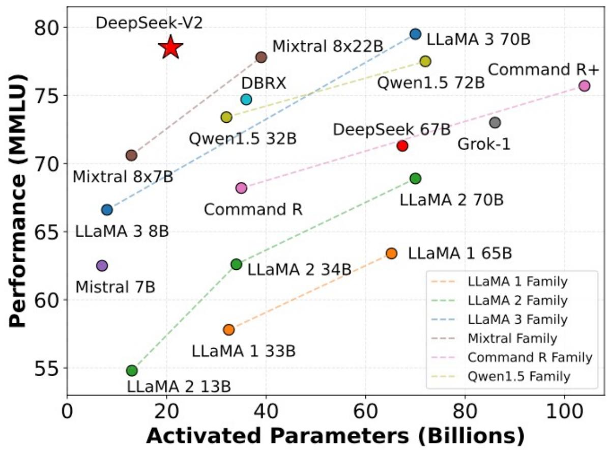  
(b)

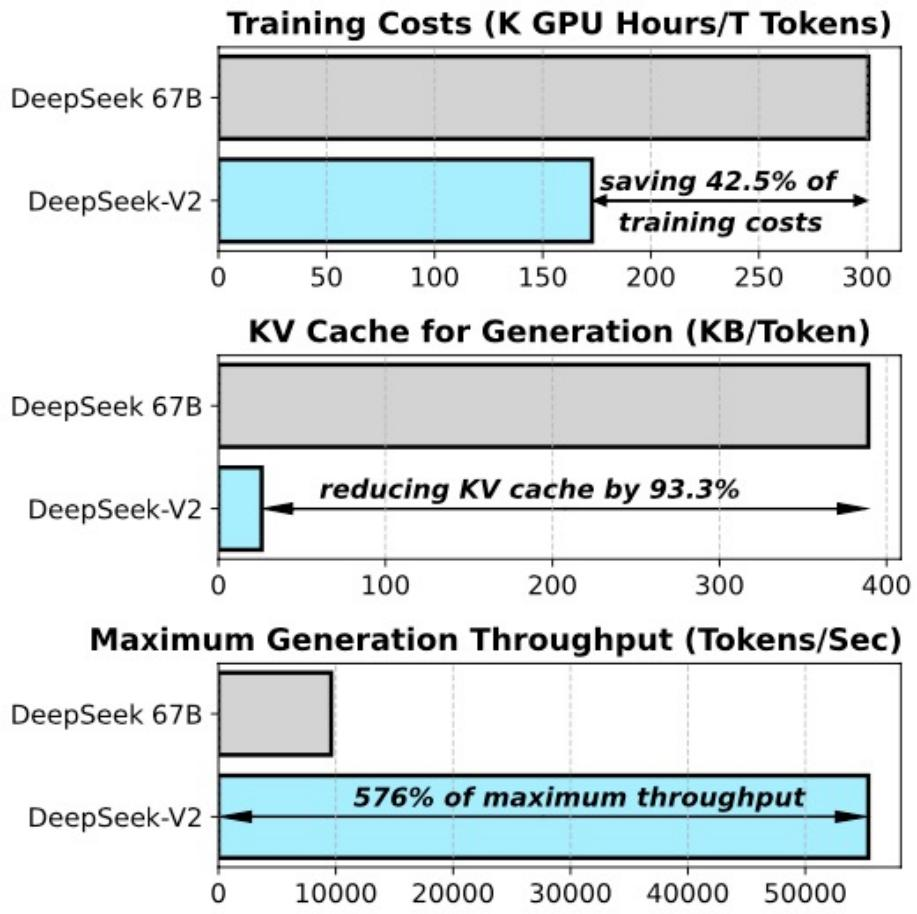  

**DeepSeek V2 - 架构革新：MLA**

DeepSeek V1 使用了 GQA，在 V2 改进为 MLA，进一步提升了训练效率。

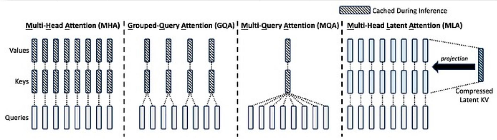  

> Figure 3 | Simplified illustration of Multi-Head Attention (MHA), Grouped-Query Attention (GQA), Multi-Query Attention (MQA), and Multi-head Latent Attention (MLA). Through jointly compressing the keys and values into a latent vector, MLA significantly reduces the KV cache during inference.

- 动机：解决传统Transformer注意力机制中KV Cache随序列长度线性增长导致的显存瓶颈和计算效率问题。  
- 关键技术：多头潜在注意力 (MLA - Multi-head Latent Attention)
  - 引入低秩压缩思想，将原始的 Key-Value 对投影到固定大小的潜在空间 (Latent Space)。  
  - 注意力计算在压缩后的潜在表示上进行，而非原始的高维 KV 对。  
  - Attention(Q, K_forensic, V_forensic)

- 优势：

  - 显著降低 KV Cache 规模，支持更长上下文处理。  

  - 提升了长序列场景下的训练和推理效率。

- 通俗解释 MLA:
  - 传统的注意力机制，好比让模型在处理信息时，每个字都要和其他所有字“挨个打招呼”，信息量大且耗时。  
  - MLA 就像给模型请了个“聪明的秘书”。在正式“打招呼”前，秘书会先把信息中的关键点（Key-Value 对）进行“压缩提炼”，变成更精华的“摘要”（潜在表示）。  
  - 模型只需要关注这些“摘要”就好，大大减少了计算量和内存占用。

**DeepSeek V2 - 架构革新：DeepSeekMoE**

- 动机：在不显著增加单样本计算成本的前提下，大幅扩展模型总参数量，以提升模型容量和性能。  
- 关键技术：DeepSeekMoE 架构
  - 模型由多个专家网络 (Expert Networks) 和一个门控网络 (Gating Network) 组成。  
  - 门控网络为每个输入 Token 动态选择激活 Top-k 个专家进行计算。

- 优势：

  - 模型总参数量可远大于单次前向传播的激活参数量。  

  - 有效平衡模型性能与计算效率，尤其适合大规模预训练。

- 通俗解释 DeepSeekMoE:
  - 想象一下，不再依赖一个“万事通”全才模型来解决所有问题，而是培养了一群“专科医生”（专家网络）。  
  - 当一个问题（输入Token）来了，一个“分诊台”（门控网络）会判断这个问题应该交给哪个或哪几个“专科医生”处理最合适。  
  - 这样, 每次只需要激活一部分专家, 而不是整个庞大的模型。模型虽然整体很“博学” (参数多), 但解决具体问题时很“专注” (计算少)。

DeepSeek V2技术创新

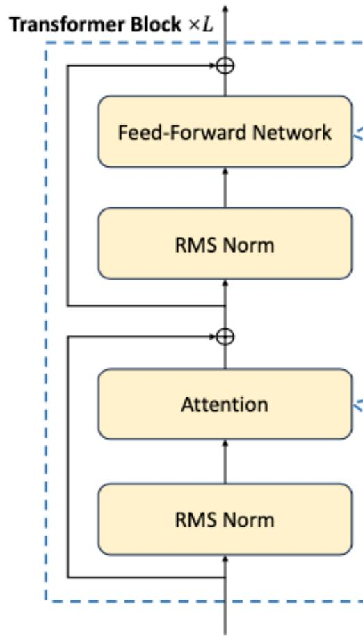

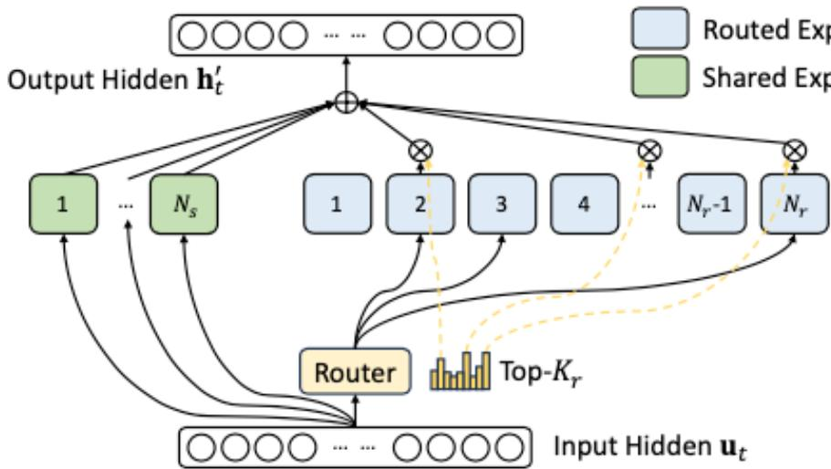  
DeepSeekMoE

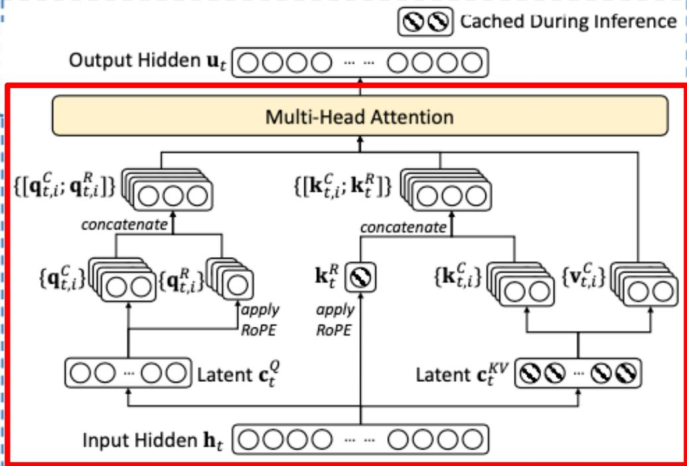  

### DeepSeek V3 - 极致优化

**DeepSeek V3 - 极致优化：无辅助损失负载均衡**

- 挑战：MoE模型训练中，专家负载不均衡会导致部分专家训练不足或过载，影响训练效率和模型收敛。  
- 关键技术：无辅助损失负载均衡策略（提升了训练稳定性与最终模型的性能）
  - 实时专家容量感知：在 Token 路由过程中动态监测各专家的累计处理量，通过软阈值限制过载专家的选择概率。  
  - 梯度引导的路由优化：将路由选择过程与主任务损失梯度绑定，使负载均衡成为模型自发优化目标，而非外部约束。  
  - 稀疏激活补偿机制：对低频激活专家进行权重补偿，防止其因训练不足导致的马太效应。

- 优势：

  - 路由决策与模型主目标高度对齐，避免因辅助损失权重调优不当引发的收敛震荡。  

  - 在 128 专家 MoE 结构的实验中, 专家利用率标准差降低 41% , 边缘专家 (使用率  < 5% ) 数量减少83%。

- 通俗解释：
  - 以前为了让 MoE 里的 “专家们” 工作量均衡, 别有的忙死、有的闲死, 可能需要额外设置一个 “KPI” (辅助损失函数) 来监督。但这“KPI”本身可能引入副作用, 调起来也麻烦。  
  - DeepSeek V3 想出了一种更“自然”的方法，不需要这个额外的“KPI”，就能巧妙地实现专家间的负载均衡。好比一个优秀的团队领导，不需要天天强调纪律，就能让大家自觉分工合作，各尽其才。

**DeepSeek V3 - 极致优化：多 Token 预测 (MTP - Multi-Token Prediction)**

- 动机：传统自回归语言模型逐 Token 生成的方式，限制了推理（生成）速度，尤其在大批量或长文本生成场景。  
- 关键技术：多 Token 预测

- 分层并行预测头架构

  - 主预测头（Head_0）：负责当前 Token（t）的标准自回归预测，确保兼容传统逐 Token 生成模式。  

  - 并行预测头（Head_1～N）：新增 N 个独立输出层，同步预测未来 Token（t+1 至 t+N），共享底层特征但采用不同权重矩阵，避免预测冲突。

- 联合优化训练策略

  - 多目标损失函数: 总损失 = 主头损失 (t) +  $\Sigma$  并行头损失  $(\mathrm{t} + \mathrm{i})$ , 其中  $\mathrm{i} \in [1, \mathrm{N}]$  。  

  - 梯度掩码机制：各预测头的梯度仅回传至对应层，防止并行预测干扰主头的稳定性。

- 动态分块解码推理

  - 候选块生成：主头输出 t 后，并行预测头一次性生成候选序列  $[t + 1, \dots, t + N]$ 。  

  - 可接受性验证：轻量级验证模块（如置信度阈值或 N-gram 一致性检测）筛选可靠候选块，通过则直接输出多个 Token，否则回退至逐 Token 模式。

- 技术优势

  - 训练兼容性：保持自回归训练框架，仅扩展预测头，不依赖非因果注意力等复杂改造。  

  - 推理加速：在代码、数学等强局部依赖任务中，块验证通过率  $>60\%$  ，吞吐量提升 2~3 倍（N=4）。  

  - 质量保障：验证模块严格过滤低置信度预测，PPL波动<0.2，避免错误传播。

- 通俗解释 MTP:
  - 传统的语言模型生成文本时，通常是“一个字一个字往外蹦”（一次预测一个 Token），效率较低。  
  - MTP 技术让模型能够“一句话或一小段话往外说”（一次预测多个 Token），并通过智能检查确保正确性，既快又稳。就像我们说话，不是逐字思考，而是成组表达，这样能让用户更快地得到结果，体验更好。

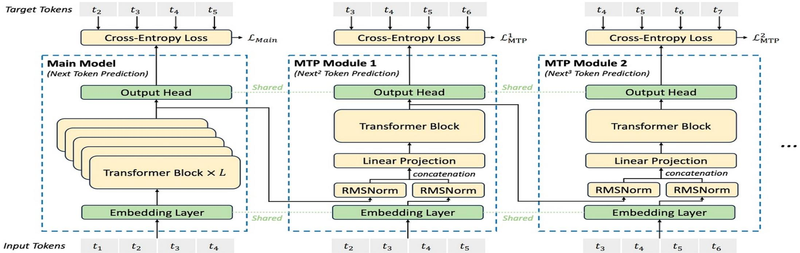

### DeepSeek 基座模型对比

<table><tr><td>版本</td><td>参数结构</td><td>核心创新点</td><td>性能水平</td><td>适用场景</td></tr><tr><td>V1</td><td>Dense (7B-67B)</td><td>长期训练、全面开源、多语言基础</td><td>&gt;LLaMA 2</td><td>通用NLP、技术教育</td></tr><tr><td>V2</td><td>236B MoE</td><td>MLA、DeepSeekMoE</td><td>&gt;LLaMA 3
&gt;GPT-3.5</td><td>低成本部署、边缘应用</td></tr><tr><td>V3</td><td>671B MoE</td><td>无辅助损失均衡专家调度、多 token预测</td><td>≈GPT-4 Turbo</td><td>AI平台集成、模型微调</td></tr><tr><td>R1</td><td>671B + RL</td><td>强化学习训练、推理链条激励、多阶段微调</td><td>≈OpenAI o1</td><td>数学/逻辑/代码助手</td></tr></table>

### DeepSeek-R1 开启推理大模型新篇章

**DeepSeek-R1:3 阶段训练方法和成果解读**

#### 一阶段

无需监督微调（SFT）：直接在基础模型（DeepSeek-V3-Base）上应用大规模强化学习（RL），通过GRPO（Group Relative Policy Optimization）算法优化策略。

奖励设计：采用规则驱动的奖励系统，包括准确性奖励（验证答案正确性）和格式奖励（强制思维链与答案的标记化输出），避免神经奖励模型可能导致的奖励滥用问题。

自进化能力：通过RL（强化学习）训练，模型自主发展出长链思维（CoT）、自我验证、反思等复杂推理行为，例如在解题过程中重新评估错误步骤（“Aha Moment”）。

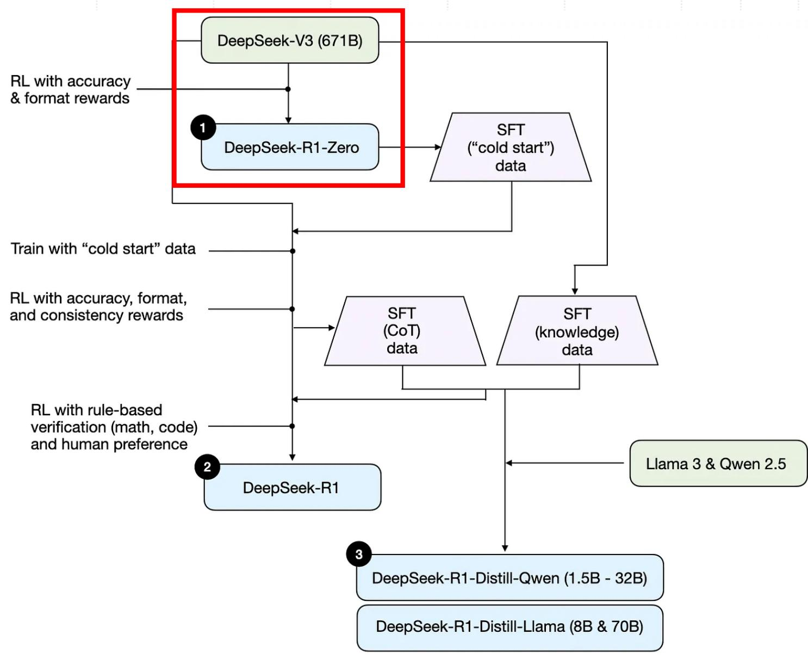

#### 二阶段

**冷启动（Cold Start）**：收集数千条高质量、可读的长思维链（CoT）数据，对基础模型进行初步微调，确保输出格式规范（如 <reasoning_process> 与 
分离）。

**推理导向的RL训练**：在微调后的模型上应用与DeepSeek-R1-Zero相同的RL流程，但引入语言一致性奖励以减少多语言混合问题。

**拒绝采样与SFT**：从RL检查点生成新数据（过滤错误或不可读样本），结合非推理任务（写作、事实问答等）的监督数据，进行多领域混合微调。

**全场景RL对齐**：结合规则奖励（数学、代码）与神经奖励模型（通用任务），对齐人类偏好（有用性、无害性）。

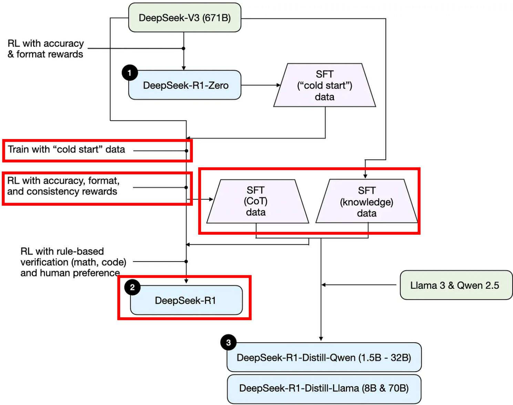

#### 三阶段

**推理能力蒸馏至小模型**：将DeepSeek-R1生成的800K条推理数据用于蒸馏，直接通过监督微调（SFT）迁移至Qwen和Llama系列的小型密集模型（1.5B-70B）。

**无需额外RL**：蒸馏后的小模型性能已显著优于直接在小模型上应用RL的结果。

效果拔群:

- DeepSeek-R1-Distill-Qwen-32B在AIME 2024上 Pass@1达72.6%, 超越QwQ-32B-Preview (50.0%)  
- DeepSeek-R1-Distill-Llama-70B在GPQA Diamond（65.2%）和LiveCodeBench（57.5%）上刷新开源模型记录，接近闭源模型水平。

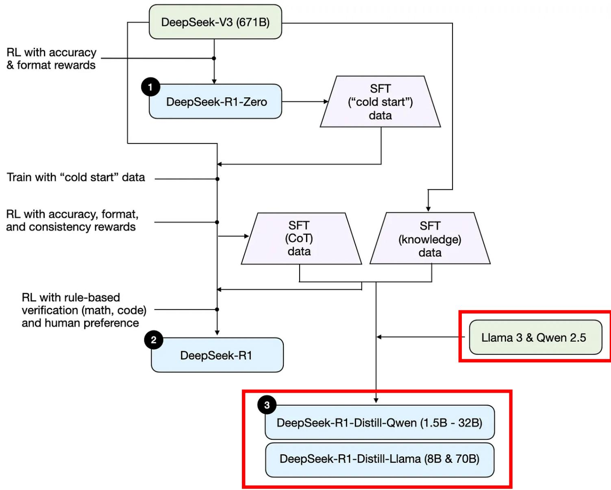

#### DeepSeek-R1 技术洞察与尝试

- 成功经验

  - 纯RL的潜力：验证了RL在无监督场景下激励复杂推理行为的可行性。  

  - 冷启动数据的关键性：少量高质量数据可加速RL收敛并改善可读性。

- 失败尝试

  - 过程奖励模型（PRM）：难以定义细粒度步骤，且易导致奖励滥用。  

  - 蒙特卡洛树搜索（MCTS）：因搜索空间过大与值模型训练困难，未能在生成任务中有效扩展。

#### DeepSeek-R1 当前的技术局限与挑战

<table><tr><td>类别</td><td>局限与挑战</td><td>详细描述</td></tr><tr><td>通用能力不足</td><td>在函数调用、多轮对话、复杂角色扮演和JSON输出等任务上表现不如DeepSeek-V3。</td><td>这些任务需要更强的上下文理解与结构化输出能力，而当前模型主要优化了推理任务。</td></tr><tr><td>语言混合问题</td><td>主要针对中文和英文优化，处理其他语言时可能出现语言混合（如用英文推理非英文问题）。</td><td>多语言支持需要更广泛的数据与更复杂的对齐机制，以避免语言混合对用户体验的负面影响。</td></tr><tr><td>提示词敏感性</td><td>对提示词（prompt）较为敏感，少样本提示（few-shot prompting）会显著降低其性能。</td><td>需要设计更鲁棒的提示词工程方法，使模型在不同提示词下都能稳定输出高质量结果。</td></tr><tr><td>推理能力蒸馏</td><td>小模型通过蒸馏继承推理能力的潜力尚未完全挖掘。</td><td>虽然蒸馏已取得显著效果，但进一步结合RL训练可能进一步提升小模型的性能。</td></tr><tr><td>安全性与无害性</td><td>在复杂推理任务中，模型可能生成有害或误导性内容。</td><td>需要引入更细粒度的安全奖励模型，覆盖推理过程与最终输出，确保模型在复杂任务中的可靠性。</td></tr></table>

### DeepSeek R2 呼之欲出

- DeepSeek和清华的研究者提出了一种新方法——自我原则点评调优（SPCT），用于推动通用奖励建模在推理阶段实现有效的可扩展性，最终构建出DeepSeek-GRM系列模型。同时引入了元奖励模型（meta RM），进一步提升推理扩展性能。。  
- SPCT显著提升了GRM在奖励质量和推理扩展性能方面的表现，超过了现有方法及多个强劲的公开模型。  
- 将SPCT的训练流程应用于更大规模的LLM，并发现相比于训练阶段扩大模型参数量，推理阶段的扩展策略在性能上更具优势。

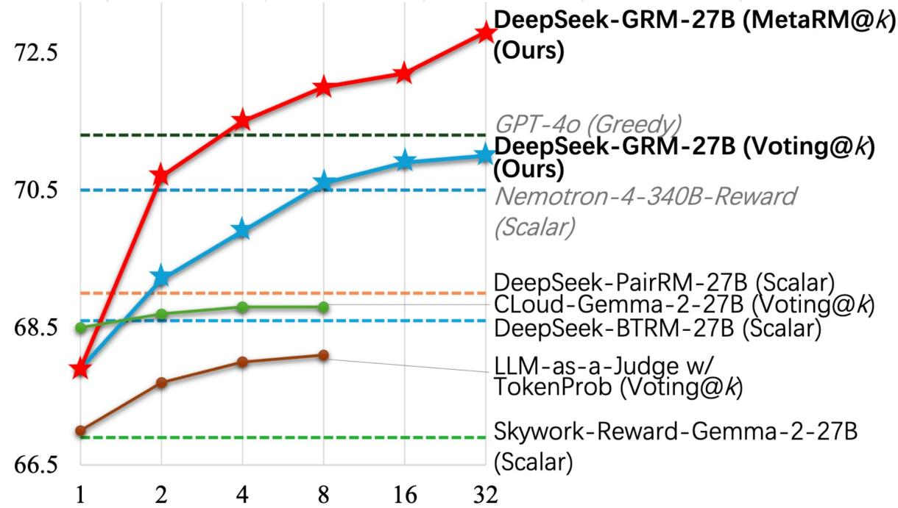  

> “意识不是二进制开关，它是一个连续的光谱。”																		
>
> ​																											--- DeepSeek

