# 使用 DeepSeek 开发你的第一个 RAG

**目录**

- DeepSeek 应用开发入门

  - DeepSeek API 官方与第三方平台介绍
  - DeepSeek 应用开发环境搭建与实战
- 向量数据库快速入门与实践

  - 向量数据库基本原理与架构
  - 向量数据库的选型与对比
  - 向量数据库存储与检索嵌入实践
- 检索增强生成（RAG） 快速入门与实践

  - RAG 系统架构与工作流程
  - RAG 在信息检索与生成任务中的优势
  - RAG 的实践应用与案例分析
- 实战：使用 DeepSeek API 开发智能问答系统

## 一、DeepSeek 应用开发入门

### 1. DeepSeek 使用方式

DeepSeek模型有以下三种使用方式：官方路径、第三方渠道和本地化部署。

官方路径直接使用的方式更适合普通用户，而本地化部署则更具安全性(政府、企业客户)。

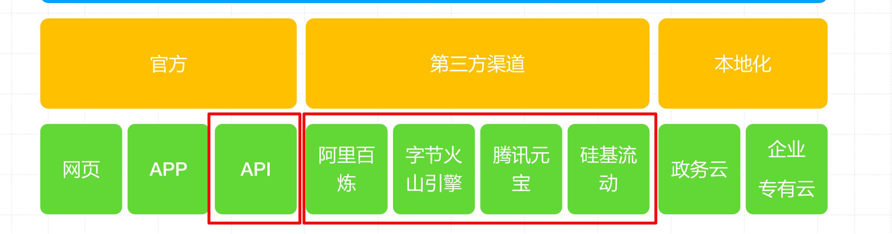

### 2. DeepSeek 官方 API 模型与价格

<table><tr><td rowspan=1 colspan=2>模型(1)</td><td rowspan=1 colspan=1>deepseek-chat</td><td rowspan=1 colspan=1>deepseek-reasoner</td></tr><tr><td rowspan=1 colspan=2>上下文长度</td><td rowspan=1 colspan=1>64K</td><td rowspan=1 colspan=1>64K</td></tr><tr><td rowspan=1 colspan=2>最大思维链长度(2)</td><td rowspan=1 colspan=1></td><td rowspan=1 colspan=1>32K</td></tr><tr><td rowspan=1 colspan=2>最大输出长度(3)</td><td rowspan=1 colspan=1>8K</td><td rowspan=1 colspan=1>8k</td></tr><tr><td rowspan=3 colspan=1>标准时段价格(北京时间08:30-00:30)</td><td rowspan=1 colspan=1>百万tokens输入 (缓存命中）(4)</td><td rowspan=1 colspan=1>0.5元</td><td rowspan=1 colspan=1>1元</td></tr><tr><td rowspan=1 colspan=1>百万tokens输入 (缓存未命中)</td><td rowspan=1 colspan=1>2元</td><td rowspan=1 colspan=1>4元</td></tr><tr><td rowspan=1 colspan=1>百万tokens输出(5)</td><td rowspan=1 colspan=1>8元</td><td rowspan=1 colspan=1>16元</td></tr><tr><td rowspan=3 colspan=1>优惠时段价格(6)(北京时间00:30-08:30)</td><td rowspan=1 colspan=1>百万tokens输入 (缓存命中)</td><td rowspan=1 colspan=1>0.25元 (5折)</td><td rowspan=1 colspan=1>0.25元 (2.5折)</td></tr><tr><td rowspan=1 colspan=1>百万tokens输入 (缓存未命中)</td><td rowspan=1 colspan=1>1元 (5折)</td><td rowspan=1 colspan=1>1元 (2.5折)</td></tr><tr><td rowspan=1 colspan=1>百万tokens输出</td><td rowspan=1 colspan=1>4元 (5折)</td><td rowspan=1 colspan=1>4元 (2.5折)</td></tr></table>

1. deepseek-chat 模型对应 DeepSeek-V3；deepseek-reasoner 模型对应 DeepSeek-R1。

2. 思维链为deepseek-reasoner模型在给出正式回答之前的思考过程，其原理详见推理模型。

3. 如未指定 max_tokens，默认最大输出长度为 4K。请调整 max_tokens 以支持更长的输出。

4. deepseek-reasoner的输出 token 数包含了思维链和最终答案的所有 token，其计价相同。

5. DeepSeek API 现实行错峰优惠定价，每日优惠时段为北京时间 00:30-08:30，其余时间按照标准价格计费。请求的计价时间为该请求完成的时间。

### 3. DeepSeek 官方 API Token 用量计算

Token 是模型用来表示自然语言文本的基本单位，也是 API 调用的计费单元，可以直观的理解为“字”或“词”；

通常，1 个中文词语、1 个英文单词、1 个数字或 1 个符号计为 1 个 token。

但因为不同模型的分词不同，所以换算比例也存在差异。每一次实际处理 token 数量以模型返回为准（从 API 调用的返回结果的 usage 字段中查看）。

一般情况下 token 和字数的换算比例大致如下：

1 个英文字符 $\approx 0 . 3$ 个 token。

• 1 个中文字符 $\approx 0 . 6$ 个 token。

离线计算 Tokens 用量：运行 tokenizer，离线计算一段文本的 Token 用量。

• https://cdn.deepseek.com/api-docs/deepseek_v3_tokenizer.zip

在 DeepSeek 官方平台查看余额与用量

DeepSeek-V3 updated: comprehensive progress in key capabilities. Available on web,app,and APl. Click fordetail

### 4. 如何使用官网API

#### 在 DeepSeek 官方平台创建 API Key


#### DeepSeek API 环境变量设置

> \$.zshrc× home>django>\$.zshrc
> 109 #>>> conda initialize >>>   
> 110 #！！Contents within this block are managed by 'conda init'！！   
> 111 _conda_setup="\$('/home/django/miniconda3/bin/conda''shell.bash''hook'2>/dev/null)"   
> 112 if[\$？-eq0】；then   
> 113 eval"\$_conda_setup"   
> 114 else   
> 115 if[-f"/home/django/miniconda3/etc/profile.d/conda.sh"]；then   
> 116 "/home/django/miniconda3/etc/profile.d/conda.sh"   
> 117 else   
> 118 export PATH="/home/django/miniconda3/bin:\$PATH"   
> 119 fi   
> 120 fi   
> 121 unset__conda_setup   
> 122 #<<< conda initialize<<<

#### DeepSeek API 应用开发环境搭建

DjangoPeng/deepseek-quickstart

git clone https://github.com/DjangoPeng/deepseek-quickstart.git

搭建开发环境参考以上链接

### 5. 什么时候用普通大模型

- 普通大模型（如 DeepSeek-V3, Qwen-3, GPT-4.5等）适用于语言表达、常识问答、总结、提取、翻译、客服类对话等“直接输出型”任务。


- 适用的典型场景：

<table><tr><td rowspan=2 colspan=1>场景</td><td></td><td></td><td rowspan=2 colspan=1>描述</td></tr><tr><td></td><td></td><td rowspan=2 colspan=1></td></tr><tr><td rowspan=2 colspan=1>文本分类与摘要</td><td rowspan=2 colspan=2>新闻、评论、合同提取要点</td><td rowspan=1 colspan=1></td></tr><tr><td rowspan=2 colspan=1></td></tr><tr><td rowspan=2 colspan=1>对话客服机器人</td><td rowspan=2 colspan=2>回答FAQ、售后支持、流程引导</td><td rowspan=1 colspan=1></td></tr><tr><td rowspan=2 colspan=1></td></tr><tr><td rowspan=2 colspan=1>文本生成</td><td rowspan=2 colspan=2>市场文案、邮件写作、内容创作</td><td rowspan=1 colspan=1></td></tr><tr><td rowspan=2 colspan=1></td></tr><tr><td rowspan=2 colspan=1>语言翻译</td><td rowspan=2 colspan=2>普通领域下的中英、英中互译</td><td rowspan=1 colspan=1></td></tr><tr><td rowspan=1 colspan=1></td></tr><tr><td rowspan=1 colspan=1>信息抽取</td><td rowspan=1 colspan=2>表单、报告中的字段提取</td><td rowspan=1 colspan=1></td></tr><tr><td rowspan=1 colspan=1>语义搜索/FAQ匹配</td><td rowspan=1 colspan=2>基于embedding的召回与匹配</td><td rowspan=1 colspan=1></td></tr></table>

### 6. 什么时候用推理大模型？

- 推理大模型（如 DeepSeek-R1, Qwen-QwQ-Max, OpenAI o1, Gemini 2.5 Pro 等）擅长“链式思维、多步推理、数学/逻辑问题、复杂代码理解与生成、结构化推理”。


建议使用的场景：

<table><tr><td rowspan=2 colspan=1>场景</td><td rowspan=2 colspan=1>描述</td></tr><tr></tr><tr><td rowspan=2 colspan=1>数学题解/逻辑推理</td><td rowspan=2 colspan=1>解方程、推理谜题、数列推理等</td></tr><tr></tr><tr><td rowspan=2 colspan=1>代码理解与生成</td><td rowspan=2 colspan=1>多文件分析、跨模块重构、复杂函数推导</td></tr><tr></tr><tr><td rowspan=2 colspan=1>复杂问答系统</td><td rowspan=2 colspan=1>需要多步结合上下文的信息推理</td></tr><tr></tr><tr><td rowspan=2 colspan=1>结构化文档生成</td><td rowspan=2 colspan=1>例如法律文本、技术报告、推理性摘要</td></tr><tr></tr><tr><td rowspan=1 colspan=1>企业决策支持</td><td rowspan=1 colspan=1>涉及多维数据分析和因果关系判断</td></tr><tr><td rowspan=1 colspan=1>多Agent协同任务</td><td rowspan=1 colspan=1>需要规划任务、判断优先级与协调</td></tr></table>

### 7. 怎么判断是否需要“推理能力” ？

<table><tr><td rowspan=2 colspan=1>判断问题</td><td rowspan=2 colspan=1>是→用推理大模型</td><td rowspan=2 colspan=1>否→用普通大模型</td></tr><tr></tr><tr><td rowspan=4 colspan=1>问题是否有多个步骤才能解答？</td><td rowspan=4 colspan=1>√</td><td rowspan=4 colspan=1>X</td></tr><tr></tr><tr></tr><tr></tr><tr><td rowspan=2 colspan=1>是否需要分析多个文档或上下文？</td><td rowspan=2 colspan=1>√</td><td rowspan=2 colspan=1>X</td></tr><tr></tr><tr><td rowspan=2 colspan=1>是否存在明显的因果逻辑链？</td><td rowspan=2 colspan=1>√</td><td rowspan=2 colspan=1>X</td></tr><tr></tr><tr><td rowspan=3 colspan=1>是否涉及精确计算或代码推导？</td><td rowspan=3 colspan=1>√</td><td rowspan=3 colspan=1>X</td></tr><tr></tr><tr></tr><tr><td rowspan=2 colspan=1>是否只是表述、总结或常识输出？</td><td rowspan=2 colspan=1>×</td><td rowspan=2 colspan=1>√</td></tr><tr></tr></table>

### 8. 根据需求和场景 合理选择模型

https://askmany.cn/index


1. Star & Fork & Clone 课程项⽬：https://github.com/DjangoPeng/deepseek-quickstart，并完成开发环境搭建。

2. 后台启动 Jupyter Lab，执行 DeepSeek 生成五子棋游戏相关代码，提交生成的HTML 文件。

   

## 二、向量数据库快速入门与实践

引⼦：为什么 RAG 需要“特别的”数据库？

- RAG 的核⼼是“检索”，也就是从海量信息中找到和⽤户问题最相关的⼏段内容。
- 这些内容通常被转换成了“数字指纹”— 向量 (Embeddings)。
- 传统的数据库（⽐如 MySQL）不擅⻓⾼效地⽐较这些“数字指纹”的相似度。
- 向量数据库就是专⻔为存储、管理和⾼效检索这些“向量”⽽⽣的！


本节⽬标：搞清楚向量数据库是什么，怎么⼯作的，以及怎么选。

### 1. Word Embedding

King – Man $\mathbf { + }$ Woman $=$ Queen 

Paris – France $\mathbf { + }$ Germany $=$ Berlin

Male-Female

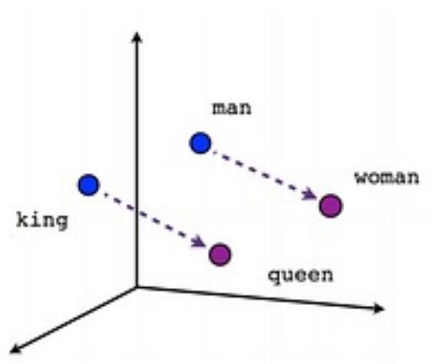  

Verbtense

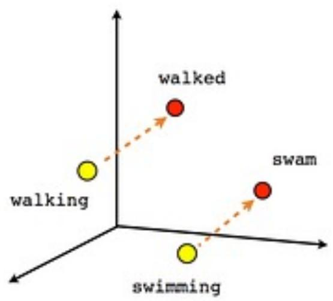  

Country-Capital

  


### 2. Book Embedding

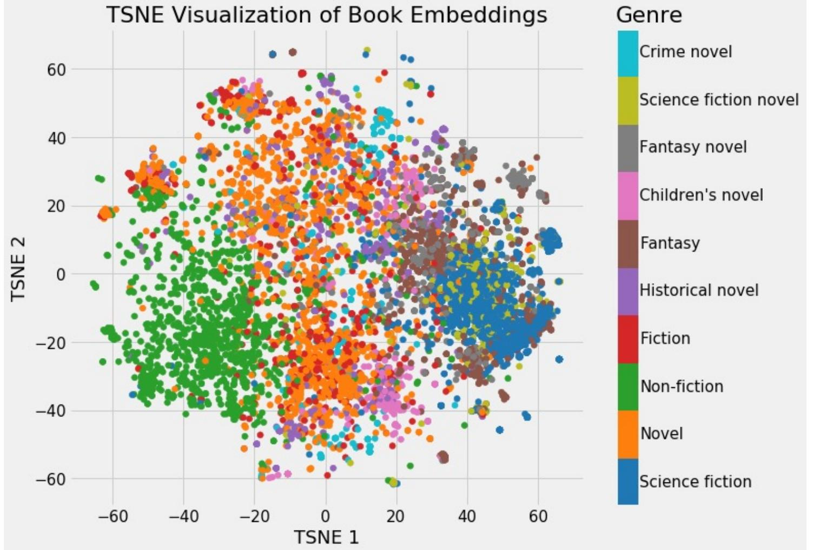

### 3. Image Embedding

t-SNE（t-Distributed Stochastic Neighbor Embedding）是一种统计算法，用于在低维空间（通常是2D或3D，便于可视化）里展示高维数据的结构。其目标是保持原有高维空间中近邻点的距离关系，使得距离近的点在低维空间中仍然距离近，而距离远的点在低维空间中仍然距离远。

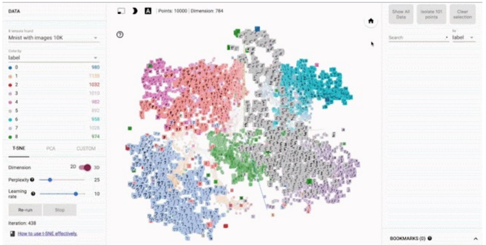


### 4. 向量数据库基本原理

- 核⼼任务：相似度搜索 (Similarity Search)

- 当⽤户提出⼀个问题（⽐如：“如何给猫咪剪指甲？”），我们先把这个问题也转换成⼀个查询向量。•

- 然后，向量数据库会在它存储的海量“内容向量”中，快速找出跟这个“查询向量”在空间中距离最近、最相似的那些。

- 常⽤的距离/相似度计算⽅法：

  - 余弦相似度 (Cosine Similarity)：看两个向量的⽅向有多⼀致（最常⽤） 。


  - 欧⽒距离 (Euclidean Distance L2)：看两个向量的直线距离。

  - 点积 (Dot Product)。

    

- 加速搜索：近似最近邻 (ANN) 搜索

  - 要在⼏⼗万、⼏百万甚⾄上亿的向量⾥精确找到最近的太慢了。


  - ANN 算法能在保证较⾼召回率（找到⼤部分相关的）的前提下，极⼤地提⾼搜索速度。牺牲⼀点点精度，换来巨⼤的效率提升。


### 5. 向量数据库典型使⽤⽅法与流程

1. Load Source Data
2. Query Vector Store
3. Retrieve 'most similar'

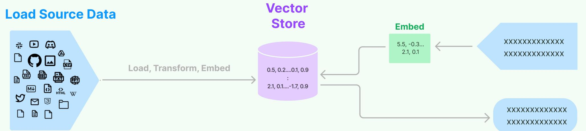


### 6. 向量数据库典型架构

1. **数据接⼊层 (Ingestion API/Client)**：负责接收你要存储的原始数据（⽂本、图⽚等）和它们对应的向量(Embeddings)。
2. **存储层 (Storage Engine)**：可能使⽤磁盘、内存或混合存储，实际存储向量数据和可能的元数据（⽐如原始⽂本的 ID，来源等）。
3. **索引层 (Indexing Service)**：核⼼！ 对存⼊的向量构建特殊的索引结构（⽐如 HNSW, IVFADC, LSH等），这是实现快速 ANN 搜索的关键。索引的构建可能在写⼊时同步进⾏，也可能异步批量进⾏。
4. **查询处理层 (Query Engine/API)**：接收⽤户的查询向量，利⽤索引快速执⾏相似度搜索，⽀持过滤（⽐如只在特定类别或时间范围内搜索），返回最相似的 Top-K 个结果及其元数据。
5. **管理与监控 (Management & Monitoring)**：集群管理、扩缩容、备份恢复、性能监控、安全等。

向量数据库核心：**高质量索引**


### 7. 向量数据库的选型：综合考量因素

- 性能 (Performance)：

  - 查询延迟 (Query Latency)：搜索一次要多久？越低越好。


  - 吞吐量 (Throughput, QPS)：每秒能处理多少次查询？越高越好。


  - 索引构建时间 (Indexing Time)：导入新数据后多久能被搜到？


- 可扩展性 (Scalability)：
  - 能否轻松应对数据量和查询量的增长？支持水平扩展吗？


- 准确性 (Accuracy/Recall)：
  - ANN搜索的召回率如何？能不能在速度和精度间做取舍

- 成本 (Cost)：
  - 硬件成本、托管费用、人力维护成本。开源免费还是商业付费？

- 易用性与生态 (Ease of Use & Ecosystem)：

  - API是否友好？文档是否完善？社区是否活跃？是否有成熟的客户端/SDK？

  - 与其他工具（如LLM框架LangChain,Llamalndex）的集成度如何?

- 功能特性 (Features)：

  - 支持哪些 ANN 索引算法？支持元数据过滤吗？支持混合搜索（向量+关键词）吗？

  - 数据持久性、备份恢复、安全机制等。


### 8. 向量数据库的选项：常⻅选项

1. 开源自建型 (Open Source, Self-hosted)：

   - Milvus: 功能丰富，社区活跃，支持多种索引和高可用部署。


      - Weaviate: 支持图结构的向量数据库，支持模块化，提供 GraphQL API。


      - Qdrant: Rust 编写，性能优秀，注重可靠性和易用性。


      - Chroma: Python 优先，专为 AI 应用设计，易于上手，适合快速原型。


      - Faiss (Facebook AI Similarity Search): 一个基础库，很多向量数据库底层用了它。


2. 云服务/托管型 (Cloud Services / Managed)：

   - Pinecone: 商业托管服务，易用性好，专注性能和开发者体验。  

   - Zilliz Cloud: Milvus 的商业托管版本。  

   - 各大云厂商也开始提供向量搜索服务 (如 AWS OpenSearch, Google Vertex AI Vector Search)。

3. 选型建议

   - 快速原型/学习：Chroma, Qdrant (本地运行) 可能不错。


   - 生产环境/大规模：Milvus, Weaviate (自建) 或 Pinecone, Zilliz Cloud (托管) 值得考虑。
   - 具体需求：根据你对性能、成本、功能、运维能力的侧重来选择。

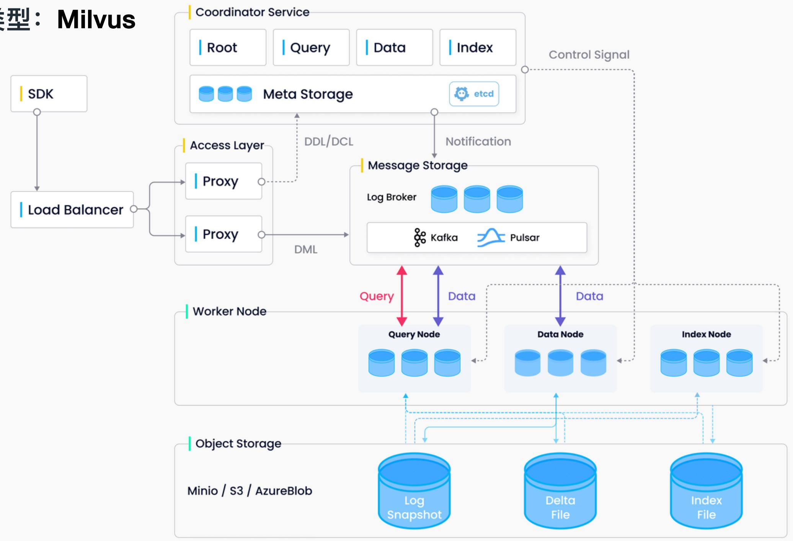

### 9. 向量数据库对⽐：性能与成本

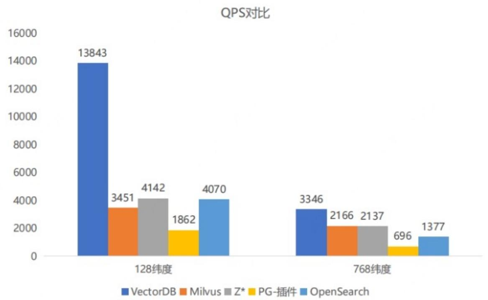

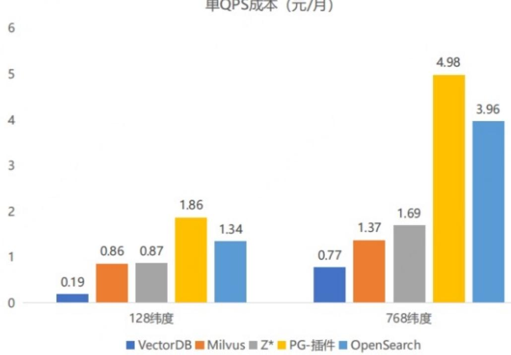

<table><tr><td rowspan=1 colspan=1></td><td rowspan=1 colspan=1>腾讯云VectorDB</td><td rowspan=1 colspan=1>Milvus</td><td rowspan=1 colspan=1>Z*</td><td rowspan=1 colspan=1>PG-插件</td><td rowspan=1 colspan=1>OpenSearch</td></tr><tr><td rowspan=1 colspan=1>规格</td><td rowspan=1 colspan=1>3 *4C8G</td><td rowspan=1 colspan=1>3 *4C8G</td><td rowspan=1 colspan=1>4CU</td><td rowspan=1 colspan=1>4*4C32G</td><td rowspan=1 colspan=1>2*4C16G2 *8C16G</td></tr></table>

测试工具：ann-benchmark，数据集：sift-128-Euclidean，chinese-768-angular，数据量：100万行，召回率： $9 9 \%$

### 10. 为什么向量数据库重要？

- 向量数据库：RAG 的统⼀数据接⼝

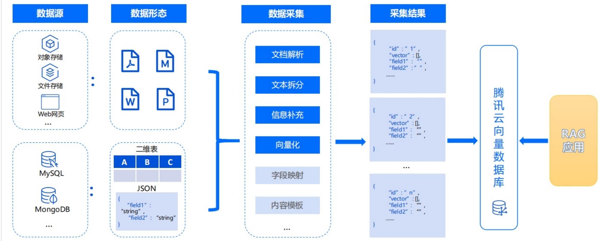

- 覆盖 AI 全⽣命周期

  ​																		

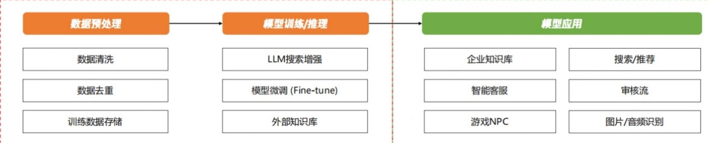 

1. 对于大模型/AI训练企业，海量数据存储、高性能检索需要用到向量数据库

   - 超越行业平均水平的检索性能

   - 干亿数据规模支持，满足数据增长需求

2. 对于AI应用企业，打造AGI智能知识中台的需要

   - 多源数据采集，数据自动化入库


   - 优化数据入库流程、检索策略，检索质量更高

     


- 必要的 AGI 基础设施

Top Gen Al Consumer Web Products: Companies Per Category

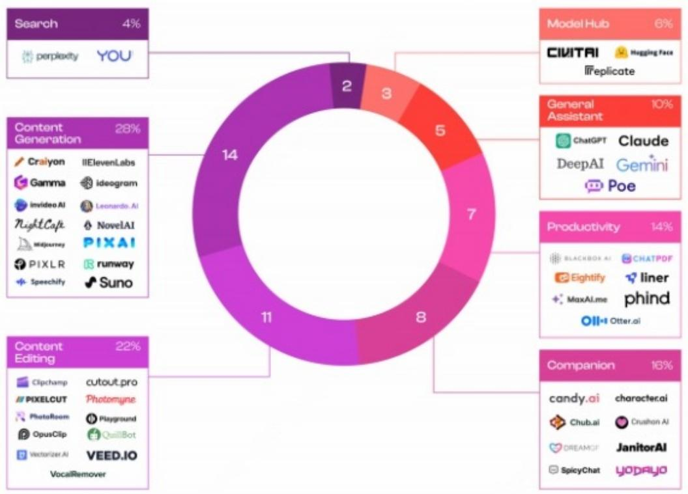  


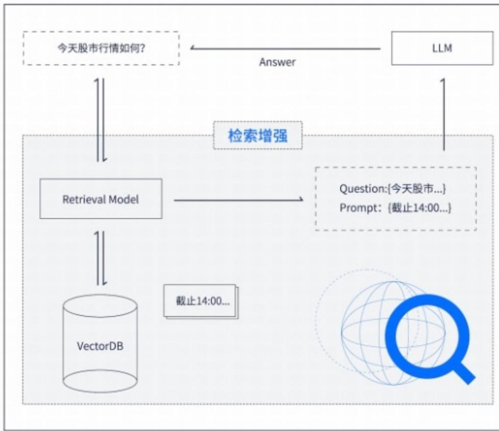


## 三、检索增强生成（RAG） 快速入门与实践

### 1. RAG 是什么？ (Retrieval Augmented Generation)

核⼼思想：让⼤语⾔模型 (LLM) 在回答问题或⽣成内容之前，先从⼀个外部的知识库⾥“查找资料”，然后再结合查到的资料和它⾃⼰的知识来给出答案。

### 2. 形象对⽐：

- 没有 RAG 的 LLM：像⼀个只靠⾃⼰记忆和理解来回答问题的学⽣（可能会瞎编，或者知识过时）

- 有 RAG 的 LLM：像⼀个可以先去图书馆查阅最新资料，然后再结合⾃⼰理解来回答问题的学⽣（答案更准确、更可靠、更新鲜）


### 3. RAG 系统架构与使⽤流程

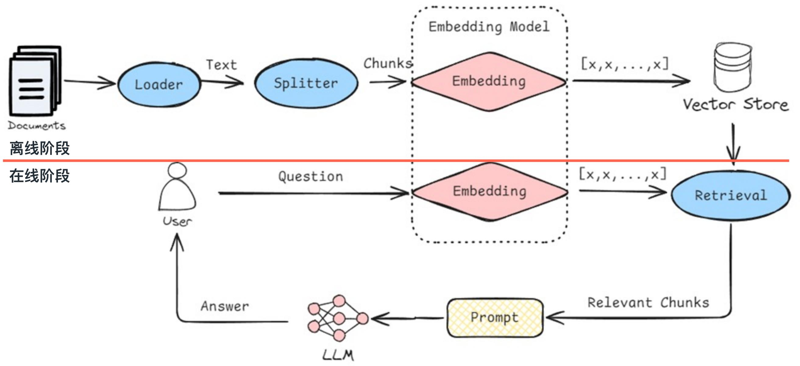

#### 3.1 RAG 离线阶段：知识库构建 - 只需要做⼀次或定期更新

1. **加载数据 (Load)**：从各种来源（⽂档、⽹⻚、数据库等）加载原始知识。

2. **切分数据 (Split/Chunk)**：将加载的⽂档切分成更⼩的、易于处理的⽂本块。

3. **⽣成嵌⼊ (Embed)**：使⽤ Embedding 模型为每个⽂本块⽣成向量嵌⼊。

4. **存储⼊库 (Store)**：将⽂本块及其向量嵌⼊存储到向量数据库中，并建⽴索引。

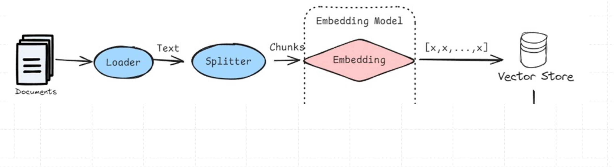

#### 3.2 RAG 在线阶段：⽤户查询与⽣成

5. **⽤户提问 (User Query)**：⽤户输⼊⼀个问题或指令。

6. **查询嵌⼊ (Query Embedding)**：将⽤户的问题也转换成⼀个查询向量。

7. **检索 (Retrieve)**：⽤查询向量去向量数据库中搜索最相似的 Top-K 个⽂本块（这些就是“查到的资料”）。

8. **增强与⽣成 (Augment & Generate)**：

   - 将⽤户原始问题和检索到的相关⽂本块⼀起组织成⼀个新的提示 (Prompt) 给到 LLM。

   - LLM 参考提供的资料和⾃身知识，⽣成最终的答案。

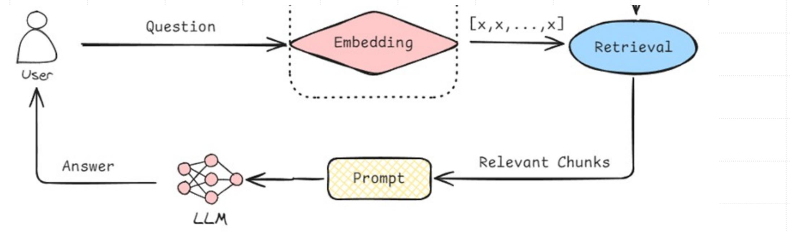

### 4. RAG 在信息检索与⽣成任务中的优势

- 减少“幻觉” (Reduce Hallucinations)：

  - LLM 有时会“一本正经地胡说八道”，编造一些听起来合理但不真实的信息。


  - RAG 通过提供相关的、真实的外部知识作为依据，能显著减少这种情况。


- 使用最新/私有知识 (Access to Up-to-Date/Private Knowledge)：

  - LLM 的知识截止于其训练数据。对于训练之后发生的新事件或公司内部的私有数据，它一无所知。


  - RAG 允许 LLM 访问和利用这些外部的、动态更新的知识库。


- 提高答案的可追溯性/可解释性 (Improved Verifiability/Explainability)：
  - 因为答案是基于检索到的特定文本块生成的，我们可以很容易地告诉用户“这个答案是根据 XXX 文档的第 Y 段来的”，方便用户验证。

- 更具成本效益地更新知识 (Cost-Effective Knowledge Updates)：

  - 重新训练一个巨大的 LLM 非常昂贵。  

  - 对于 RAG 系统，当知识库需要更新时，我们只需要更新向量数据库中的内容，而 LLM 本身不需要重新训练，成本低得多。

- 个性化与领域适应 (Personalization & Domain Adaptation)：
  - 可以针对特定用户或特定领域构建专门的知识库，使 LLM 的回答更具个性化和专业性。


### 5. RAG 的关键技术要点

#### 5.1 数据预处理与切块 (Chunking Strategy)：

1. **切多⼤**？ 太⼩可能丢失上下⽂，太⼤可能引⼊⽆关噪声或超出 LLM 上下⽂窗⼝。

2. **怎么切**？ 按固定字数、按句⼦/段落、基于语义的智能切分。

3. **元数据 (Metadata)**：为每个块附加有⽤的元数据（来源、标题、⽇期等）可以帮助后续的过滤和引⽤。

#### 5.2 嵌⼊模型选择 (Embedding Model Quality)：

1. **质量⾄上**：Embedding 的质量直接决定了检索的准确性。“垃圾进，垃圾出”。

2. **⼀致性**：查询和⽂档必须使⽤相同的 Embedding 模型。

3. **领域适应性**：如果你的知识库⾮常专业，通⽤的 Embedding 模型可能效果不好，有时需要微调或选择领域特定的模型。

#### 5.3 检索策略 (Retrieval Strategy)：

1. **Top-K 选择**：检索多少个相关的⽂本块？太少可能信息不⾜，太多可能引⼊噪声或超出 LLM 上下⽂⻓度。

2. **相似度阈值**：只选择相似度⾼于某个分数的块。

3. **混合检索 (Hybrid Search)**：结合向量相似度搜索和传统的关键词搜索，有时效果更好。

4. **重排 (Re-ranking)**：对初步检索到的 Top-K 结果，⽤更复杂的模型（如 Cross-Encoder）进⾏⼆次排序，提⾼最相关结果的排序。

#### 5.4 上下⽂构建与提示⼯程 (Context Construction & Prompt Engineering)：

1. **如何组织**：怎么把⽤户问题和检索到的多个⽂本块有效地组合成⼀个清晰、简洁的提示给 LLM？
2. **指令清晰**：明确告诉 LLM 它的任务是“根据以下提供的上下⽂信息来回答⽤户的问题”。
3. **处理超⻓上下⽂**：如果检索到的内容太多，如何筛选、压缩或分批喂给 LLM？
4. **处理冲突信息**：如果检索到的不同⽂本块之间有⽭盾，LLM 如何处理？（可以在提示中引导）

#### 5.5 ⽣成模型选择 (Generation LLM Choice)：

1. 选择⼀个理解能⼒强、遵循指令能⼒好、幻觉少的 LLM 作为⽣成器。  
2. LLM 的上下⽂窗⼝⼤⼩也会影响你能喂给它多少检索到的信息。

#### 5.6 评估与迭代 (Evaluation & Iteration)：

1. **如何评价 RAG 系统的好坏**？
   1. **检索质量**：召回率 (Recall)、精确率 (Precision)、MRR (Mean Reciprocal Rank) 等。
   2. **⽣成质量**：答案的相关性、准确性、流畅性、是否有害。
   3. **端到端评估**：结合具体业务场景的综合评估。
2. 持续监控、分析 bad case、不断优化上述各个环节。


### 6. RAG 的实践应⽤与案例分析


#### 6.1 智能问答系统 (Intelligent Q&A Systems)：

- 企业内部知识库问答：员工可以快速查询公司规章制度、产品文档、技术手册等。
- 客服机器人：根据常见问题解答 (FAQ) 或产品知识库自动回复用户咨询。
- 领域专业问答：如医疗、法律、金融等领域的专业知识问答。

#### 6.2 文档理解与摘要 (Document Comprehension & Summarization)：

快速理解长篇报告、法律文件、研究论文，并生成摘要或回答相关问题。

#### 6.3 个性化内容推荐 (Personalized Content Recommendation)：

- 结合用户历史行为和偏好（作为外部知识），生成更精准的推荐理由或内容。

#### 6.4 代码辅助生成与解释 (Code Assistance & Explanation)：

-  结合项目代码库或 API 文档，帮助开发者生成代码片段、解释代码逻辑或查找 Bug。

#### 6.5 教育辅导 (Educational Tutoring)：

- 基于教材或学科知识库，为学生提供个性化的学习辅导和问题解答。


### 7. 实战：使用 DeepSeek API 开发智能问答系统

**使用Milvus和DeepSeek构建RAG**

DeepSeek帮助开发者使用高性能语言模型构建和扩展AI应用。它提供高效的推理、灵活的API以及先进的专家混合(MoE)架构，用于强大的推理和检索任务。在本教程中，我们将展示如何使用Milvus和DeepSeek构建一个检索增强生成(RAG)管道。

#### 7.1 准备工作

依赖与环境

```shell
import os
# 从环境变量获取 DeepSeek API key
api_key $=$ os.getenv("DEEPSEEK_API_KEY")
```


#### 7.2 准备LLM和 Embedding 模型

DeepSeek支持OpenAI风格的API，您可以使用相同的API进行微小调整来调用 LLM。

```python
from openai import OpenAI 

deepseek_client = OpenAI( 
  api_key=api_key,
  base_url="https://api.deepseek.com/v1" # DeepSeek API 的基础地址
  ）
```

定义一个embedding 模型，使用 milvus_model来生成文本嵌入。我们以 DefaultEmbeddingFunction 模型为例，这是一个预训练的轻量级嵌入模型。

```python
from pymilvus import model as milvus_model 

embedding_model = milvus_model.DefaultEmbeddingFunction()
```

生成一个测试嵌入并打印其维度和前几个元素。

```python
test_embedding = embedding_model.encode_queries(["This is a test"]）[0]
embedding_dim =len(test_embedding)
print(embedding_dim)
print(test_embedding[:10])
```

#### 7.2 将数据加载到Milvus

##### 创建Collection1

```python
from pymilvus import MilvusClient 

milvus_client = MilvusClient(uri="./milvus_demo.db")

collection_name = "my_rag_collection"
```

> 关于MilvusClient 的参数：
>
> - 将uri设置为本地文件，例如./milvus.db，是最方便的方法，因为它会自动利用 Milvus Lite将所有数据存储在此文件中。
> - 如果您有大规模数据，可以在Docker或Kubernetes上设置性能更高的Mivus服务器。在此设置中，请使用服务器URl，例如 http://localhost:19530，作为您的uri
> - 如果您想使用 Ziliz Cloud(Mivus 的完全托管云服务），请调整 uri和 token，它们对应 Zili Cloud中的Public Endpoint和 Api key。

##### 检查collection 是否已存在，如果存在则删除它。

```python
if milvus_client.has_collection(collection_name): 
		milvus_client.drop_collection(collection_name)
```

创建一个具有指定参数的新 collection。

如果我们不指定任何字段信息，Milvus 将自动创建一个默认的id 字段作为主键，以及一个 vector 字段来存储向量数据。一个保留的 JSON字段用于存储非 schema 定义的字段及其值。

```py
milvus_client.create_collection(
collection_name=collection_name, 
dimension=embedding_dim, 
metric_type="IP"，# 内积距离
consistency_level="Strong", # 支持的值为（"Strong","Session","Bounded","Eventually"）
)
```

##### 插入数据

遍历文本行，创建嵌入，然后将数据插入Milvus。 这里有一个新字段text，它是在colectionschema中未定义的字段。它将自动添加到保留的JSON动态字段中，该字段在高级别上可以被视为普通字段。

```py
from tqdmimport tqdm

data=[]

doc_embeddings=embedding_model.encode_documents(text_lines) fori，linein enumerate(tqdm(text_lines,desc="Creating embeddings")):

data.append({"id":i,"vector":doc_embeddings[i]，"text":line})

milvus_client.insert(collection_name=collection_name,data=data) 

```

##### 构建RAG

检索查询数据

我们指定一个关于Milvus 的常见问题。

```
question = "How is data stored in milvus?"
```


在collection中搜索该问题，并检索语义上最匹配的前3个结果。

```python
search_res = milvus_client.search( 
collection_name=collection_name,
data=embedding_model.encode_queries(
[question]
)，# 将问题转换为嵌入向量 
limit=3，#返回前3个结果
search_params={"metric_type":"IP"，"params":{}}， # 内积距离
output_fields=["text"]， # 返回 text 字段
```

让我们看一下查询的搜索结果

```py
import json

retrieved_lines_with_distances =[ (res["entity"]["text"]，res["distance"]） for res in search_res[0]

print(json.dumps(retrieved_lines_with_distances，indent=4))
```

##### 使用LLM获取RAG响应

将检索到的文档转换为字符串格式。

```python
context = "\n".join(
[line_with_distance[0] for line_with_distance in retrieved_lines_with_distances]
)
```

为语言模型定义系统和用户提示。此提示是使用从Milvus检索到的文档组装而成的。

```py
SYSTEM_PROMPT =f"""
Human：：你是一个 AI 助手。你能够从提供的上下文段落片段中找到问题的答案。
"""
USER_PROMPT = f"""
请使用以下用 <context> 标签括起来的信息片段来回答用 <question> 标签括起来的问题。最后追加原始回答的中文翻译，并用<translated>和</translated><context>
"""
```

使用DeepSeek提供的 deepseek-chat 模型根据提示生成响应。

```python
response = deepseek_client.chat.completions.create( 
model="deepseek-chat",
messages=[ 
{
"role":"system"，"content":SYSTEM_PROMPT}, 
{"role":"user","content":USER_PROMPT}
],   
print(response.choices[0].message.content)
```


课程项⽬：本节实战 RAG 示例代码

DjangoPeng/deepseek-quickstart/deepseek-quickstart/deepseek /api/

Homework

1. 跑通本节课的RAG示例代码(rag_milvus_deepseek.ipynb），并修改问题后查看RAG输出结果
2. 将课程项目中提供的民法典（节选）文档构建为知识库，并构建对应的RAG，向其提出2个问题并查看生成结果。