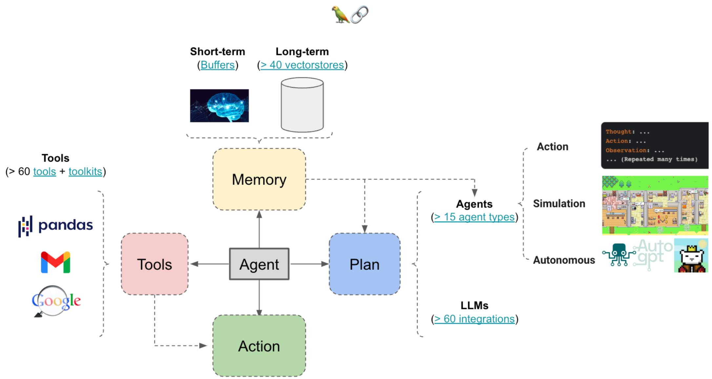

# 使用DeepSeek开发小红书文案生成助手

## 一、目录

- Agent 理论基础与开发入门
  - Agent 基本概念与工作机制  
  - Agent 核心能力与独特优势  
  - Agent 开发流程与关键模块解析

- DeepSeek Agent 开发入门与案例分析
  - DeepSeek 工具调用入门  
  - DeepSeek Prompt 设计策略方法  
  - DeepSeek Agent 真实应用案例解析


- 实战：使用 DeepSeek 开发小红书爆款文案生成助手

  - 需求拆解与 Agent 任务规划  

  - 爆款文案生成逻辑与 Prompt 设计  

  - 文案生成策略与评估优化


## 二、Agent 理论基础与开发入门

### 1.  引子：LLM 已经很强了，为什么还需要 Agent?

- **LLM (大语言模型)**: 擅长理解和生成文本, 但通常是 “一次性” 的响应。你问一句, 它答一句。  
- **Agent (智能体)**: 不仅仅是对话, 它是一个能自主规划、使用工具、并根据环境反馈采取行动的系统。它让 LLM 从一个“聊天机器人”进化成一个能完成复杂任务的“智能助理”。

大模型(LLM) vs 智能体(Agent)

理解输入->思考->生成结果

  

LLM + 记忆 + 工具使用 + 长任务规划

  

螺旋共生关系

### 2. Agent 基本概念与特点

- 自主性 (Autonomy):
  - Agent 可以在没有人为干预的情况下，根据设定的目标和当前环境，自主地做出决策和执行动作。


- 感知 (Perception):
  - Agent 能够通过各种方式（如文本输入、API 返回、传感器数据）感知其所处的环境和状态。


- 行动 (Action):
  - Agent 能够执行一系列动作来改变环境或达成目标。这些动作可能包括调用 API、执行代码、生成文本、与其他系统交互等。


- 目标导向 (Goal-oriented):
  - Agent 的所有行为都是为了实现一个或多个预设的目标。


### 3. 最简 AI Agent 核心组件

Agents 通过传感器（Sensors）收集各类数据（Percepts），借助推理引擎（Reasoning Engine）提出合理解决方案（Rational Solutions），并通过控制系统（Actuators）执行动作（Action），以此提升能力。


### 4. Agent 核心能力与独特优势

- 复杂任务分解与规划 (Task Decomposition & Planning):

  - LLM 强大的理解和推理能力，可以将一个复杂的大目标分解成一系列可执行的小步骤。  

  - 能够动态调整计划以应对意外情况。


- 工具使用 (Tool Using):

  - Agent 可以被赋予使用各种“工具”的能力，LLM 负责决定何时以及如何使用这些工具。  

  - 工具示例：搜索引擎（获取最新信息）、计算器（进行数学运算）、代码执行器（运行 Python 脚本）、数据库接口（查询和修改数据）、API 调用（与其他服务交互，如天气 API、日历 API）


- 长期记忆与学习 (Long-term Memory & Learning):
  - 通过外部记忆模块（如向量数据库），Agent 可以存储和检索过去的经验、知识和对话历史，从而实现更连贯的交互和持续学习。


- 自主性与适应性 (Autonomy & Adaptability):
  - Agent 能够在没有人持续干预的情况下，根据环境变化和任务进展自主推进工作。


- 与外部世界交互 (Interaction with the External World):
  - 不再局限于文本生成，Agent 可以通过工具实际影响和改变外部系统或获取外部信息。


### 5. Agent 开发核心技术栈


### 5. Agent 开发关键模块

  

### 6. Agent 开发流程与关键模块解析

1. 定义目标与范围 (Define Goal & Scope):

   1. Agent 要完成什么具体任务？（例如：预订机票、撰写报告、回答特定领域问题）  

   2. 任务的边界和约束是什么？

2. 选择核心LLM(ChooseCoreLLM):
   1. 选择一个具备良好指令遵循能力、推理能力和（如果需要）工具使用能力的LLM (如 DeepSeek)。


3. 设计 Agent 架构 (Design Agent Architecture):

   1. 核心逻辑/控制器 (Controller/Orchestrator): 负责驱动整个 Agent 的运行流程（如 ReAct 循环）。  

   2. 规划模块 (Planner): LLM 思考如何分解任务、制定计划。  

   3. 工具集 (Tool Set): 定义 Agent 可以使用的工具, 并提供调用接口。  

   4. 记忆模块 (Memory Module): 短期记忆（如对话历史）、长期记忆（如知识库）。  

   5. 行动执行器 (Action Executor): 实际执行 LLM 决定的动作。

4. 工具开发与集成 (Develop & Integrate Tools):

   1. 为 Agent 需要的每个功能开发或封装成一个“工具”。  

   2. 确保 LLM 能够理解工具的描述、输入输出格式。


5. 提示工程 (Prompt Engineering):
   1. 至关重要！设计精良的 Prompt 来引导 LLM 进行思考、规划、工具选择和最终输出。  
   1. Prompt 建议包含：Agent 角色、目标、可用工具描述、输出格式要求、思考链模板等。

6. 记忆机制实现 (Implement Memory):
   1. 选择合适的记忆存储方式（如简单的列表、向量数据库）。


7. 测试、评估与迭代 (Test, Evaluate & Iterate):
   1. 在各种场景下测试 Agent 的表现。  
   1. 评估其任务完成率、效率、鲁棒性。  
   1. 根据测试结果不断优化 Prompt、工具、计划逻辑等。


## 三、DeepSeek Agent 开发入门与案例分析

DeepSeek Agent: 超越传统LLM的智能体

Agent 基本概念回顾:

- 不仅仅是语言模型，而是具备感知、规划、决策、执行、反思能力的智能体。  
- 核心要素：LLM（大脑）+工具（双手）+记忆（经验）+规划与反思（思维）。

### 1. DeepSeek Agent 的特点与优势：

- 强大的推理能力：DeepSeek 模型在复杂逻辑推理和多步骤任务处理上表现出色。  
- 灵活的工具调用：无缝集成外部API、函数，扩展LLM的能力边界。  
- 高效的任务执行循环：通过迭代的“思考-行动-观察”循环，逐步逼近目标。  
- 易于开发与部署：提供友好的接口和框架，降低Agent开发门槛。

### 2. DeepSeek Agent 核心架构与工作流

1. 用户指令输入：接收用户的任务需求。  
2. 意图理解与规划 (LLM核心):
   1. DeepSeek 模型分析用户意图，将其分解为一系列可执行的子任务。
   2. 生成初步的执行计划和步骤。

3. 工具选择与调用:
   1. 根据规划的子任务, 智能选择最合适的外部工具 (Function Calling)。  
   2. 构造工具调用参数, 并执行。

4. 结果观察与反思:
   1. 接收工具执行结果 (Observation)。  
   2. DeepSeek 模型对结果进行评估和分析：是否达到预期？是否有新的信息？是否需要调整计划？

5. 循环与迭代:
   1. 基于反思结果，修正计划。
   2. 再次进入工具选择与调用阶段，直至任务完成或达到终止条件。

6. 最终输出: 将任务结果以用户可理解的方式呈现。


### 3. Agent 典型范式 ReAct (Reasoning and Acting)

思维链 + 工具调用 = ReAct


### 4. Prompt 设计: DeepSeek Agent 的“大脑”与“指令集”

Prompt 核心作用：指导 DeepSeek Agent 行为、设定其能力边界和目标的关键，如同 Agent 的“操作系统”。

#### 4.1 DeepSeek Prompt 的核心构成:

- **System Prompt (角色与全局设定)**: 定义 Agent 身份、专业领域、基本行为准则和总体目标。这是 DeepSeek Agent 的“灵魂”。  
  - 示例：你是一个小红书爆款文案专家，擅长结合最新潮流和产品卖点，创作引人入胜的文案。
- **User Prompt (任务指令)**: 用户具体输入的任务需求。  
  - 示例：请为一款「XXXX口红」生成一篇小红书文案，要求有标题、正文、标签和表情符号，语气要甜美活泼。

- **Tool Description (工具描述)**: 在 system 或 tools 参数中详细描述可用工具的功能、参数和用途。这直接影响 DeepSeek 是否能正确调用工具。
  - 示例（自然语言描述）：我有一个名为 'search_web' 的工具，可以帮助你搜索最新的美妆趋势和产品评价。（与 JSON Schema 结合使用）

- **Few-shot Examples (示例引导)**: 通过提供输入-输出的少量示例, 帮助 DeepSeek 理解复杂任务模式或特定的行为规范。(尤其是用于引导 Agent 的思维过程)。

ReAct Prompt 模板: [LangchainHub](https://smith.langchain.com/hub/)

### 5. DeepSeek 工具调用入门: DeepSeek Agent的“手”与“脚”

- 为何需要工具调用？

  - LLM存在知识滞后性、计算限制、无法直接与外部系统交互等问题。  

  - 工具调用是扩展 LLM 能力边界的核心机制，赋予 Agent 感知和执行外部世界的能力。

- DeepSeek 的工具调用机制: Function/Tool Calling

  - DeepSeek 模型通过理解工具的 schema (结构化描述), 智能判断何时以及如何调用外部函数。  

  - 模型在推理过程中，会生成一个结构化的 tool_calls 对象，开发者捕获后执行对应工具。

- 工具与 Agent 的关系：

  - 工具是 Agent 的“四肢”，帮助 Agent 完成具体任务。

  - DeepSeek 作为 Agent 的“大脑”，负责规划、选择和解释工具返回的结果。


#### 5.1 DeepSeek工具定义

示例：定义一个网页搜索工具 search_web

```json
{
    "type": "function",
    "function": {
        "name": "search_web",
        "description": "搜索互联网上的实时信息，用于获取最新新闻、天气、百科知识等。",
        "parameters": {
            "type": "object",
            "properties": {
                "query": {
                    "type": "string",
                    "description": "要搜索的关键词或问题"
                },
            }, 
            "required": ["query"]
        }
    }
}
```

- 每个工具都包含:  
  - type:"function"  

  - function 对象

- function 对象包含:
  - name (字符串，工具唯一名称)  

  - description（字符串，工具功能描述，非常重要！）  

  - parameters (JSON Schema 对象,定义工具所需的参数)

- 通过 tools 参数传递给 DeepSeek API。

#### 5.2 DeepSeek 工具调用流程

调用流程简述（以天气查询为例）：

1. 用户发起请求，将请求和定义的 tools 传递给 DeepSeek。  
2. DeepSeek 判断需要调用工具，返回一个包含 tool_calls 的响应。  
3. 开发者解析 tool_calls, 根据 name 和 arguments 调用对应的实际工具。  
4. 将工具执行结果作为 tool_message 再次发送给 DeepSeek,让模型继续处理。  
5. 模型返回最终结果


DeepSeek 工具调用完整代码（以天气查询为例）

```python
from openerai import OpenAI

def send_messages (messages): 
	response =  client.chat completions.create( 
		model = "deepseek-chat", 
		messages =  messages, 
		tools  =  tools )
  return response Choices[0].message
  
client = OpenAI(  
    api_key="<your api key>",  
    base_url="https://api_deepseek.com",
)

tools = [
]
messages = [{"role": "user", "content": "How's the weather in Hangzhou?"}]
message = send_messages(messages)
print(f"User>\t {messages[0]['content']}")

tool = message_tool_calls[0]
messages.append(message)
messages.append({"role": "tool", "tool_call_id": tool.id, "content": "24'})
message = send_messages(messages)
print(f"Model> \t{message(content)}")
```

```json
tools =[   
{ 
	"type": "function", 
	"function": { 
    "name": "get/weather", 
		"description": "Get weather of an location, the user shoud supply a location",
		"parameters": { 
			"type": "object", 
			"properties": { 
        "location": {
				"type": "string", 
				"description": "The city and state, e.g. San Francisco, CA", 
				} 
			}, 
      "required": ["location"] 
    }, 
  }
}
]
```

模拟函数调用返回结果（24度）

**DeepSeek 工具调用关键参数**

```python
def send_messages (messages): 
response  =  client.chat completions.create(
  model="deepseek-chat",
  messages  =  messages, 
  tools  =  tools )
return response Choices[0].message
```

```json
tools =[   
{ 
	"type": "function", 
	"function": { 
    "name": "get/weather", 
		"description": "Get weather of an location, the user shoud supply a location",
		"parameters": { 
			"type": "object", 
			"properties": { 
        "location": {
				"type": "string", 
				"description": "The city and state, e.g. San Francisco, CA", 
				} 
			}, 
      "required": ["location"] 
    }, 
  }
}
]
```

工具参考：https://api-docs_deepseek.com/zh-cn/api/create-chat-completion/

### 6. DeepSeek 真实应用案例

#### 6.1 智能客服与故障排查 Agent

- 案例背景：传统客服面临**响应慢、知识库分散、复杂问题无法即时解决**等挑战，导致**用户满意度下降**。  
- 设计目标：构建一个能够**理解用户问题、查询知识库、执行诊断流程**并提供解决方案的**智能客服 Agent**。
- 价值体现：
  - 24/7 即时响应: 无论何时何地, 用户都能获得即时帮助。  
  - 提高首问解决率：大部分常见问题可由 Agent 直接解决。  
  - 降低运营成本：减少人工客服压力，优化人力资源配置。  
  - 个性化服务：根据用户历史记录和偏好提供定制化解决方案。

- Agent 核心能力与工具:
  - 意图识别与情感分析：DeepSeek LLM 理解用户诉求和情绪。  
  - 内部知识库查询：通过 query_knowledge_base(keyword) 工具，查询产品手册、FAQ、故障排除指南。  
  - 工单系统交互：通过create-ticket(priority, description)、query-ticket.status ticket_id)工具，实现工单创建和查询。  
  - 外部系统诊断：通过 run_diagnostics_tool(device_id) 工具，对特定设备进行远程诊断。  
  - 用户验证：通过 authenticate_user username, password) 工具，进行身份验证。

#### 6.2 自动化市场分析与报告生成 Agent

- 案例背景：市场分析师花费大量时间收集、整理和分析市场数据，制作周期性报告，效率低下且容易遗漏关键信息。  

- 设计目标：提升市场分析效率和报告质量，为决策者提供及时准确的市场洞察

- 价值体现：

  - 数据时效性：实时获取最新市场信息，避免信息滞后。  

  - 分析效率：大幅缩短报告生成周期，从数天到数小时。  

  - 报告质量：基于全面数据和高级分析，提供更深入的洞察。  

  - 决策支持：辅助企业快速响应市场变化，制定更明智的商业策略。

- Agent 核心能力与工具:

  - 实时数据采集：通过 search_web(query) 工具抓取新闻、行业报告、竞品动态。  

  - 数据API调用：通过 get_market_data(industry, time_range) 工具，从专业数据库获取市场规模、增长率、消费者行为等数据。  

  - 数据处理与分析：通过 run_python_script(code) 或 analyze_data(dataframe, method) 工具，执行数据清洗、统计分析、趋势预测。  

  - 图表生成：通过 generate_chart(data, type) 工具，自动生成可视化图表。  

  - 文档生成：DeepSeek LLM 结合分析结果，撰写结构化报告（总结、趋势、建议）。

#### 6.3 个性化学习导师 Agent

- 案例背景：传统教育难以满足学生个性化学习需求，**资源获取耗时，缺乏即时反馈**和**针对性辅导**。  

- 设计目标：提升学习效率，激发学习兴趣，实现真正意义上的个性化教育。

- 价值体现：

  - 个性化定制：根据每个学生的特点和学习曲线调整教学内容。  

  - 即时反馈：学生疑问和练习能得到立即解答和批改。  

  - 知识获取效率：快速定位和学习所需知识点。  

  - 学习兴趣提升：互动式的学习体验更具吸引力。

- Agent 核心能力与工具:
  - 知识点解释与答疑：DeepSeek LLM 根据学生问题进行多角度解释，提供类比、举例等。  
  - 学习进度跟踪：通过 get/student_progress(student_id, course_id) 工具，获取学生学习数据。  
  - 课程资源检索：通过search_course_material(topic, level)工具，检索教学视频、文章、练习题。  
  - 生成练习与测验：DeepSeek LLM 结合知识点和难度，动态生成习题和答案解析。  
  - 反馈与纠错：通过 evaluate_answer(user_answer, correct_answer) 工具，提供即时、详细的反馈和错误分析。  
  - 学习路径推荐：通过 recommend_next Lesson(student_id) 工具，推荐下一步学习内容。


## 四、实战：DeepSeek 小红书爆款文案生成助手

### 1. 小红书爆款文案生成助手：需求拆解

**用户痛点与核心需求**：

- 效率低下：人工创作周期长，难以满足高频发布需求。  
- 创意瓶颈：难以持续产出新颖、吸引人的爆款创意。  
- 趋势捕捉难：实时流行元素难以快速融入文案。  
- 平台特性把握：小红书特有风格（标题、正文、标签、表情）难以精准复制。

**“爆款”文案的特征**：

- 强吸引力标题：制造好奇、痛点共鸣、利益点清晰。  
- 沉浸式正文：真实体验分享、细节描述、情感共鸣。  
- 精准且多样标签：热门话题、品牌词、产品词、垂直领域词。  
- 生动表情符号：增强表达力，提升活泼感。  
- 清晰的行动召唤 (CTA)。


### 2. 小红书爆款文案生成助手：Agent 任务规划

**核心工作流**

1. **用户指令接收**：接收产品信息、主题、风格等。
2. **信息收集 (Web Search/DB Query)**: 实时搜索行业趋势、热门话题、竞品分析、产品卖点。
3. **内容构思与初稿生成 (LLM)**: 结合所有信息, 撰写标题、正文、标签、表情符号。
4. **风格与格式优化 (LLM)**: 根据小红书平台特点和指定风格, 对文案进行润色和结构调整。
5. **最终输出**：呈现完整文案。


### 3. 爆款文案生成逻辑与Prompt 设计

- System Prompt (角色设定与全局目标):

  - 角色：你是一个资深的小红书爆款文案专家，擅长结合最新潮流和产品卖点，创作引人入胜、高互动、高转化的笔记文案。  

  - 目标：你的任务是根据用户提供的产品和需求，生成包含标题、正文、相关标签和表情符号的完整小红书笔记。  

  - 行为准则：请始终采用'Thought-Action-Observation'模式进行推理和行动。文案风格需活泼、真诚、富有感染力。

- ReAct 模式
  - 通过 T-A-O 的循环，模拟人类的思考-行动-观察过程，使 Agent 能够进行多步骤推理和工具调用。

- Tools (Agent 的“双手”):

  - search_web(query: str): 搜索互联网最新美妆/护肤趋势、产品评价、热门话题。  

  - query_product_database/product_name: str): 获取产品详细卖点、成分、适用人群等信息。（模拟工具）  

  - generate_emoji(context: str): 根据文案内容生成恰当的表情符号。（模拟工具）

- User Prompt (用户指令): 明确、具体地提出任务要求。
  -  示例：请为「深海蓝藻保湿面膜」生成一篇小红书爆款文案。要求：语气甜美活泼，包含标题、正文、至少5个相关标签和5个表情符号。重点突出其补水和修复敏感肌的功效。

- Few-shot Examples (小样本): 通过提供高质量的“输入- 输出”示例, 直接示范“爆款”文案的风格、结构和内容。
  - 优点：引导 Agent 更快地理解期望的输出格式和高质量标准。  
  - 示例片段：示例一个成功的标题、正文、标签和表情组合，帮助 Agent 学习。
    - Example Input: 产品：玻尿酸精华，需求：补水，提亮，适合干皮  

    - Example Output: 【标题】OMG! 干皮救星 这款玻尿酸精华让你秒变水光肌! … 【正文】… 【标签】#玻尿酸精华 #干皮必备 #水光肌 #护肤分享 #好物推荐 … 【表情】

- 输出格式与约束：

  - 风格与长度约束：在 Prompt 中明确要求语气、长度、关键信息点等。  

  - 明确输出结构：建议使用 Markdown 或 JSON 格式，如：

```json
{
    "title": "...",
    "body": "...",
    " hashtags": ["#", "#", "..."], "emoji": ["***", "", "*"]
}
```

### 4. 打造持续进化的爆款文案 Agent：策略评估

- 爆款”文案生成策略：
  - 用户痛点切入：强调产品如何解决用户的实际问题（如：熬夜脸、皮肤干燥）。  
  - 情感共鸣：使用贴近生活、引发共鸣的语言和表情。  
  - 场景化描述：描述产品使用的具体场景和带来的美好体验。  
  - 明星/KOL 风格模仿：（高级）引导 Agent 学习特定KOL的文案风格。  
  - A/B Test 推荐：Agent 生成多版本文案，供人工选择或实际测试。

- 评估文案质量：

  - 客观量化评估 (数据):

    - 点赞/收藏/评论/分享：基础互动  

    - 曝光/阅读/点击/涨粉：流量与曝光  

    - 停留时长/截图率：用户行为  

    - 商品页浏览/加购/ROI/成交转化：商业价值  

    - 爆文率/同类横向对比：竞争对比

  - 主观内部评估 (人工):

    - 相关性：是否符合产品特点和主题。  

    - 吸引力：标题是否抓人，内容是否流畅。  

    - 合规性：是否有敏感词、违规宣传。  

    - • 风格匹配：是否符合小红书调性和指定语气。  

    - 用户画像：目标人群年龄、地域、兴趣标签。

### 5. 打造持续进化的爆款文案 Agent: 策略优化

**优化迭代方法**

- Prompt 优化：根据评估结果，精修 System Prompt、User Prompt，增加或修改 Few-shot 示例。
- 工具扩充：引入新的工具（如敏感词检测工具、竞品分析工具）。
- RAG 引入：结合更精准的内部知识库，减少幻觉。

### Homework:

1. 跑通本节课的小红书示例代码（rednote.ipynb），并生成3篇不同主题的文案。  
2. （可选）结合 DeepSeek RAG 课程中学习到的方法，将示例代码中的模拟工具 mock_query_product_database 替换为真实的产品/商品数据。