# DeepSeek 私有化部署与最佳实践

## 一、目录

- 私有化部署的概念与需求分析
  - 私有化部署的定义与核心价值  
  - 适用场景：金融、医疗、政府等高隐私要求行业  
  - 私有化部署的优势：数据隔离、定制化服务、性能优化

- 大模型私有化部署技术选型

  - 私有化部署技术栈：构建你自己的AI工厂  

  - 选型建议：基础设施、容器、推理服务、容器编排、应用接口  

  - 关于行业标准的探讨：从云原生到智能体


- 实战：基于Ollama的DeepSeek私有化部署
  - 大模型私有化部署工具：Ollama  

  - 基于华为云GPU服务器部署DeepSeek


- 实战：私有化部署的小红书爆款文案生成助手


## 二、私有化部署的概念与需求分析

### 1. DeepSeek 使用方式

DeepSeek模型有以下三种使用方式：**官方路径**、**第三方渠道**和**私有化部署**。

官方路径直接使用的方式更适合普通用户，而本地化部署则更具安全性(政府、企业客户)。

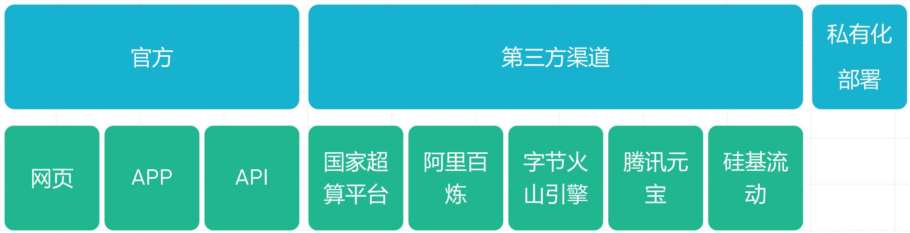

### 2. 深入理解私有化部署：从“租房”到“自建房”

- 公共云 API (租房):
  - 你使用服务商 API（如 OpenAI, DeepSeek），在他们服务器上运行的模型。  
  - 优点：开箱即用，无需关心硬件和运维，按需付费。  
  - 缺点：数据需要全部发送给服务商，无任何隐私保护，大规模使用成本可能高昂。

- 私有化部署 (自建房):

  - 你将模型系统完整地搬到自己控制的服务器（“地皮”）上。  

  - 优点：数据和模型完全归你掌控，**安全性、合规性、定制性**极强，大规模使用成本较低。  

  - 缺点：需要自己“盖房和装修”（前期投入高），并负责“物业管理”（长期运维）。

一句话总结：私有化部署是将大模型的技术栈从“**服务消费**”模式转变为“**资产持有**”模式，核心是为了获得对数据和技术的**【完全控制权】**。

### 3. 私有化部署的两种主要模式

1. 本地部署 (On-Premise):

- 定义：在企业自有的、物理存在的数据中心或服务器机房内部署模型。  

- 特点：

  - 最高控制级别：对硬件、网络、物理安全拥有端到端的完全控制。  

  - 最高初始投资 (CAPEX)：需要购买服务器、GPU、网络设备等。  

  - 最高运维要求：需要专业的 IT 团队负责硬件维护、系统更新和物理安全。

- 适用：对数据安全和主权有极致要求的组织，如军工、核心政府部门。

2. 私有云部署 (Private Cloud):

- 定义：在云服务商提供的隔离的专有云上部署模型，通常通过虚拟私有云（VPC）实现。  

- 特点：

  - 数据逻辑隔离：数据仍在你的VPC内，不与公网或其他租户直接交互，享受高安全性。  

  - 弹性与灵活性：可以利用云的弹性伸缩能力，按需增减计算资源。  

  - 运维负担减轻：云服务商负责底层硬件的维护。 

  - 成本模式：从重资产的CAPEX转向持续的运营支出(OPEX)。

- 适用：绝大多数有私有化需求的企业，希望在安全合规与云的便利性之间取得平衡。

### 4. 核心驱动力：为什么必须选择私有化？

- 数据安全与隐私保护 (Data Security & Privacy):

  - 最核心的价值！所有敏感数据（如用户输入、业务数据、模型训练数据）都保留在企业内部，不离开受控边界，最大限度降低数据泄露和隐私侵犯风险。

- 合规性要求 (Compliance):
  - 许多行业（如金融、医疗、政府）有严格的数据存储和处理法规（如GDPR、HIPAA、等级保护），私有化部署更容易满足这些合规要求。

- 高度定制化与集成 (Customization & Integration):
  - 可以在私有环境中对模型进行微调（Fine-tuning）以适应特定业务场景。  
  - 更容易与企业内部现有系统（如CRM、ERP、知识库）进行深度集成。

- 网络延迟与稳定性 (Network Latency & Stability):
  - 对于需要低延迟响应的应用，本地部署可以避免公网传输带来的延迟和不稳定性。  
  - 内部网络通常更可控，服务可用性更高。

- 成本可控性 (Potential Cost Control - 长期来看):

  - 虽然初始投入可能较高，但对于大规模、高频次使用的场景，长期来看可能比按量付费的云服务更经济。  

  - 不受外部 API 定价策略变动的影响。

- 自主可控 (Autonomy & Control): 对模型的版本、升级节奏、运维策略有完全的自主权。

### 5. 私有化部署典型适用场景：需求与行业的交汇点

- 金融服务 (Financial Services):
  - 场景：基于内部信贷模型的贷款审批、分析客户非公开财务数据的智能投顾。

- 医疗健康 (Healthcare):
  - 场景：分析电子病历（EHR）生成诊疗建议，且任何患者可识别信息（PHI）都不能离开医院网络。

- 政府与公共事业 (Government & Public Sector):
  - 场景：在涉密内网中，为特定部门提供基于海量机密文件的情报分析与决策支持。

- 法律行业 (Legal Services):
  - 场景：扫描和分析涉及客户隐私的案件卷宗、合同，提供法律意见，保障律师-客户特权。

- 大型企业内部应用 (Large Enterprises):
  - 场景：构建企业专属的“知识大脑”，回答关于内部研发文档、项目历史、HR政策等敏感问题。

- 先进制造业(Advanced Manufacturing):
  - 场景：分析包含核心工艺参数、良品率等商业机密的生产数据，进行流程优化和故障预测。

### 6. 决策框架：我需要私有化部署吗？

<table><tr><td>决策维度</td><td>关键问题</td><td>倾向“私有化”的答案</td></tr><tr><td>数据与合规</td><td>我的数据是否涉及个人隐私、商业机密或受特定法规（GDPR/HPAA）监管？</td><td>是，且风险不可接受</td></tr><tr><td>模型定制化</td><td>我是否需要用大量自有非公开数据对模型进行微调以达到可用水平？</td><td>是，且数据无法/不便上传</td></tr><tr><td>性能与集成</td><td>我的应用是否要求毫秒级的稳定低延迟？是否需要与内网深层系统集成？</td><td>是，且公网无法满足要求</td></tr><tr><td>成本与规模</td><td>我的预期调用量是否极大，导致长期API费用远超自建硬件和运维成本？</td><td>是，TCO测算后确认</td></tr><tr><td>技术与运维</td><td>我是否有能力（或预算）组建团队来管理GPU服务器、K8s集群和模型运维？</td><td>是，具备相应的技术储备</td></tr></table>

决策建议：

- “是”的答案超过 3 个: 私有化部署是**强烈推荐**的战略选择。  
- 只有 1-2 个“是”: 可考虑混合云方案或寻找提供**更强安全保障的公有云服务**。  
- 全是“否”：公共云 API 服务是更经济、高效的选择

## 三、大模型私有化部署技术选型

### 1. 私有化部署技术栈：构建你自己的 AI 工厂

大模型私有化部署需要一个清晰、分层的技术架构，从底层的硬件（动力）到顶层的应用（接口），环环相扣。

一个完整的私有化部署技术栈通常包括以下层面：

<table><tr><td>层面</td><td>目标</td><td>核心技术示例</td></tr><tr><td>应用接口层</td><td>安全、高效地对外提供服务</td><td>API网关(Nginx, Kong)</td></tr><tr><td>监控与日志层</td><td>保障系统稳定运行，性能可观测</td><td>Prometheus, Grafana, ELK/Loki</td></tr><tr><td>容器编排层</td><td>自动化部署、扩展和管理服务</td><td>Kubernetes (K8s), DockerCompose</td></tr><tr><td>推理服务层</td><td>【核心引擎】高效运行模型并提供API</td><td>Ollama, vLLM, Triton, TGI</td></tr><tr><td>容器化层</td><td>打包应用和环境，实现一致性</td><td>Docker</td></tr><tr><td>模型与数据层</td><td>存储和管理模型文件与数据</td><td>DeepSeek, Llama 3, Qwen等模型文件</td></tr><tr><td>基础设施层</td><td>提供最底层的计算、存储和网络资源</td><td>GPU服务器 (NVIDIA), 私有云 (VPC)</td></tr></table>

#### 1.1 基础设施层选型：计算资源（GPU）

1. 首选：NVIDIA GPU
   1. 为什么？CUDA 生态系统是当前 AI 计算的事实标准，拥有最广泛的软件支持和最佳的性能。  
   2. 高端生产级：H100, A100 - 为大规模训练和推理设计，性能极致，但成本高昂。  
   3. 高性价比生产级：A800，T4 - 兼顾推理和微调，是许多企业私有化部署的甜点级选择。  
   4. 入门开发级：RTX 4090, RTX 3090 - 拥有大显存 (24GB), 适合个人开发者或小型团队进行实验和轻量级部署。

2. 备选：其他厂商
   1. AMD GPU: 通过 ROCm 软件栈提供计算能力，生态正在追赶。  
   2. 国产芯片：在特定合规场景下，是很好的选择。

3. 关键决策点：显存（VRAM）大小是第一生命线！
   1. 原则: 总显存 > (模型大小 * 每个参数的字节数 * 精度)。7B 模型用半精度 (FP16, 2B/参数) 加载, 至少需要 \(7 * 2 = 14 GB) 显存。这还没算 KV Cache 等运行时的开销。  
   2. 多卡互联：对于超大模型，需要通过 NVLink 等高速互联技术将多张 GPU 连接起来。

#### 1.2 推理服务层选型：AI工厂的“引擎”

技术选型的核心，直接决定了模型的运行效率、吞吐量和延迟。

<table><tr><td>工具/框架</td><td>核心特性</td><td>优点</td><td>缺点</td><td>最适用场景</td></tr><tr><td>Ollama</td><td>一键启动，开箱即用</td><td>极度简单，自动下载模型和提供API，跨平台，社区活跃。</td><td>性能非最优，定制化和高级功能有限，不适合大规模高并发。</td><td>个人开发、快速原型验证、桌面级应用、教学演示。</td></tr><tr><td>vLLM</td><td>极致吞吐量</td><td>推理吞吐量极高，显著降低显存开销，支持连续批处理，提供OpenAI兼容API。</td><td>安裝配置相对复杂，对模型结构有一定要求。</td><td>需要处理大量并发请求的在线服务，如聊天机器人、内容生成平台。</td></tr><tr><td>NVIDIA Triton</td><td>企业级通用模型服务框架</td><td>功能全面，支持多种模型格式（LLM, CV,...），支持动态批处理、模型编排，稳定可靠。</td><td>配置复杂，学习曲线陡峭，对于单纯的LLM部署可能过于“重”。</td><td>需要统一管理多种AI模型的企业级平台，对稳定性和服务丰富度要求高。</td></tr><tr><td>TGI (Text Generation Inference)</td><td>Hugging Face 官方推理方案</td><td>与Hugging Face 生态无缝集成，支持多种量化和优化技术，性能优异。</td><td>主要为文本生成任务优化，生态相对封闭在Hugging Face 体系内。</td><td>重度依赖Hugging Face模型和生态的用户，追求良好性能和易集成性。</td></tr><tr><td>Irama.cpp</td><td>轻量级、跨平台 C++ 引擎</td><td>资源占用极低，支持多种量化格式(GGUF)，可在CPU上高效运行，可移植性强。</td><td>本身不是一个完整的“服务”，需要二次开发封装API，功能相对基础。</td><td>边缘计算设备、资源受限环境、桌面客户端应用、移动端集成。</td></tr></table>

选型建议：先用Ollama跑起来，再用vLLM/TGI跑得快，最后用Triton/K8s跑得稳。

#### 1.3 容器化与编排层选型：工厂的“流水线”与“中央调度室”

容器化：Docker - 标准化的“集装箱”

- 是什么：将推理服务代码、模型依赖、系统库等一切所需，打包成一个标准的、隔离的、可移植的Docker镜像。  

- 为什么：
  - 环境一致性：彻底解决“在我机器上能跑”的问题。  
  - 快速部署：镜像可以被秒级启动和复制。  
  - 依赖隔离：不同模型的不同依赖（如不同版本的 CUDA）可以互不干扰。

- 结论：Docker 在私有化部署中是无可争议的行业标准。

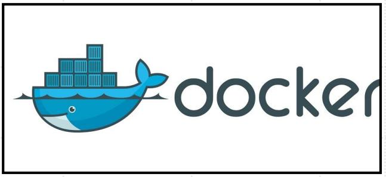

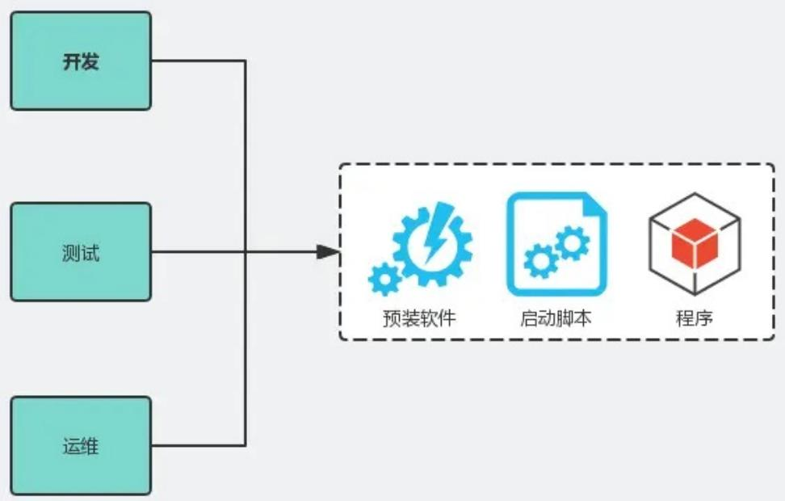

Container

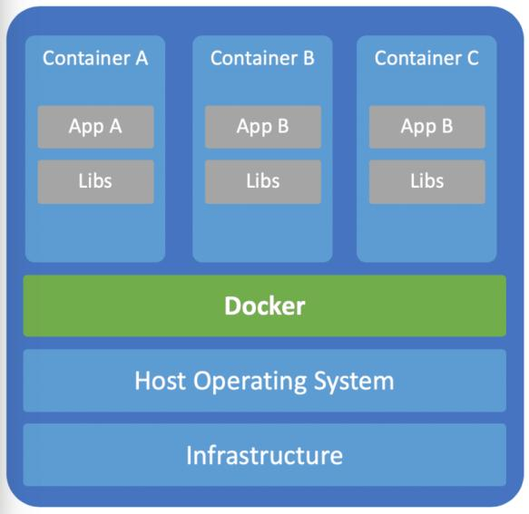

Virtual Machines

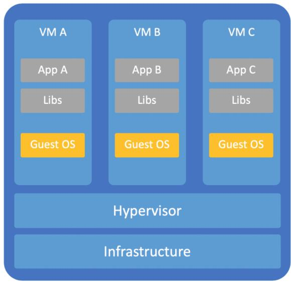

##### 容器编排：管理成千上万的“集装箱”

- 当你的服务需要多副本、高可用时，就需要容器编排。  
- 首选：**Kubernetes (K8s)** - AI 工厂的“中央调度室”
  - 是什么：一个自动化部署、扩展和管理容器化应用程序的开源平台。  
  - 核心能力：
    - 自动扩缩容：根据负载自动增加或减少模型服务实例。  
    - 服务发现与负载均衡：自动将流量分发给健康的服务实例。  
    - 自我修复：自动重启失败的容器，保证服务高可用。  
    - GPU 资源管理：通过 NVIDIA Device Plugin 等插件，高效调度和分配 GPU 资源。

  - 适用场景：所有生产级别的私有化部署。

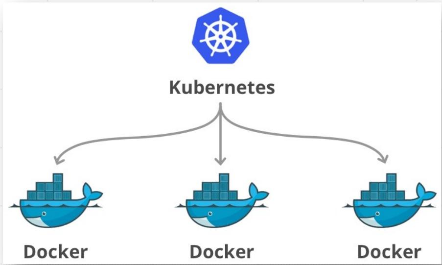

#### 1.4 监控与日志（Observability）- AI工厂的“中央仪表盘”

- 为什么需要？“无法观测就无法管理”。你需要实时了解服务的健康状况、性能瓶颈和资源消耗。  
- 黄金组合: Prometheus + Grafana
  - Prometheus：一个开源的监控和警报系统。它会定期从你的推理服务中“拉取”性能指标（如请求延迟、吞吐量、GPU利用率）。  
  - Grafana: 一个开源的可视化平台。它可以连接到Prometheus，将枯燥的数字指标变成炫酷、直观的仪表盘图表。

- 日志管理：ELK Stack / Loki
  - ELK (Elasticsearch, Logstash, Kibana): 功能强大的日志收集、存储和查询分析系统。  
  - Grafana Loki: 更轻量级的日志聚合系统, 与 Prometheus 和 Grafana 无缝集成, 运维成本更低。

### 1.5 应用接口层(API Gateway) - AI工厂的“安全大门”

- 为什么？不建议让应用直接调用推理服务的 API。API 网关提供了一个统一的入口，并附加了关键功能。  
- 核心功能：
  - 统一鉴权与认证：确保只有合法的应用才能调用模型服务。  
  - 流量控制与速率限制：防止恶意请求或突发流量冲垮后端服务。  
  - 路由：根据请求路径将流量转发到不同的模型服务或版本。  
  - 日志与分析：提供统一的 API 调用日志。

- 主流选型:
  - Nginx: 高性能、稳定可靠的 Web 服务器和反向代理, 可以通过配置实现网关功能。  
  - Kong / Apache APISIX: 专业的、功能更丰富的开源 API 网关。

### 1.6 总结：三种典型的私有化部署路径

根据你的需求、预算和技术能力，可以选择不同的技术组合路径。

<table><tr><td>路径名称</td><td>个人开发与快速验证</td><td>中小型业务生产</td><td>大型企业级平台</td></tr><tr><td>目标</td><td>快速实现功能，验证想法</td><td>稳定服务特定业务，兼顾性能与成本</td><td>高可用、高并发、统一管理</td></tr><tr><td>典型用户</td><td>个人开发者、AI爱好者、产品经理</td><td>创业公司、企业内部特定部门</td><td>大型企业、金融/医疗/政府机构</td></tr><tr><td>推荐技术栈</td><td>Ollama / LM Studio
运行在 GPU 服务器/主机</td><td>vLLM / TGI
+ Docker
+ DockerCompose
部署在2-5台服务器</td><td>NVIDIA Triton / vLLM
+ Docker
+ 完整 Kubernetes 集群
+ Prometheus &amp; Grafana
+ API Gateway
部署在数据中心/私有云</td></tr><tr><td>易用性</td><td>★★★★★</td><td>★★★</td><td>★</td></tr><tr><td>性能/扩展性</td><td>★★</td><td>★★★★</td><td>★★★★★</td></tr></table>


最终建议：从左到右，技需演进。

- 不要一开始就追求“屠龙刀”（完整K8s体系），先用“水果刀”（Ollama）把苹果削了。  
- 当业务跑起来，流量上来了，再逐步引入更专业的工具，完成从“作坊”到“工厂”的升级。

关于行业标准的讨论：CNCF部分已毕业项目

- Kubernetes：容器编排领域的全球领导者，通过声明式API和弹性架构定义了云原生应用的部署与管理标准。  
- CRI-O: 专为Kubernetes设计的轻量级容器运行时, 符合OCI标准，无缝集成Kubernetes CRI，成为容器生态的核心基础设施。  
- etcd: 云原生领域的分布式键值存储标杆，提供强一致性与高可用性，是Kubernetes集群状态存储的事实标准。  
- Prometheus：CNCF首个毕业的监控系统，以多维数据模型和PromQL查询语言成为云原生监控的事实标准，支撑现代可观测性体系。

**CNCF成员**

Platinum (15)

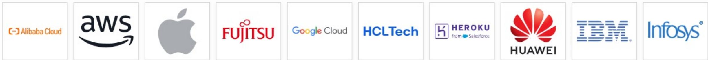


Gold (26)

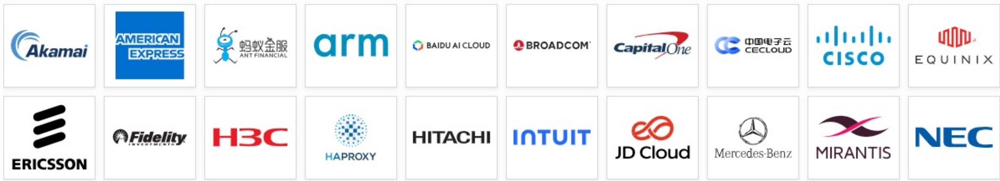


Agent2Agent Protocol：A2A 是一种开放协议，提供了 Multi-Agents 相互协作的标准。

Partners contributing to the Agent2Agent protocol

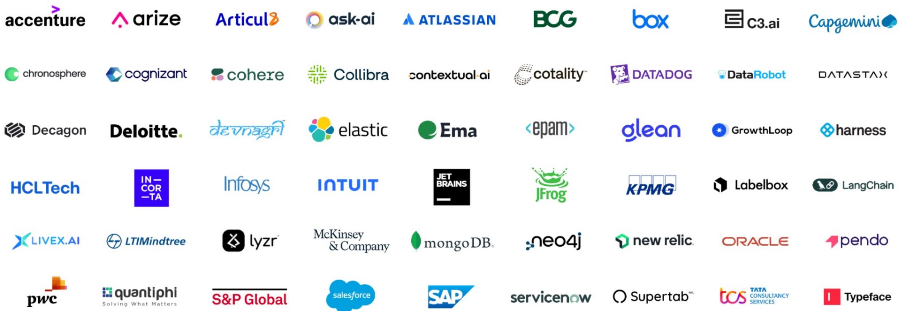


## 四、实战：基于Ollama的DeepSeek私有化部署

### 1. Ollama 是什么?

Ollama 是私有化大模型管理（LLMOps）领域，最受关注的开源项目之一。

Ollama 提供了一套用于下载、运行和管理 LLMs 的工具和服务，简化了复杂模型的部署流程。

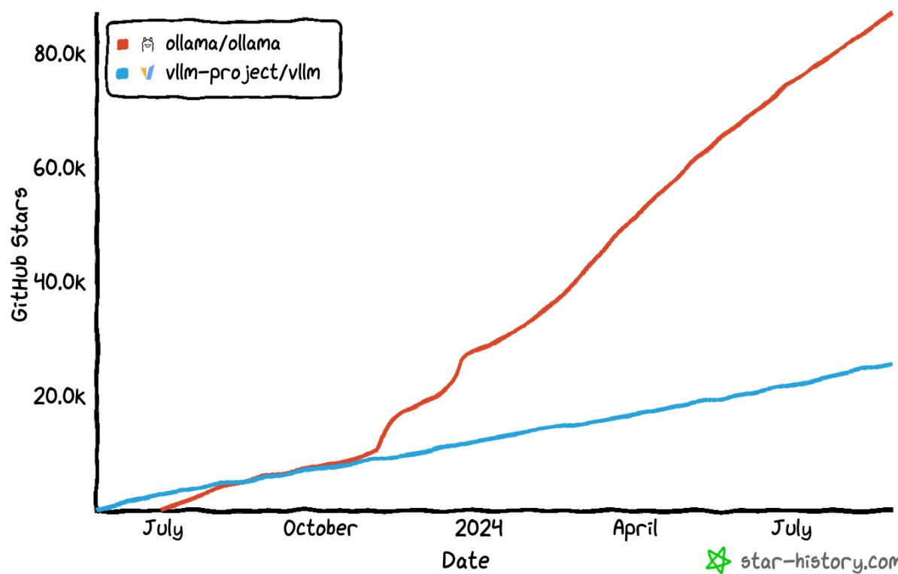  

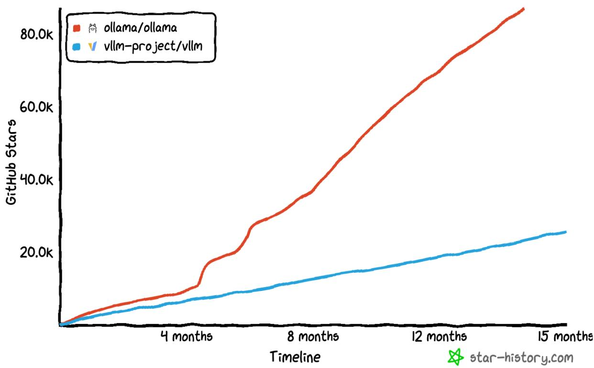  


与上一代的模型管理（MLOps）明星项目（Kubeflow和TF Serving）相比，LLMOps的关注度高了一个量级。

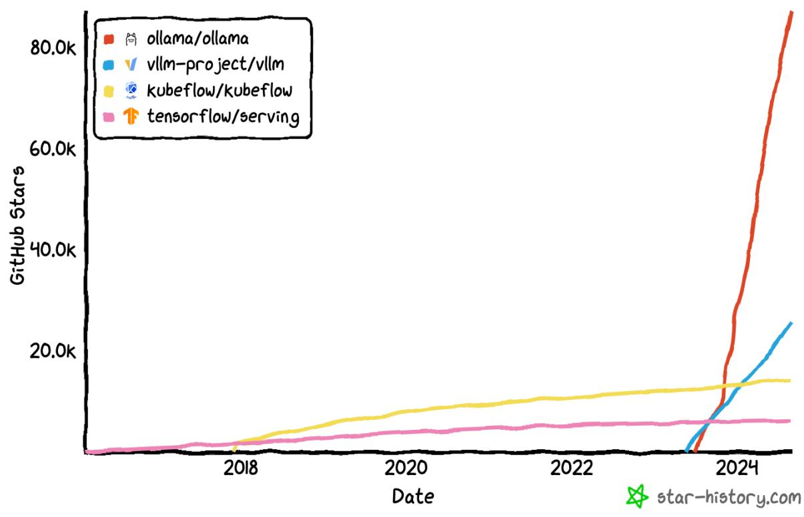  

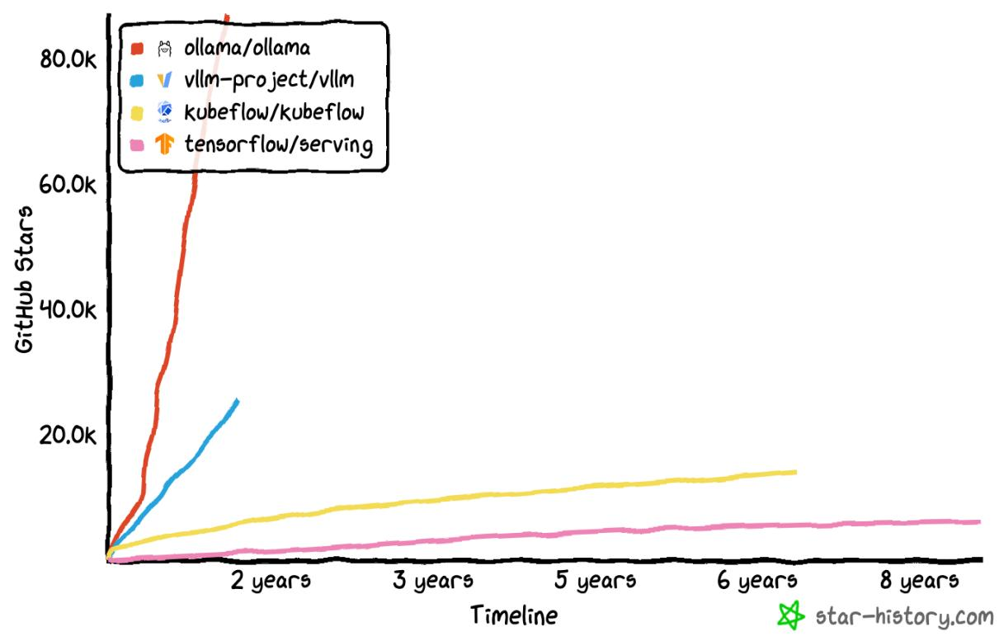  

### 2. Ollama 定位：最简单好用的LLMOps


Get up and running with large language models.

Run Llama 3.1, Phi 3, Mistral, Gemma 2, and other models. Customize and create your own.

<table><tr><td>Llama 3.1</td><td>70B</td><td>40GB</td><td>ollama run llama3.1:70b</td></tr><tr><td>Llama 3.1</td><td>405B</td><td>231GB</td><td>ollama run llama3.1:405b</td></tr><tr><td>Phi 3 Mini</td><td>3.8B</td><td>2.3GB</td><td>ollama run phi3</td></tr><tr><td>Phi 3 Medium</td><td>14B</td><td>7.9GB</td><td>ollama run phi3:medium</td></tr><tr><td>Gemma 2</td><td>2B</td><td>1.6GB</td><td>ollama run gemma2:2b</td></tr><tr><td>Gemma 2</td><td>9B</td><td>5.5GB</td><td>ollama run gemma2</td></tr><tr><td>Gemma 2</td><td>27B</td><td>16GB</td><td>ollama run gemma2:27b</td></tr><tr><td>Mistral</td><td>7B</td><td>4.1GB</td><td>ollama run mistral</td></tr><tr><td>Moondream 2</td><td>1.4B</td><td>829MB</td><td>ollama run moondream</td></tr><tr><td>Neural Chat</td><td>7B</td><td>4.1GB</td><td>ollama run neural-chat</td></tr><tr><td>Starling</td><td>7B</td><td>4.1GB</td><td>ollama run starling-lm</td></tr><tr><td>Code Llama</td><td>7B</td><td>3.8GB</td><td>ollama run codellama</td></tr></table>


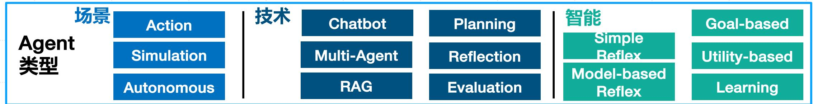

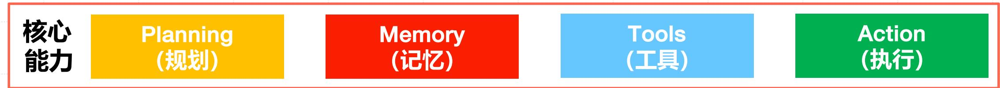

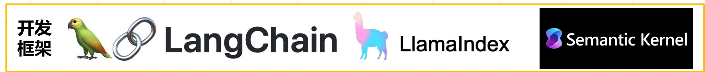

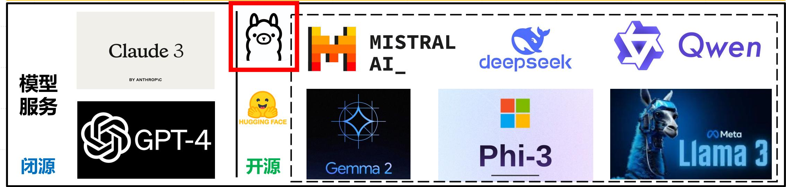

### 3. Ollama 安装与环境搭建

#### 3.1 手动安装

https://ollama.com/download

Ollama 命令行操作简洁

#### 3.2 Docker支持

Ollama官方提供了Docker镜像 ollama/ollama，可以在DockerHub上找到。

**使用CPU运行**

```txt
docker run -d -v ollama:/root/.ollama -p 11434:11434 --name ollama ollama/ollama
```

**使用 Nvidia GPU 运行**

要使用 Nvidia GPU，首先需要安装 NVIDIA Container Toolkit:

```shell
# 配置仓库

curl -fsSL https://nvidia.github.io/libnvidia-container/gpgkey | sudo gpg --dearmor -o /usr/share/keysrings/nvidia-ci  
curl -s -L https://nvidia.github.io/libnvidia-container/stable/deb/nvidia-container-toolkit.list | sed 's#deb https://

sudo apt-get update

# 安装NVIDIAContainerToolkit包

sudo apt-get install -y nvidia-container-toolkit

# 配置Docker使用Nvidia驱动

sudo nvidia-ctk runtime configure --runtime  $\equiv$  docker

sudo systemctl restart docker
```

启动容器：

```dockerfile
docker run -d --gpus=all -v ollama:/root/.ollama -p 11434:11434 --name ollama ollama/ollama
```

### Homework

1. 根据个人情况，在GPU服务器上部署DeepSeek-R1:8B推理模型（如果只有CPU，就部署DeepSeek-R1:1.5B模型），使用Ollama命令行模式生成环保咖啡杯的小红书文案，测试是否部署成功。  
2. （可选）调用Ollama私有化部署的DeepSeek API，生成环保咖啡杯的小红书文案。

## 五、实战：私有化部署的小红书爆款文案生成助手

### 1. 管理界面：下载模型

### 2. 对话界面：选择模型 deepseek-r1:8b

### 3. 设置 系统/用户 提示词

系统提示词 (System Prompt)

> 你是一个资深的小红书爆款文案专家，擅长结合最新潮流和产品卖点，创作引人入胜、高互动、高转化的笔记文案。
>
> 你的任务是根据用户提供的产品和需求，生成包含标题、正文、相关标

用户提示词

> 请为产品Sony蓝牙降噪耳机生成一篇小红书爆款文案。要求：语气科技硬朗，包含标题、正文、至少5个相关标签和5个表情符号。请以完整的JSON格式输出，并确保JSON内容用markdown代码块包裹（例如：json{{...}}）

### 4.  推理过程

首先，用户提供了一个任务：为Sony蓝牙降噪耳机生成一篇小红书爆款文案。要求是语气科技硬朗，包含标题、正文、至少5个相关标签和5个表情符号。

我的角色是资深的小红书爆款文案专家，我需要使用'Thought-Action-Observation'模式进行推理和行动。这意味着：

1. Thought（思考）：先分析产品卖点、目标受众、平台特点等，收集足够的信息。  
2. 'Action（行动）：基于这些信息创作文案。  
3. 'Observation（观察）：确保文案符合要求，并输出在指定的JSON格式中。'

用户指定了输出格式：以完整的JSON格式直接输出最终文案，并且用markdown代码块包裹，例如：json{\...}。但示例是json{\...}，这可能是个错误；标准应该是像json\n{...}\n或类似的东西，但我需要确保它被正确包裹。

现在，分析产品：Sony蓝牙降噪耳机。这是一个科技产品，我需要保持语气"科技硬朗"，意思是硬朗、直接、强调技术方面，而不是太软性或情感化。

小红书的特点：用户喜欢活泼、真诚、富有感染力的文案，经常使用表情符号和相关标签来增加互动和转化。爆款文案通常引人入胜、高互动、高转化。

产品卖点（基于我作为AI的知识）：

- 'Sony耳机通常是高品质，如WH-1000XM系列，强调降噪技术。'  
  蓝牙连接稳定，音质好。  
  电池续航长。  
  可能有智能功能，如语音助手集成。  
  设计时尚、便携。

需求：用户说"生成一篇小红书爆款文案”，所以我需要创作一个完整的笔记。

结构：

- ‘标题: 需要吸引人,符合科技硬朗风格。可能使用数字、问题或强动词来开头。’  
- 正文：活泼、真诚、富有感染力。结合Thought和Observation：先思考产品优势，然后用行动导向的语言描述，最后观察潜在效果（如用户反馈）。  
  标签(,)：至少5个相关标签。例如：#Sony耳机#降噪神器#蓝牙耳机#科技生活等。  
- 表情符号(emojis): 至少5个。需要选择与科技主题相关的, 如 (电池)、 (耳机) 等, 但要保持硬朗风格, 可能使用一些技术感强的表情。

需求：用户说"生成一篇小红书爆款文案”，所以我需要创作一个完整的笔记。

结构：

标题：需要吸引人，符合科技硬朗风格。可能使用数字、问题或强动词来开头。  

- 正文：活泼、真诚、富有感染力。结合Thought和Observation：先思考产品优势，然后用行动导向的语言描述，最后观察潜在效果（如用户反馈）。  
  标签( hashtags): 至少5个相关标签。例如: #Sony耳机#降噪神器#蓝牙耳机#科技生活等。  
- 表情符号(emojis):至少5个。需要选择与科技主题相关的，如（电池）、（耳机）等，但要保持硬朗风格，可能使用一些技术感强的表情。

Thought过程：

1. 收集信息：产品是Sony蓝牙降噪耳机。假设它是高端系列，卖点包括出色降噪、长续航、舒适设计、高质量音质。  
2. '目标受众：小红书用户，可能是年轻人、科技爱好者、经常出差或旅行的人，需要安静环境使用耳机。  
3. 文案风格：活泼但硬朗——所以用直接的语言描述技术优势，同时保持一些感染力。例如，用感叹号和强词如“超强”、“无与伦比”。  
4. 爆款元素：确保高互动性（可能通过提问或呼呼行动），高转化率（突出好处）。

Action过程：

标题示例："Sony降噪耳机霸屏市场！音质狂飙，续航无敌"  
需要硬朗语气，所以用技术术语。  

- 正文：开头吸引注意，描述产品问题解决、个人体验。例如：作为科技爱好者，我最近入手了这款耳机，瞬间提升我的音频体验。解释卖点。

正文结构建议：

- '引入（Hook）：以一个问题或惊叹开始。'  
  主体：描述功能和好处。  
  结尾：呼吁行动或分享个人感受。

至少5个标签：例如#Sony耳机#降噪效果好#蓝牙连接稳定#续航持久#科技必备等。

表情符号：5个，选择如（表示出色）、、等相关性高的。

Observation过程：“

“检查文案是否引人入胜：使用生动语言。”  
“高互动：加入问题或邀请评论。”  

- JSON格式正确：确保输出是JSON，并用markdown代码块包裹。

### 5. json 最终输出

```json
{
"title": "Sony降噪耳机征服噪音战场！续航狂飙音质炸裂",

"body": "作为科技硬核玩家，我必须说这款Sony蓝牙降噪耳机简直是音频界的猛。它的主动降噪技术直接把我的通勤和工作环境变成了”，

"hashtags": ["#Sony降噪耳机", "#蓝牙耳机", "#科技装备", "#降噪效果", "#音质优化"],

"emojiis": ["", "", "", "", "", ","]
}
```

### Homework

1. 在服务器上使用Docker部署OpenWebUI，并下载DeepSeek-R1:8B推理模型（若只有CPU，使用DeepSeek-R1:1.5B模型），生成蓝牙降噪耳机的小红书文案。  
2. （可选）将上一节课的小红书爆款文案助手项目中的 DeepSeek API 调用，改为私有化部署 DeepSeek-R1 模型，实现数据隐私保护。